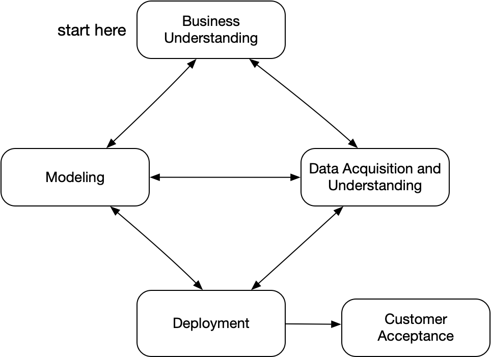
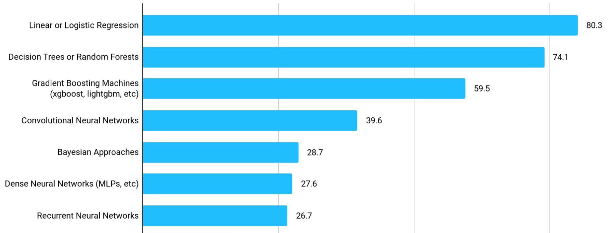
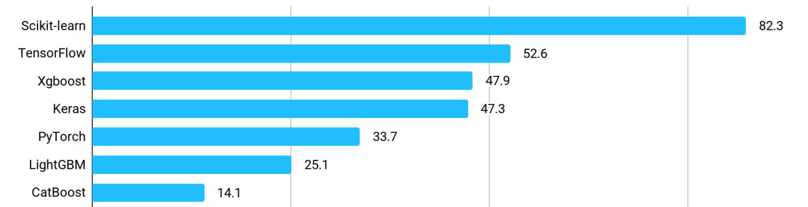
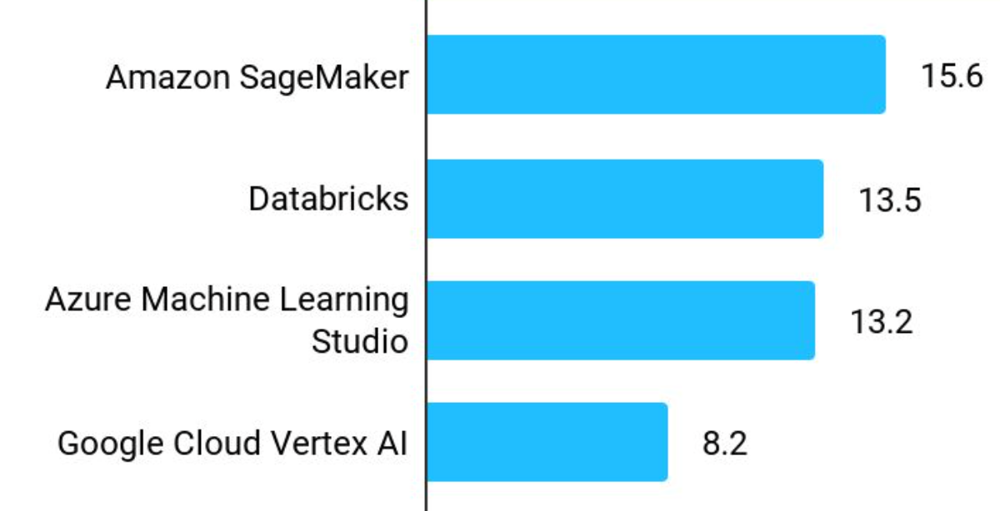
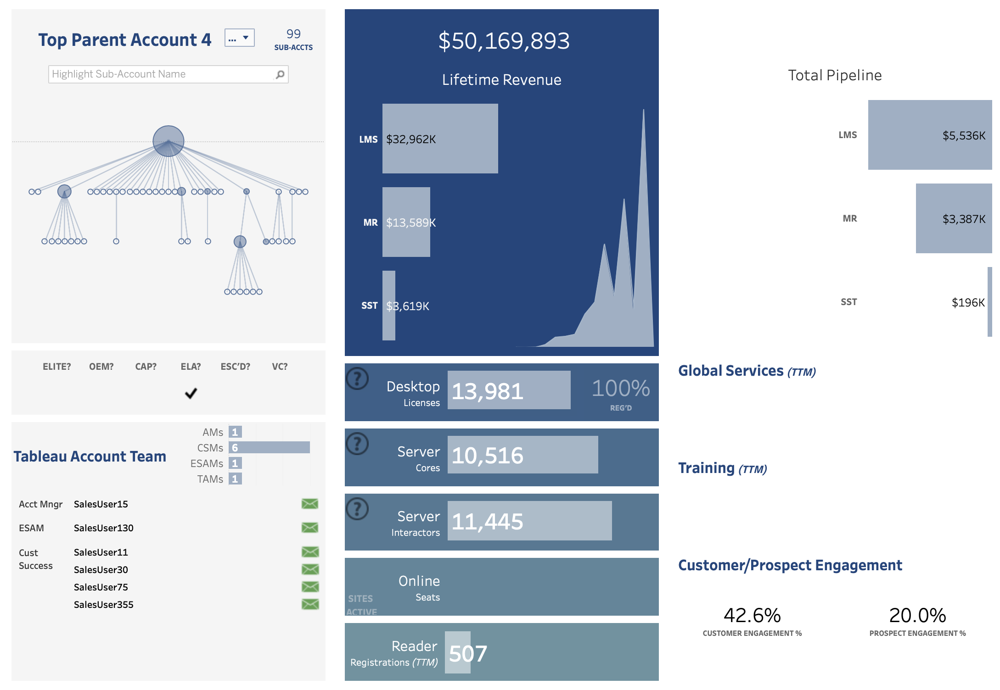

[comment]: # (THEME = pdsp)
[comment]: # (CODE_THEME = base16/zenburn)
Practical Data Science with Python
# 1. Introduction

[comment]: # (!!!)

## Why is data science big today?

- Lots of data, mainly in the cloud
- Lots of great tools 
- Lots of high-stakes decisions to make

[comment]: # (!!!)

## Why Python?

- Great libraries (pandas, numpy, scikit-learn, etc)
- Flexible, powerful language
- Everyone uses python
<
Other options: R, SAS, Julia, Matlab

[comment]: # (!!!)

## Project Steps

- Understand the question
- Find and clean the data
- Explore the data
- Make a model and fit it to data
- Tune hyperparameters
- Answer question (including confidence measure!)
- Make into something anyone can see anytime

[comment]: # (!!!)

## TDSP

"Team Data Science Process" from Microsoft replaces CRISP-DM:

[comment]: # (!!!)

## Models

From Kaggle 2021 Data Science Survey:

[comment]: # (!!!)

## Frameworks

From Kaggle 2021 Data Science Survey:

[comment]: # (!!!)

## Products?

From Kaggle 2021 Data Science Survey:

[comment]: # (!!!)

## Databricks?

- From creators of open-source Apache Spark in 2013
- 3000 employees
- Valued at $38B (Oct 2021)
- Founder (Ali Ghodsi) worth $1.8B

[comment]: # (!!!)

## Graphical Interface
- Simple: Excel
- Expensive: Tableau, SAS, Alteryx
 
"Business Intelligence"

[comment]: # (!!!)

## Tableau?
- Founded in 2003 by Stanford CS researchers
- Sold to Salesforce in 2019 for $15.7B

[comment]: # (!!!)

## Skills you need

- Statistics (emphasizing prediction models)
- Software development
- Math (emphasizing optimization)
- Business understanding and communication
- Design of data visualizations

This course will **not** make you a data science expert.

This course **will** make you employable in data science.

[comment]: # (!!!)

## Specializations

- Machine learning
	-  Deep learning
	-  Natural language processing
	-  Robotics
- Data engineering and big data
	- Apache Spark
	- Hadoop
- Business intelligence and analytics
	- Tableau
- Statistical methods

[comment]: # (!!!)

# Questions?

Video: What REALLY is Data Science?

[https://youtu.be/xC-c7E5PK0Y](https://youtu.be/xC-c7E5PK0Y)
