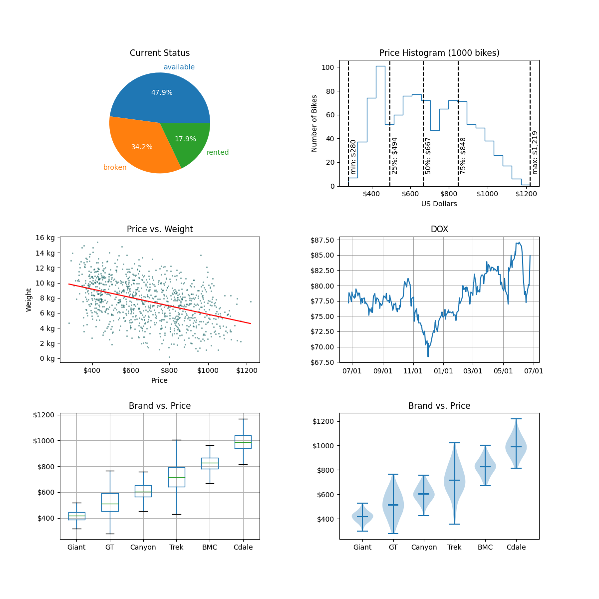

[comment]: # (THEME = pdsp)
[comment]: # (CODE_THEME = base16/zenburn)

### Practical Data Science with Python

# 5. Exploratory Data Analysis and Visualization

[comment]: # (!!!)

## Everytime you use matplotlib

```
import matplotlib.pyplot as plt

fig1, ax1 = plt.subplots()

# Make plot on ax1 here

fig1.show()
# OR
fig1.savefig("test.png")

```

#### Need multiple plots in your figure?

```
fig, axs = plt.subplots(3, 2, figsize=(12, 12))
```

[comment]: # (!!!)

## Your homework



[comment]: # (!!!)

## Demo

[Demo](https://colab.research.google.com/drive/1iZso7j2z-Iqb2dgQudIoIYc7j19c2Vyj?usp=sharing)

[comment]: # (!!!)

# Questions?

