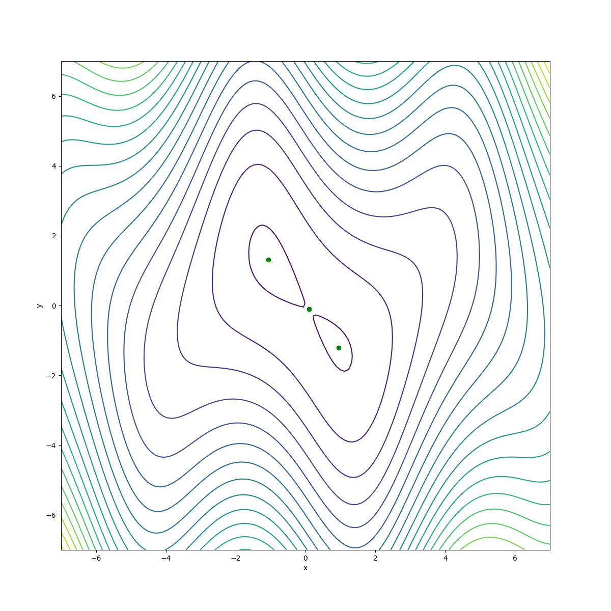

[comment]: # (THEME = pdsp)
[comment]: # (CODE_THEME = base16/zenburn)

### Practical Data Science with Python

# 5b. Derivatives and Gradients

[comment]: # (!!!)

## The derivative of a function

$f(x) = x^2 \hspace{20mm}\frac{df}{dx}(x) = 2x$

 

[comment]: # (!!!)

## $f: R^2$ to $R$

$f(x,y) = 3 y \sin{x} + x^2 + y^2 + \frac{x}{4}$

 

[comment]: # (!!!)


## Two different derivatives!

Slope as you increase x (blue): $\frac{\partial f}{\partial x}(x,y)$

Slope as you increase y (red): $\frac{\partial f}{\partial y}(x,y)$

 

[comment]: # (!!!)

## Partial derivatives

$f(x,y) = 3 y \sin{x} + x^2 + y^2 + \frac{x}{4}$

The trick: Treat other variables as constants.

$\frac{\partial f}{\partial x}(x,y) = 3 y \cos{x} + 2x + \frac{1}{4}$

$\frac{\partial f}{\partial y}(x,y) = 3 \sin{x} + 2y$


[comment]: # (!!!)

## Contour plot

 


[comment]: # (!!!)


## Gradient

$ \nabla f(x, y) = \begin{bmatrix} \frac{\partial f}{\partial x}(x,y) & \frac{\partial f}{\partial y}(x,y)\end{bmatrix}$

Gradiant is perpendicular to contour lines.

Magnitude is slope of tangent plane. Direction is uphill.

 


[comment]: # (!!!)


 

[comment]: # (!!!)


## Zero gradients

$\nabla f(x, y) = 0$ means the tangent plane is level.

At local maximums and minimums, $\nabla f(x, y) = 0$.

Also at "saddle points"

 


[comment]: # (!!!)

## Difficult to solve

For what $(x, y)$ is $\nabla f$ zero?

$\frac{\partial f}{\partial x}(x,y) = 3 y \cos{x} + 2x = 0$

$\frac{\partial f}{\partial y}(x,y) = 3 \sin{x} + 2y = 0$

*Ummmmmm......*

Global min: $f(-1.07117403, 1.31662556) = -0.85393473$

Local min: $f(0.9439074, -1.21476033 = -0.34876384$

[comment]: # (!!!)


$-\nabla f$

 

[comment]: # (!!!)

## Gradient descent
Start with a guess $x_0, y_0$

Repeatedly step downhill:
$(x_{i+1}, y_{i+1}) = (x_i, y_i) - t_i \nabla f$

Stop when it stops changing.

 

[comment]: # (!!!)


 

[comment]: # (!!!)

## SymPy

```python
import sympy

x, y = sympy.symbols('x y')
f = 3.0 * sympy.sin(x) * y + x**2 + y**2

v_at_zero = f.evalf(subs={x:0, y:0})
print(f"f(0,0) = {v_at_zero}")

df_x = sympy.diff(f, x)
df_y = sympy.diff(f, y)
print(f"df/dx = {df_x}")
print(f"df/dy = {df_y}")
```
Results in:

```
f(0,0) = 0
df/dx = 2*x + 3.0*y*cos(x)
df/dy = 2*y + 3.0*sin(x)
```

[comment]: # (!!!)


## Higher dimensions

$f: R^d$ to $R$ 

Gradient is a $d$-dimensional vector:

$\nabla f(x_1, \ldots, x_d) = \\\\ \hspace{20mm}\begin{bmatrix}\frac{\partial f}{\partial x_1}(x_1, \ldots, x_d) & \ldots & \frac{\partial f}{\partial x_d}(x_1, \ldots, x_d)\end{bmatrix}$

[comment]: # (!!!)

## 3D plotting in matplotlib?

```python
from mpl_toolkits import mplot3d
import numpy as np
import matplotlib.pyplot as plt

x = np.linspace(-7, 7, 30)
y = np.linspace(-7, 7, 30)
X, Y = np.meshgrid(x, y)
Z = 3.0 * np.sin(X) * Y + X**2 + Y**2

fig = plt.figure(1, (12,12))
ax = plt.axes(projection='3d')
ax.plot_surface(X, Y, Z, rstride=1, cstride=1,
                cmap='viridis', edgecolor='none')
```
 

[comment]: # (!!!)

## Contour in matplotlib
```python
x = np.linspace(-7, 7, 30)
y = np.linspace(-7, 7, 30)
X, Y = np.meshgrid(x, y)
Z = 3.0 * np.sin(X) * Y + X**2 + Y**2
fig1, ax1 = plt.subplots()
ax1.contour(X, Y, Z, 21)
```
 


[comment]: # (!!!)

## Quiver plot in matplotlib

```
x = np.linspace(-7, 7, 30)
y = np.linspace(-7, 7, 30)
X, Y = np.meshgrid(x, y)
U = 3 * Y * np.cos(X) + 2.0 * X
V = 3 * np.sin(X) + 2.0 * Y
Z = 3.0 * np.sin(X) * Y + X**2 + Y**2
fig1 = plt.figure(1, (12,12))
ax1 = fig1.add_axes([0.1, 0.1, 0.8, 0.8])
ax1.quiver(X, Y, U, V, Z)
```
 
[comment]: # (!!!)


# Questions?

