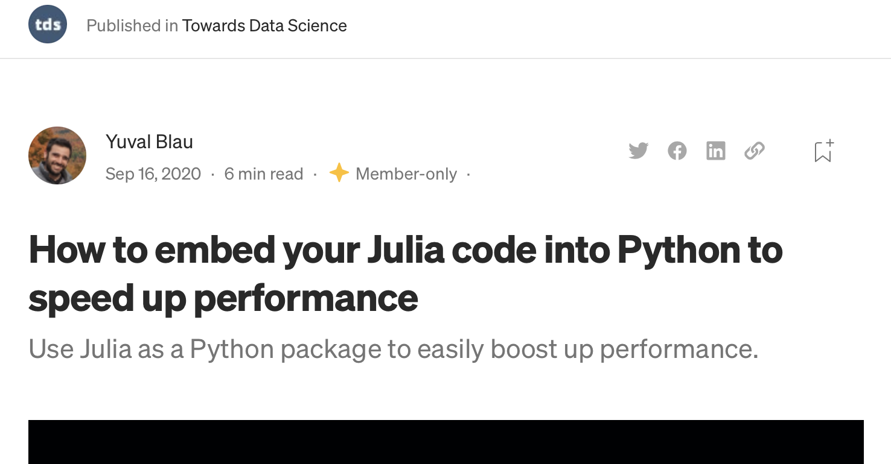

[comment]: # (THEME = pdsp)
[comment]: # (CODE_THEME = base16/zenburn)

### Practical Data Science with Python

# 6. Data Wrangling Documents and Spreadsheets

[comment]: # (!!!)

## HW01: Software survives

```
def series_report(
    series, 
    is_ordinal=False, 
    is_continuous=False, 
    is_categorical=False
):
    if series.name == "dob" or 
       series.name == "death" or 
       series.name == "employee_id":
```

## Calling Julia from Python?

PyJulia framework

 


## glob and expanduser

Get a list of filenames using wildcard:

```
from glob import glob

pngs = glob('data/*.png')

all_pngs = glob('*.png', root_dir='data', recursive=True)
```
Expand user directory:
```
import os.path
users_photo_dir = os.path.expanduser('~/photos')
```

[comment]: # (!!!)

## textract

Reads text from Word, PowerPoint, PDFs:

```
bstring = textract.process('my_contract.docx')
text = bstring.decode('utf-8')
```
[comment]: # (!!!)

## Translators


```
translator = str.maketrans('aeiou','xxxxx','3')
no3novowels = my_string.translate(translator)
```
Get rid of punctuation and numbers:

```
import string
text = text.translate(str.maketrans('','',
                string.punctuation + string.digits)
```
[comment]: # (!!!)

## nltk

Natural Language Tool Kit

```
stopwords = nltk.corpus.stopwords.words('english')
```

['i', 'me', 'my', 'myself',...,"wouldn't"]

```python
stopset = set(stopwords)
docwords = text.lower().split()
wordlist = []
for w in docwords:
	if w not in stopset and len(w) > 3:
		wordlist.append(w)
```

[comment]: # (!!!)

## Pandas to read/write Excel files

```python
import pandas as pd
df = pd.read_excel('myfile.xlsx', sheet_name='Projections')

df2 = ...
df2.to_excel('out.xlsx', sheet_name='Analysis', header=True)
```

Multiple sheets?

```
with pd.ExcelWriter('out.xlsx', 'a') as writer:
   df2.to_excel(writer, sheet_name='Analysis')
   df3.to_excel(writer, sheet_name='Raw Data')
```
[comment]: # (!!!)


# Questions?

(That gets us to page 201 of the textbook.)

