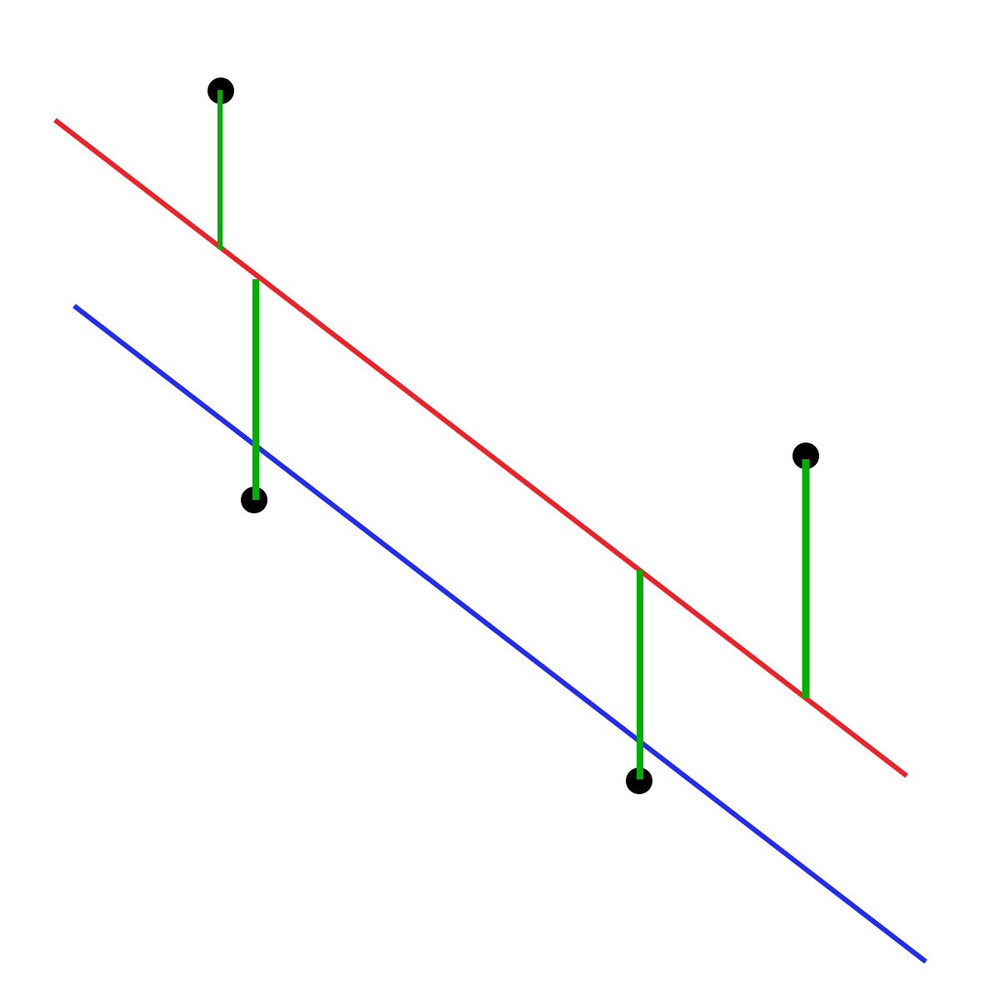

[comment]: # (THEME = pdsp)
[comment]: # (CODE_THEME = base16/zenburn)

### Practical Data Science with Python

# 6b. Linear Regression

[comment]: # (!!!)

## Regression?


## Data

 


[comment]: # (!!!)


## Linear Model?

$\bar{y} = m x + b$

 

[comment]: # (!!!)


## Error (or residual)

$r = y - \left( m x + b\right)$


[comment]: # (!!!)

## Residual in numpy

Reminder: $r = y - (b_0 + b_1 x)$

$X = \begin{bmatrix} 1  & x_0 \\\\ 1 & x_1 \\\\
\ldots & \ldots \\\\ 1 & x_n \end{bmatrix} \hspace{5mm}
B = \begin{bmatrix}b_0 \\\\ b_1\end{bmatrix}
\hspace{5mm}
Y = \begin{bmatrix} y_0 \\\\ y_1 \\\\ \ldots \\\\ y_n \end{bmatrix}$
```
R = Y - X @ B
```
[comment]: # (!!!)

## Model in d-dimensions

$\bar{y} = b_0 + b_1 x_1 + b_2 x_2 + \ldots b_d x_d$

In python

$X = \begin{bmatrix} 1  & x_{0,1} & \ldots & x_{0,d} \\\\ 
1 & x_{1,1} & \ldots & x_{1,d} \\\\
\ldots & \ldots &\ldots & \ldots \\\\ 
1 & x_{n,1} & \ldots & x_{n, d} \end{bmatrix}
 \hspace{5mm}
B = \begin{bmatrix}b_0 \\\\ b_1 \\\\ \ldots \\\\ b_d\end{bmatrix}
 \hspace{5mm}$

```
R = Y - X @ B
```
[comment]: # (!!!)


## What should we minimize?

Total error?  $\sum_{i=1}^{n} | b_1 x_i + b_0 - y_i |$

"L1"



[comment]: # (!!!)


## L2 "Least Squares"

$\frac{1}{2}\sum_{i=1}^{n} \left( m x_i + b - y_i \right)^2$

What if we calculate this for every possible $(m, b)$?


[comment]: # (!!!)


## Gradient of L2 Error?

$J(m, b) = 
frac{1}{2}\sum_{i=1}^{n} \left( m x_i + b - y_i \right)^2$

So...

$\frac{\partial J}{\partial m} = \sum_{i=1}^{n} x_i \left( m x_i + b - y_i \right)$
$\frac{\partial J}{\partial b} = \sum_{i=1}^{n} \left( m x_i + b - y_i \right)$

In matrices:

$\nabla J(B) = X^T (X B - Y)$


[comment]: # (!!!)

## Where is gradient zero?

$\nabla J(B) = X^T (X B - Y) = X^T X B - X^TY = 0$

$B = (X^T X)^{-1} X^T Y$

When is this impossible? 


[comment]: # (!!!)

## Solving in python

$B = (X^T X)^{-1} X^T Y$

```python
ext_X = np.stack([np.ones(n),X], axis=1)
coefs_correct = np.linalg.inv(ext_X.T @ ext_X) @ ext_X.T @ Y
print(coefs_correct)
```

[comment]: # (!!!)

## Performance

Inverting a matrix requires

* $O(n^3)$ in time
* $O(n^2)$ in memory

Alternative when $N > 10^6$?

[comment]: # (!!!)


# Questions?

