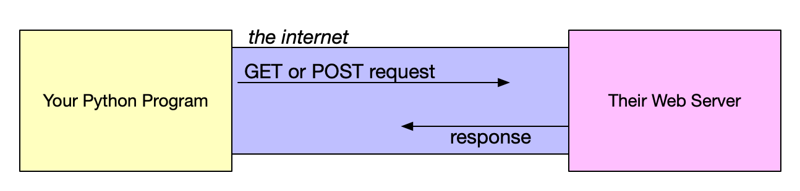
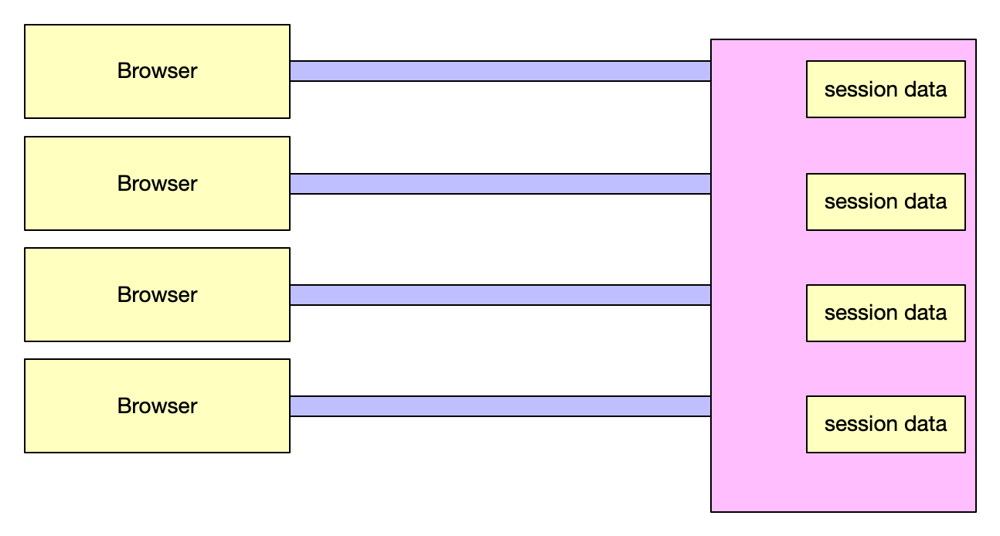
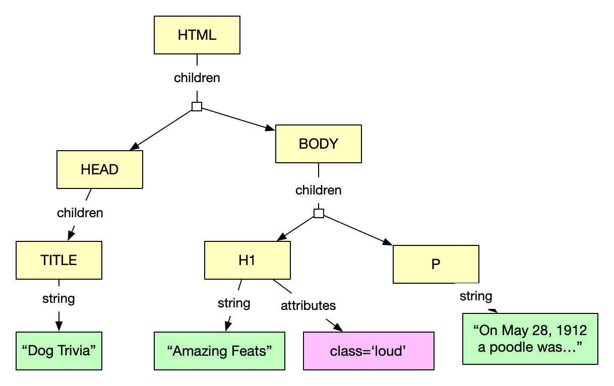

[comment]: # (THEME = pdsp)
[comment]: # (CODE_THEME = base16/zenburn)

### Practical Data Science with Python

# 7. Web Scraping

[comment]: # (!!!)

## Web Request/Response

 


```python
import requests

response = requests.get('https://hooli.com/index.html')
some_bytes = response.content
```

[comment]: # (!!!)

## When you fill out a form

```text
POST /cgi-bin/process.cgi HTTP/1.1
User-Agent: Mozilla/4.0 (compatible; MSIE5.01; Windows NT)
Host: www.dogtrivia.com
Content-Type: application/x-www-form-urlencoded
Content-Length: 31
Accept-Language: en-us
Accept-Encoding: gzip, deflate
Connection: Keep-Alive

search_str=poodles&order_by=date
```
[comment]: # (!!!)

## What comes back

```text
HTTP/1.1 200 OK
Date: Mon, 27 Jul 2009 12:28:53 GMT
Server: Apache/2.2.14 (Win32)
Last-Modified: Wed, 22 Jul 2009 19:15:56 GMT
Content-Length: 88
Content-Type: text/html
Connection: Closed

<html>
...
</html>
```
[comment]: # (!!!)

## Response headers

```python
r = requests.get('https://sup.com/mydoc.html')
if r.headers['Content-Type'] == 'application/json':
	...
```
[comment]: # (!!!)


## Status codes

```python
r = requests.get('https://sup.com/mydoc.html')
if r.status_code != requests.codes.ok:
    print(f"Fetch failed! error:{r.status_code}")
    print(f"\tReason:{r.reason""
```
[comment]: # (!!!)


## Args

https://sup.com/fet.php?first=ted&last=smith

```python
arg_dict = {'first': 'ted', 'last': 'smith'}
r = requests.get('https://sup.com/fetcher.php', params=payload)

arg_dict = {'somekey': 'somevalue'}
r = requests.post('https://sup.com/rform.php', data = arg_dict)
```
or 

```
r = requests.post('https://sup.com/rform.php', json = arg_dict)
```

[comment]: # (!!!)

## Response conversions

### Automatic

```python
r = requests.get('https://sup.com/declaration.html')
my_string = r.text

r = requests.get('https://sup.com/event.php')
my_dict = r.json()
```

### Explicit

```python
from PIL import Image
from io import BytesIO

r = requests.get('https://sup.com/logo.png')
i = Image.open(BytesIO(r.content))
```

[comment]: # (!!!)

## Sessions

 

[comment]: # (!!!)

## Session approaches
- Unique ID in URL: 

```https://sup.com/cart?session=8a3942```

- ID in cookie 
- ID in form data: <hidden> tag

[comment]: # (!!!)

## Cookies

### In response
```python
r = requests.get(url)
sess_id = r.cookies['session_id']
```

### In request
```python
cookies = dict('session_id':sess_id)
r = requests.get(url, cookies=cookies)
```

[comment]: # (!!!)

## HTML
```text
<HTML>
<HEAD>
  <TITLE>
</HEAD>
<BODY>
  <H1 class="loud">Amazing Feats</H1>
  <P>On May 2, 1912, a poodle was...
</BODY>
```
[comment]: # (!!!)

## The DOM Tree

 

```python
from bs4 import BeautifulSoup as bs

response = rq.get(url)
text = response.content
soup = bs(text, 'html.parser')
```
[comment]: # (!!!)

## Querying

```python
title_node = soup.title
print(f"This page is {title_node.string}")
headings = soup.find_all('H1')
for heading_node in headings:
    title = heading_node.string
    
    at_dict = heading_node.attrs
    at_class = at_dict.get('class')
```
[comment]: # (!!!)

## find_all()

```python
find_all(name, attrs, recursive, string, limit, **kwargs)
```

```
soup.find_all("p", "title")

soup.find_all(id="link2")

import re
soup.find_all(string=re.compile("b.t"), limit=3)

def is_the_only_string_within_a_tag(s):
    """True if `s` is only child of its parent."""
    return (s == s.parent.string)

soup.find_all(string=is_the_only_string_within_a_tag)
```
[comment]: # (!!!)
  

# Questions?

