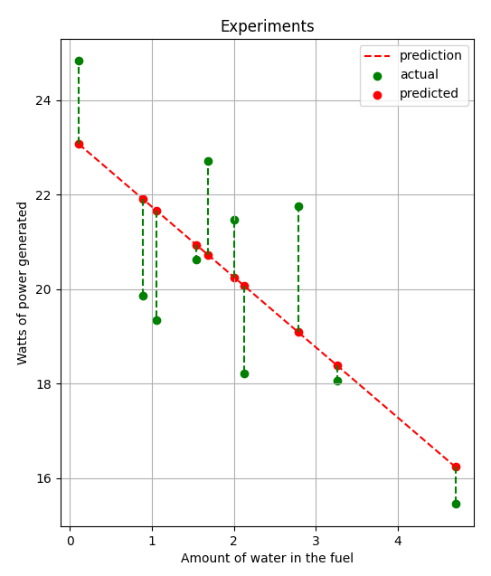
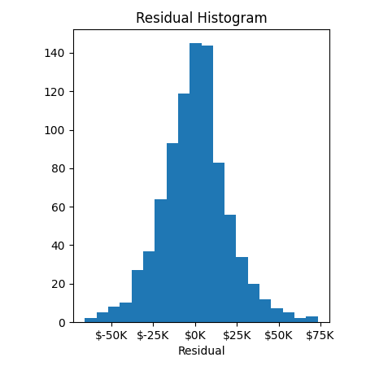
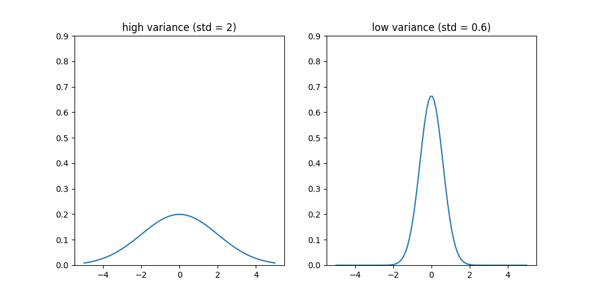
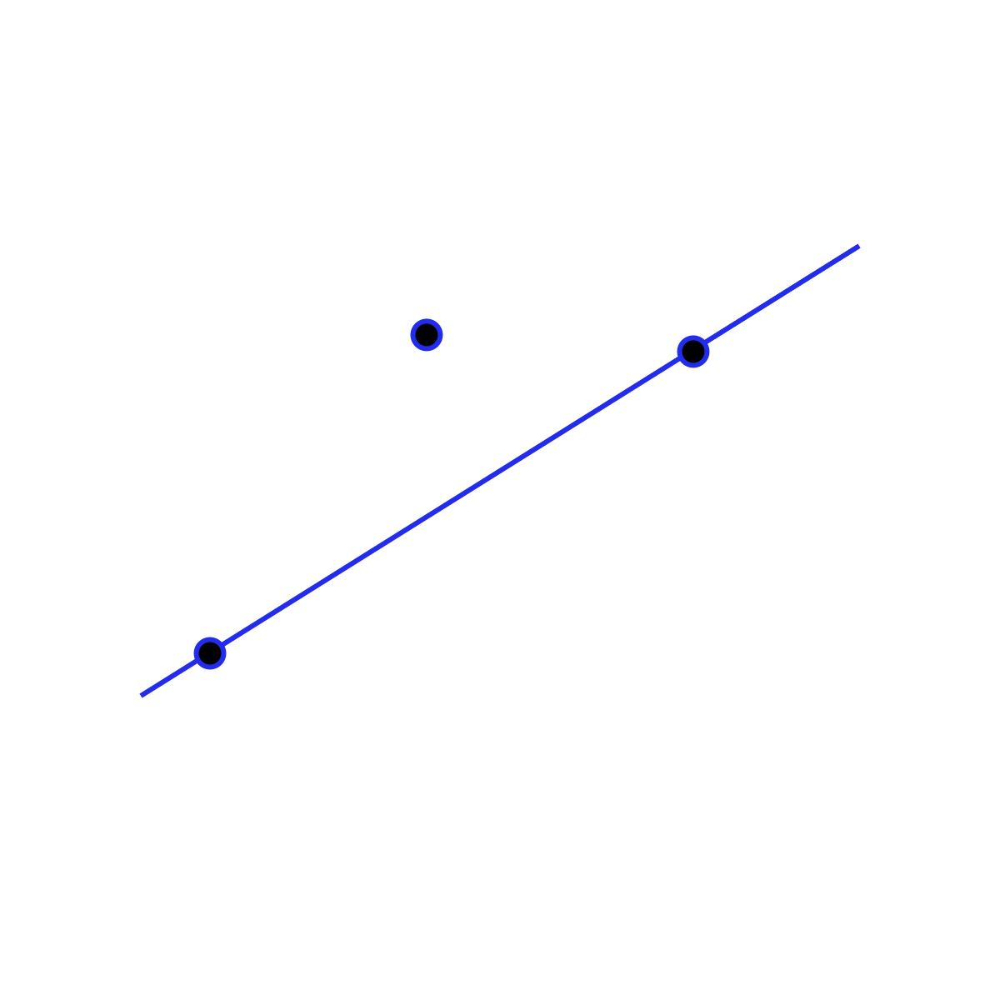
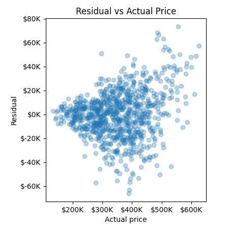
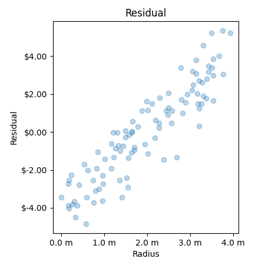
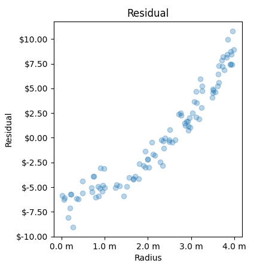
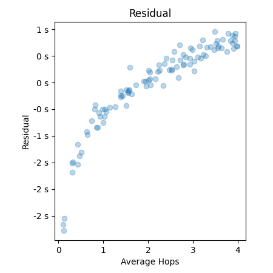
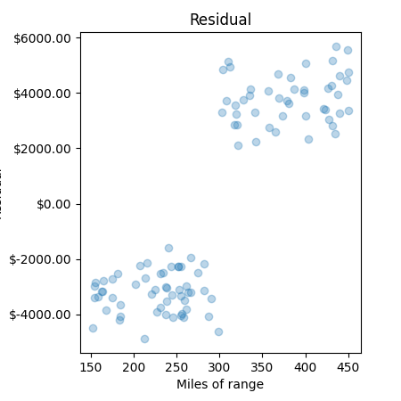
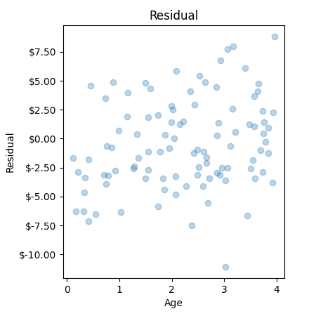

[comment]: # (THEME = pdsp)
[comment]: # (CODE_THEME = base16/zenburn)

### Practical Data Science with Python

# 7b. Residuals

[comment]: # (!!!)

## Residuals



### $r_i = y_i - \hat{y_i}$

```python
predictions = lin_reg.predict(X)
residual = Y - predictions
```
 

[comment]: # (!!!)

## Questions residuals answer

- How confident am I in this model?
- Can I get rid of any of the inputs?
- Do I need to create some new inputs?
- Is this data really linear?

[comment]: # (!!!)


## How confident am I in this model?

Mean of the residual? Always zero.

 

[comment]: # (!!!)


## Variance of a population

### $\sigma^2 = \frac{\left(y_i - \bar{y_i} \right)^2}{n}$

 


[comment]: # (!!!)


## Variance of the residual

### $\sigma^2 = \frac{\sum_{i=1}^{n} \left(y_i - \hat{y_i} \right)^2}{n - d - 1}$

 


[comment]: # (!!!)

## Is the residual normally distributed?

Kolmogorov-Smirnov test!

```python
from scipy.stats import kstest, norm

result = kstest(residual, norm.cdf)
print(f"Kolmogorov-Smirnov: P-value = {result.pvalue}")
if (result.pvalue < 0.05):
    print(f"\tThe residual follows a normal distribution.")
else:
    print(f"\The residual does not follow a normal distribution.")
```

68% of your estimates will be within $\sqrt{\sigma^2}$.

95% of your estimates will be within $2\sqrt{\sigma^2}$.

[comment]: # (!!!)

## Am I more confident in some predictions?

"Heterodasticity"

 

[comment]: # (!!!)


## Interactions

Example: Input is length and width, but price is proportional to area.

$y = b_0 + b_1 x_1 + b_2 x_2 + b_3 x_1^2 + b_4 x_1 x_2 + b_5 x_2^2$

```python
from sklearn.preprocessing import PolynomialFeatures

X = ... (no column of 1s)
labels = ...
poly_features = PolynomialFeatures(degree=2)
X_extended = poly_features.fit_transform(X)
labels_extended = poly_features.get_feature_names_out(labels)
```

[comment]: # (!!!)

## Looking at individual features

- Drop column from the input
- Do linear regression
- Get the residual
- Scatter plot residual vs. deleted column
- Is there a relationship between the error and the feature?

[comment]: # (!!!)


## Linear Feature

Prediction is linear with the feature:

 

(Line could go down.)

[comment]: # (!!!)

## Non-linear Feature (square)

Prediction is linear with square of feature:

 

[comment]: # (!!!)


## Non-linear Feature (log)

Prediction is linear with log of feature:

 

[comment]: # (!!!)

## Non-linear Features (discrete)

Features have discrete effect:

 

[comment]: # (!!!)


## Garbage Features

 Prediction is not related feature:

 

[comment]: # (!!!)


## Garbage features?

Data includes a feature that has no correlation with output.  Lasso regression penalizes non-zero weights.

Linear regression minimizes:

### $\sum_{i=1}^{n} \left(y_i - \left( \sum_{j=0}^{n}x_{i,j} b_j \right) \right)^2$

Lasso regression minimizes:

### $\sum_{i=1}^{n} \left( y_i - \left( \sum_{j=0}^{n}x_{i,j} b_j \right) \right)^2 + \lambda \sum_{j=0}^{n} | b_j |$

[comment]: # (!!!)


# Questions?

