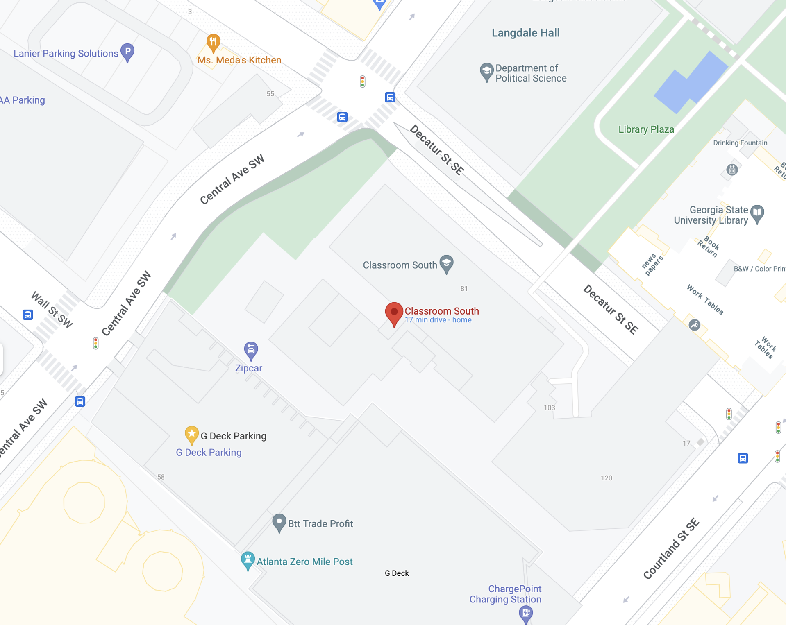
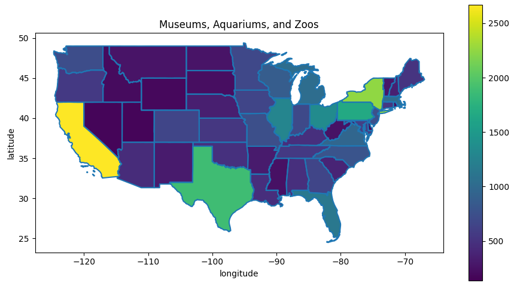

[comment]: # (THEME = pdsp)
[comment]: # (CODE_THEME = base16/zenburn)

### Practical Data Science with Python

# 7f. Working with Geographical Data

[comment]: # (!!!)

## GIS is deep

- ESRI
- ArcGIS
- Mapbox
- CartoDB
- Google Maps 

[comment]: # (!!!)

## Locations are latitude, longitude

33.7525081,-84.3879076

 

No one uses minutes, seconds; Use decimals.

1 minute of latitude is a mile.

[comment]: # (!!!)


## Geocoding and reverse geocoding?

Geocoding: You have address, want lat/lon

Reverse geocoding: You have lat/lon, want address

```text
https://maps.googleapis.com/maps/api/geocode/json?<s>&<k>

address=95%20Decatur%20St%20SE%20Atlanta%20GA%2030303
key=ABCDE1234567890ABCDE098775
```

[comment]: # (!!!)

## What you get back

```text
{
"results": [
  { 
 "address_components": [
   {  "long_name": "95",
      "short_name": "95",
      "types": ["street_number"]
    },
      ...],
 "formatted_address":"95 Decatur St SE, Atlanta, GA 30303,USA",
 "geometry": {
     "location": {
         "lat": 33.7525081,
         "lng": -84.3879076
   },
            ...
    ],
    "status": "OK"
}
```

[comment]: # (!!!)

## Distance: Haversine
  
 $\varphi_1$ and $\varphi_2$ are latitudes
 
 $\lambda_1$ and $\lambda_2$ are longitudes 
  
 $\small{2r \arcsin\left(\sqrt{\sin^2\left(\frac{\varphi_2 - \varphi_1}{2}\right) + \cos \varphi_1 \cdot \cos \varphi_2 \cdot \sin^2\left(\frac{\lambda_2 - \lambda_1}{2}\right)}\right)}$
  
  The radius of the earth is 6371 km.

[comment]: # (!!!)

## Tables of Geo Data

geopandas + shapely

Draws maps, deals with projections, boundaries, distances

 

[comment]: # (!!!)

## Folium

Wraps leaflet.js, generates HTML

[Demo](https://colab.research.google.com/drive/1qslYXFB0p7_GMjV_KRhHrzZwBdo5zk7e?usp=sharing)

[comment]: # (!!!)

# Questions?

