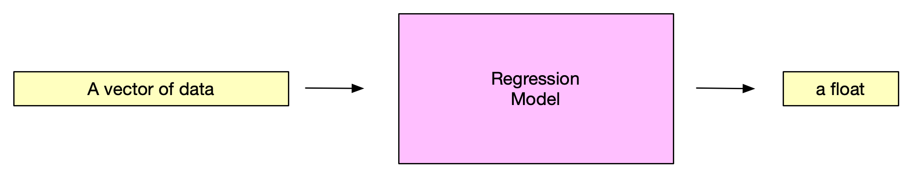
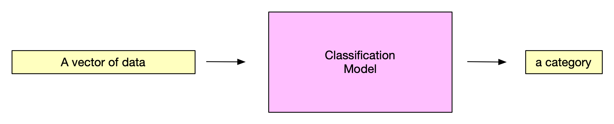
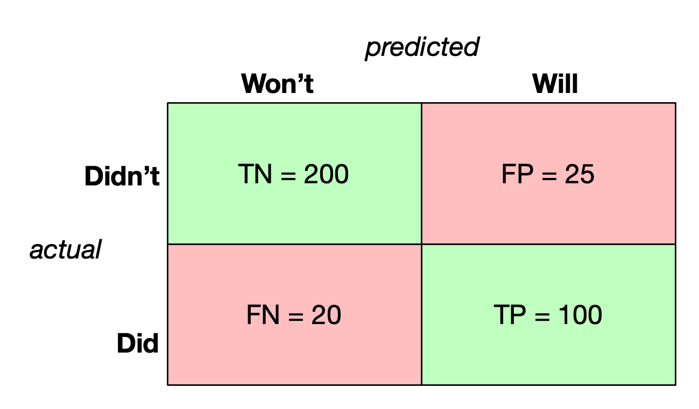
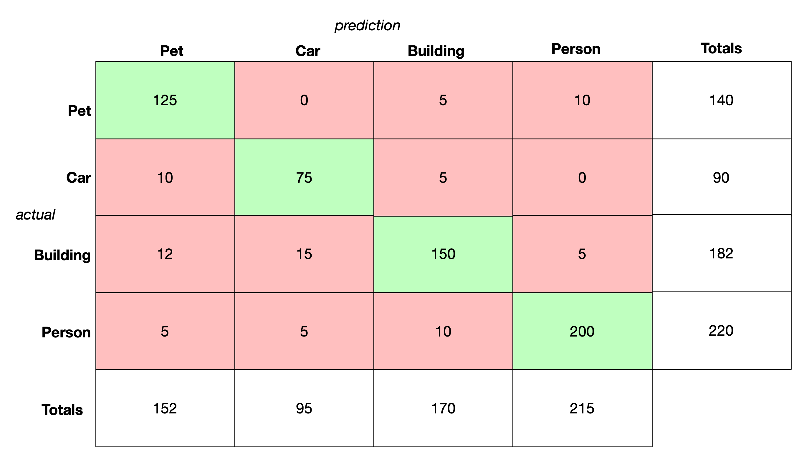
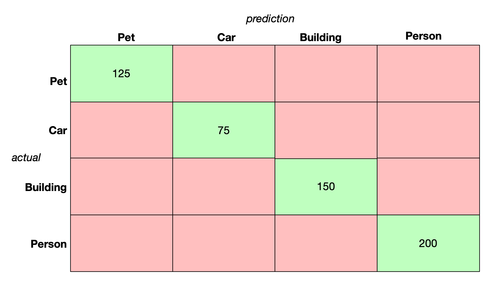
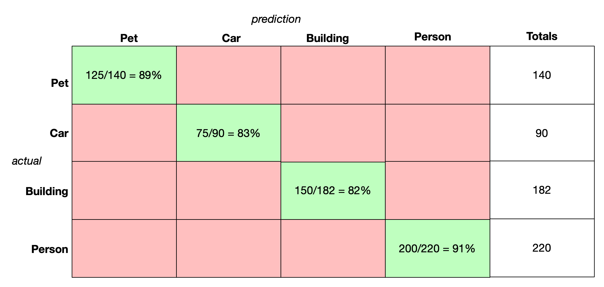
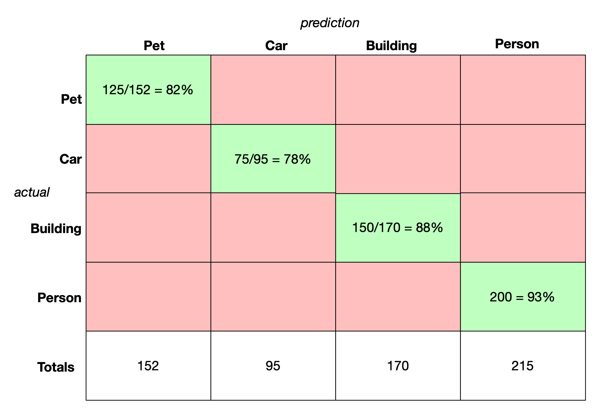
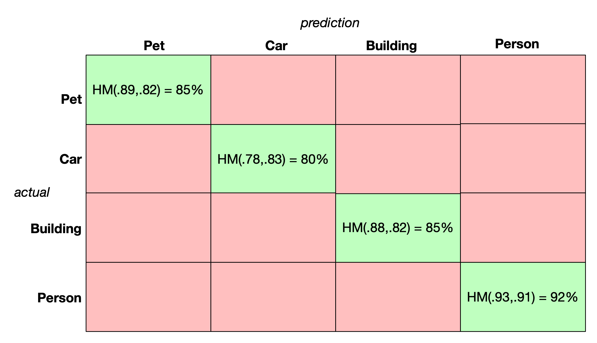

[comment]: # (THEME = pdsp)
[comment]: # (CODE_THEME = base16/zenburn)

### Practical Data Science with Python

# 7f. Classification

[comment]: # (!!!)

## Regression

 

- Is it good? Look at residual.
- Examples: Linear regression and neural nets

[comment]: # (!!!)

## Classification

 

- Is it good? Look at confusion matrix.
- Examples: Decision trees, K-nearest neighbor 

[comment]: # (!!!)

## Classifiers

Binary: "Is it or isn't it?"

Multi-class: "Which of these 15 possibilities is it?"

[comment]: # (!!!)

## Binary Confusion Matrix

"Will this patient have a stroke in the next year?"

**Inputs:** blood_pression, is_smoker, age, etc.

**Output:** Will/won't have a stroke in the next year.

 

N = 365

[comment]: # (!!!)

## Summarizing Error: Accuracy

### "How often is it correct?"

### Accuracy = $\frac{TP + TN}{N} = \frac{100 + 200}{365} \approx 82\\%$

 

[comment]: # (!!!)

## Summarizing Error: Recall

### "When actually True, how often does predicted True?"

### Accuracy = $\frac{TP}{\text{Actual True}} = \frac{100}{120} \approx 83.3\\%$

 

[comment]: # (!!!)

## Summarizing Error: Precision

### "When its predicts True, how often is actually True?"

### Precision = $\frac{TP}{\text{Predicted True}} = \frac{100}{125} \approx 80\\%$

 

[comment]: # (!!!)

## Recall vs. Precision

The usual trade-off:

- For 100% recall: model says "True" always

- For 100% precision: model says "False" always

Spam detector: True means it is spam.  High recall or high precision?

[comment]: # (!!!)

## F1 score

### F1: harmonic mean of recall and precision

### $F1 = \frac{2 (\text{recall} )( \text{precision})} {\text{recall} + \text{precision}} \approx 81.6\\%$

[comment]: # (!!!)

## Other summaries

**Misclassification rate** $= 1 - accuracy \approx 8\\%$

**False positive rate** = $\frac{FP}{FP + TN} = \frac{25}{225}$

**False negative rate** = $\frac{FN}{FN + TP} = \frac{20}{120}$

 

[comment]: # (!!!)

## Multiclass Confusion Matrix

### "What is this a photo of?"

 

N = 632

[comment]: # (!!!)

## Multiclass Accuracy

### Accuracy = $\frac{\text{correct}}{N} = \frac{125 + 75 + 100 + 200}{632} \approx 95\\%$

 

[comment]: # (!!!)

## Multiclass Recall

### "When actually X, how often does it predict X?"

 

[comment]: # (!!!)

## Multiclass Precision

### "When predicted X, how often was it really X?"

 

[comment]: # (!!!)

## Multiclass F1

### $F1 = \frac{2 (\text{recall})(\text{precision})} {\text{recall} + \text{precision}}$

 
 

 

[comment]: # (!!!)

## Training vs Test Data

- **Good model:** training = 97%, test = 91%
- **Poor generalization:** training = 97%, test = 45%
- **Poor model/fit:** training = 59%, test = 45%

[comment]: # (!!!)

# Questions?

