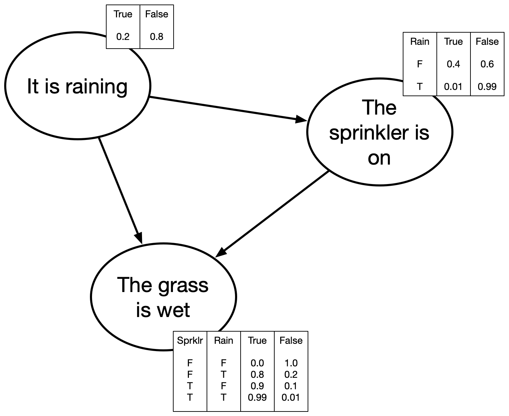
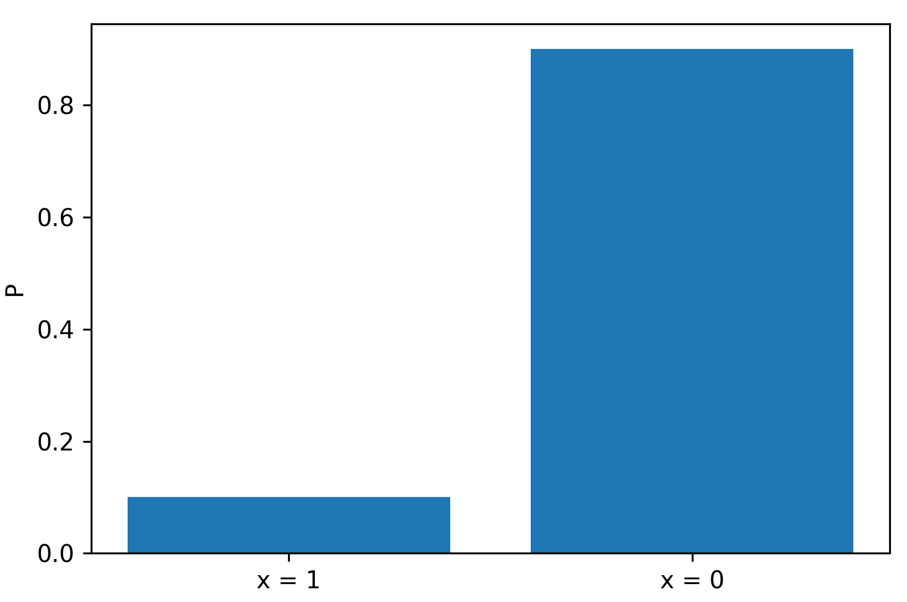
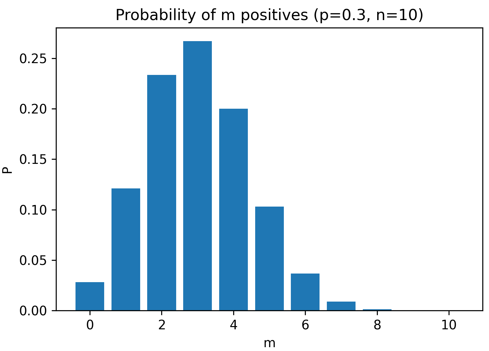

[comment]: # (THEME = pdsp)
[comment]: # (CODE_THEME = base16/zenburn)

### Practical Data Science with Python

# 8. Discrete Probability

[comment]: # (!!!)

# Quiz

### on iCollege

[comment]: # (!!!)


# Do your own work

### Struggle is part of the plan

[comment]: # (!!!)


## Notation for Discrete Probability

### $x \in X$

### $0 \leq P(x) \leq 1$

### $\sum_{x \in X} P(x) = 1$

[comment]: # (!!!)


## Joint Probability

### $x \in X, y \in Y$

### $P(x, y)$

[comment]: # (!!!)


## Conditional Probability

### $x \in X, y \in Y$

### $P(x | y) = \frac{P(x, y)}{P(y)}$

### $P(x, y) = P(x | y)P(y)$

### $P(x) = \sum_{y \in Y} P(x | y) P(y)$

[comment]: # (!!!)


## Indepedence

### $P(x, y) = P(x) P(y)$

### $P(x) = P(x | y)$

[comment]: # (!!!)

## Practice

### Probability of rolling die 7 times without ever rolling a 3?

[comment]: # (!!!)


## Practice

Odds of rolling die 7 times without ever rolling a 3?
 
$\left(\frac{5}{6}\right)^7 \approx 30\\%$

[comment]: # (!!!)

## Expectation

You have a function $f$ and a random variable $X$.  Expectation of $f$ over $X$ is

### $E_X(f) = \sum_{x \in X} f(x) p(x)$

I will pay you what ever you roll on the die.  What do you expect?

$(1)\left(\frac{1}{6}\right) + (2)\left(\frac{1}{6}\right) + (3)\left(\frac{1}{6}\right) + (4)\left(\frac{1}{6}\right)$

$ + (5)\left(\frac{1}{6}\right) + (6)\left(\frac{1}{6}\right) = 3.5$

[comment]: # (!!!)


## Inference: Thomas Bayes

English minister who died in 1761.

Richard Price published it. (Laplace?)

### $P(x | y) = \frac{P(y | x) P(x)}{P(y)}$

[comment]: # (!!!)


## Evidence + Belief

- GSU tests students for a disease.

- False positive rate = 1%, False negative 2%

- You get a positive result.

How likely is it that you actually have the disease?

[comment]: # (!!!)


## Evidence + Belief

GSU tests students for a disease.

False positive rate = 1%

Disease present in 0.01% of population.

### $P(d = True | +) = \frac{P(+ | d = True) P(d = True)}{P(+)}$

### = $\frac{(.98)(0.0001)}{ (0.98)(0.0001)+ (0.01)(0.999)} \approx 1\\%$

[comment]: # (!!!)


## Bayes again

### $P(d_0 | +) = \frac{P(+ | d = True) P(d = True)}{P(+)}$

### $P(d_0 | +) = \frac{P(+ | d_0) P(d_0)}{\sum_{d \in D} P( + | d) P(d)}$

### $P(d_0 | +) \propto P(+ | d_0) P(d_0)$

[comment]: # (!!!)

- Die D is thrown, value $d$ is note by croupier
- Die R is thrown repeatedly to get $r$. Croupier announces:
	- "L" if r < d
	- "E" if r = d
	- "H" if r > d

- Base odds on entire sequence $T = [H, E, H, L, E, \ldots]$
- At any moment what is your best guess?
- How confident are you?

[comment]: # (!!!)

## We want the posterior

### $P(d=x | T) = \frac{P( T | d=x)P(d=x)}{P(T)}$

[comment]: # (!!!)


## The Prior

### $P(d=1) = P(d=2) = \ldots = P(d=6) = \frac{1}{6}$

[comment]: # (!!!)

## Likelihood: T = [H, H, L]

$P(T | d=1) = 0$

$P(T | d = 2) =  \left(\frac{4}{6}\right)^2 \left(\frac{1}{6}\right) \approx 0.074$

$P(T | d = 3) =  \left(\frac{3}{6}\right)^2 \left(\frac{2}{6}\right) \approx 0.083$

$P(T | d = 4) =  \left(\frac{2}{6}\right)^2 \left(\frac{3}{6}\right) \approx 0.056$

$P(T | d = 5) =  \left(\frac{1}{6}\right)^2 \left(\frac{4}{6}\right) = 0.019$

$P(T | d = 6) =  0$


[comment]: # (!!!)


## Marginal Likelihood: P(T) 


### $P(T) = \sum_{d_0 \in D} P(T | d = d_0) P(d = d_0)$

### $= \frac{1}{6}\left(\left(\frac{4}{6}\right)^2 \left(\frac{1}{6}\right) + \left(\frac{3}{6}\right)^2 \left(\frac{2}{6}\right) + \left(\frac{2}{6}\right)^2 \left(\frac{3}{6}\right) + \left(\frac{1}{6}\right)^2 \left(\frac{4}{6}\right)\right)$

### $\approx 0.039$

[comment]: # (!!!)

## Posterior: T = [H, H, L]

### $P(d=x | T) = \frac{P( T | d=x)P(d=x)}{P(T)}$


$P(d=1 | T) = 0$

$P(d = 2 | T) = 32\\%$

$P(d = 3 | T ) = 36\\%$

$P(d = 4 | T ) = 24\\%$

$P( d = 5 | T) =  8\\%$

$P(d = 6 | T) =  0$


[comment]: # (!!!)

## Spreadsheet

[Google Sheet](https://docs.google.com/spreadsheets/d/1ZAUCdRUI2EfFdXyYsT1y085dKmVETaJNURtyGQoWvNA/edit?usp=sharing)

[comment]: # (!!!)


## Bayes Nets

 

[comment]: # (!!!)


## Dealing with really small numbers

### $v = \left(\frac{1}{60} \right)^{20} \left(\frac{3}{127} \right)^{12}$ 

[comment]: # (!!!)

## Dealing with really small numbers

### $v = \left(\frac{1}{60} \right)^{20} \left(\frac{3}{127} \right)^{12}$ 


### $\log(v) = -20 \log{60}  + 12 \left(\log{3} - \log{127} \right)$

### Need a result? $v = e^{\log{v}}$


### Maximizing $f(x)$ is the same as maximizing $\log(f(x))$

[comment]: # (!!!)

## One more trick for small numbers

```python
my_probs = ...
normalized_probs = my_probs / np.sum(my_probs)
```

```python
my_log_probs = ...
my_probs = np.exp(my_log_probs - np.max(my_log_probs))
normalized_probs = my_probs / np.sum(my_probs)
```
[comment]: # (!!!)

## The Bernoulli distribution

### $P(x = 1) = p$

### $P(x = 0) = 1 - p$

 

[comment]: # (!!!)

## The binomial distribution

How many positives should we expect in a run of n?

### $P(x = m) = \binom{n}{m} p^m (1 - p)^{n - m}$

 

[comment]: # (!!!)

## Other discete distributions

- Multinomial
- Poisson
- Hypergeometric
- Negative Binomial
- Geometric

[comment]: # (!!!)


# Questions?

