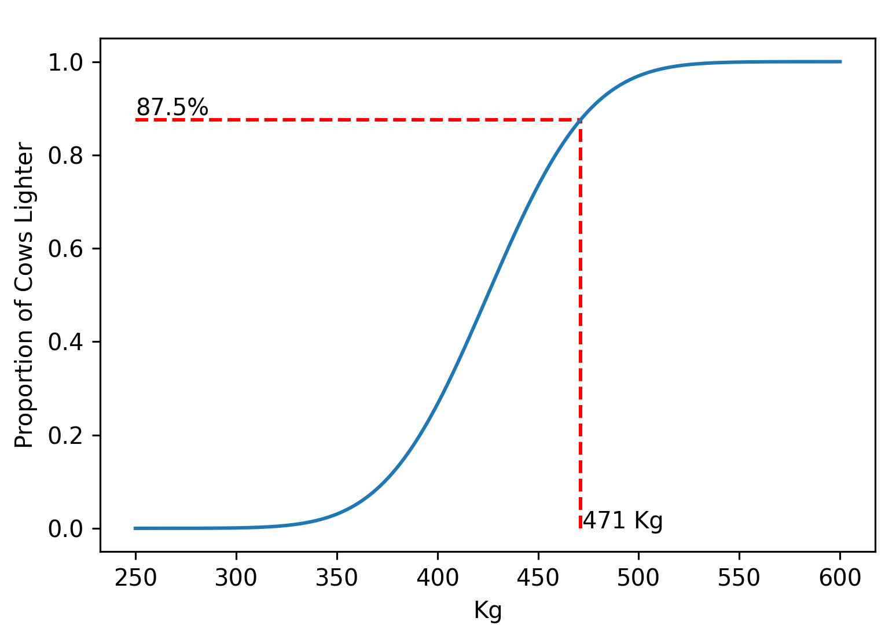

[comment]: # (THEME = pdsp)
[comment]: # (CODE_THEME = base16/zenburn)

### Practical Data Science with Python

# 8. Continuous Probability

[comment]: # (!!!)

## Cow weight

$c = [412.9, 472.2, \ldots, 397.9]$

## $\bar{c} = \frac{\sum_{i = 1}^n c_i}{n}$

## $\sigma^2 = \frac{\sum_{i = 1}^n \left(c_i - \bar{c} \right)^2}{n}$

[comment]: # (!!!)

## Cumulative Density Function

"This cow is heavier than 87.5% of all other cows!"

 

[comment]: # (!!!)

## Cumulative Density Function

"What percentage weigh between 410 and 420 Kg?"

 

[comment]: # (!!!)

## Probability Density Function

 

[comment]: # (!!!)

## Probability Density Function

### $\int_{-\infty}^{\infty} p(x) dx = 1$

### $p(x) \geq 0$ for all $x$

 

[comment]: # (!!!)

## Mean, Mode, Median

### mean: $\int_{-\infty}^{\infty} x \left(p(x)\right) dx$

### mode: $\operatorname{argmax}{p(x)}$

### median: $m$ such that $\int_{-\infty}^{m} p(x) dx = \frac{1}{2}$

 

[comment]: # (!!!)

## Normal (Gaussian) distribution

### $\frac{1}{\sigma \sqrt{2\pi} } e^{-\frac{1}{2}\left(\frac{x-\mu}{\sigma}\right)^2}$

### $\mu$ is the mean/mode/median, $\sigma^2$ is variance

 

[comment]: # (!!!)

## Uniform distribution

### From $a$ to $b$: $\frac{1}{b - a}$

 

[comment]: # (!!!)

## Generate samples for any distribution

### Feed uniform(0,1) into inverse of CDF

 

[comment]: # (!!!)

# Questions?

