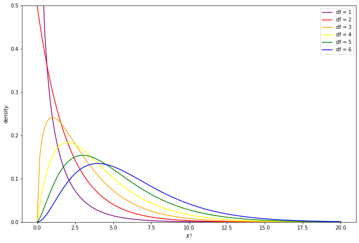

[comment]: # (THEME = pdsp)
[comment]: # (CODE_THEME = base16/zenburn)

### Practical Data Science with Python

# 8c. Testing for independence of Categorical Variables

[comment]: # (!!!)

## Example

From 2012 General Social Survey

|  Income  |  Not Happy  |  Pretty Happy  | Very Happy | Total |
| ---------|-------------|----------------|------------|-------|
| **Above avg** | 29          | 178            | 135        | **342**   |
| **Average**  | 83          | 494            | 277        | **854**   |
| **Below avg**| 104         | 314            | 119        | **537**   |
| **Total**    | **216**     | **986**        | **531**    | **1,733** |

Is happiness independent of income?

[comment]: # (!!!)

## Compare percentages

|  Income  |  Not Happy  |  Pretty Happy  | Very Happy |
| ---------|-------------|----------------|------------|
| **Above avg** | 8%        | 52%            | 39%     |
| **Average**  | 10%         | 58%           | 32%     |
| **Below avg**| 19%         | 58%           | 22%     | 
| **All**      | **12%**     | **57%**   | **31%**     | 

[comment]: # (!!!)


## Independence

#### $P(X | Y) = P(X)$

Example: "The probability of a rich person being very happy is the same as the probability of any person being very happy."

|  Income  |  Not Happy  |  Pretty Happy  | Very Happy |
| ---------|-------------|----------------|------------|
| **Above avg** | 12%        | 57%            | 31%     |
| **Average**  | 12%         | 57%           | 31%     |
| **Below avg**| 12%         | 57%           | 31%     | 
| **All**      | **12%**         | **57%**   | **31%**     | 

[comment]: # (!!!)


## Expected values (if independent)


|  Income  |  Not Happy  |  Pretty Happy  | Very Happy | Total |
| ---------|-------------|----------------|------------|-------|
| **Above avg** | 29          | 178            | 135        | **342**   |
| Expected | 42.6          | 194.6            | 104.8        |   |
| **Average**  | 83          | 494            | 277        | **854**   |
| Expected  | 106.4          | 485.9           | 261.7        |   |
| **Below avg**| 104         | 314            | 119        | **537**   |
| Expected| 66.9        | 305.5            | 164.5        |    |
| **Total**    | **12%**     | **57%**        | **31%**    | **1,733** |

[comment]: # (!!!)

## Expected values in python

```python
observed_matrix = np.array([[29, 178, 135], 
                            [83, 494, 277], 
                            [104, 314, 119]])
group_totals = np.sum(observed_matrix, axis=1)
cat_totals = np.sum(observed_matrix, axis=0)
expected_proportions = cat_totals/np.sum(cat_totals)
expected_matrix = np.outer(group_totals, expected_proportions)
print(expected_matrix)
```

```text
[[ 42.62665897 194.58280439 104.79053664]
 [106.44200808 485.8880554  261.66993653]
 [ 66.93133295 305.52914022 164.53952683]]
```

[comment]: # (!!!)

## $X^2$ statistic

A measure of difference between expected and observed.

#### $X^2 = \sum \frac{ \left(\text{observed} - \text{expected} \right)^2 }{ \text{expected} } $

For example: $X^2 = 54$

Does that prove "not independent"?

[comment]: # (!!!)

## $X^2$ statistic in Python

```python
numerator = np.square(observed_matrix - expected_matrix)
x2 = np.sum(numerator/expected_matrix)
print(x2)
```

```text
54.04307787750451
```

[comment]: # (!!!)


## Degrees of freedom

Bigger tables tend to toward larger $X^2$

#### $df = (r - 1)(c - 1)$

For example: $(3 - 1)(3 - 1) = 4$

[comment]: # (!!!)

## $X^2$ distribution

 


- Mean is $df$
- Standard deviation is $\sqrt{df}$

Is 54 unusually large?  $p$ test!


[comment]: # (!!!)


## $p$ test


Is 54 unusually large?  $p$ test!

Find the area under $X^2$ distribution beyond 54.

```python
from scipy.stats import chi2

p_less = chi2.cdf(x2, 4)
p = 1.0 - p_less
print(p)
```

```text
5.154499049808692e-11
```
Almost certainly *not* independent!

[comment]: # (!!!)

## The easy way

```python
from scipy.stats import chisquare

result = chisquare(observed_matrix.flatten(), 
                   expected_matrix.flatten(), 4)
print(result.statistic, result.pvalue)
```

[comment]: # (!!!)

## Fisher's Exact Test

Only reasonable when you have a lot of samples.

Lets than 5 samples for a category? Try something else.

2 x 2 table? Fisher's Exact Test

```python
from scipy.stats import fisher_exact

table = np.array([[3, 1], [1,3]])
result = fisher_exact(table, 'greater')
print(result)
```

```text
(9.0, 0.24285714285714263)
```

[comment]: # (!!!)


## General Permutation Test

Small number of samples? Not a 2 x 2 table? Permutation Test

Beyond the scope of this class.

[comment]: # (!!!)


# Questions?

