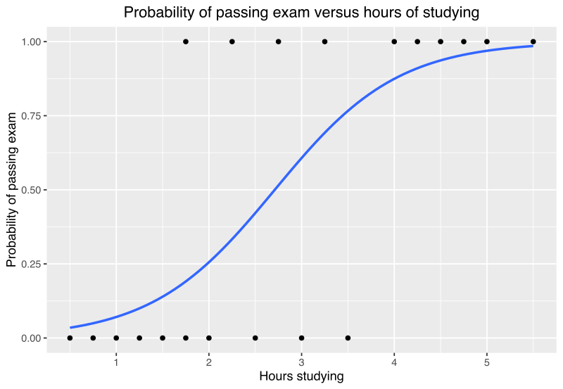
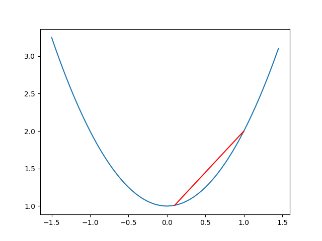

[comment]: # (THEME = pdsp)
[comment]: # (CODE_THEME = base16/zenburn)

### Practical Data Science with Python

# 11. Classification with Logistic Regression

[comment]: # (!!!)

## Homework: long_dice.py

```python
# Bayes rule: the posterior is proportional 
# to the likelihood times the prior
unnormalized_posteriors = ## Your code here
```
Right:
```python
# Get the log of the priors
log_priors = np.log(priors)
...
unnormalized_log_posteriors = log_likelihoods + log_priors
```
What I got:
```python
unnormalized_posteriors = likelihoods
```

[comment]: # (!!!)

## Linear regression

### $ \hat{y} = \beta_0 + \beta_1 x_1 + \ldots + \beta_d x_d$


[comment]: # (!!!)

## Binary classification


| hours_studying |  passed |
-----------------|----------|
|  1   |   0   |
|   1.75  |    1  |
|   2  |    0  |
|  4.5  |   1  |
|   5  |    1  |
|   5.5  |    1  |


### $p(passed=1 | hours studying = 3) = ?$        

[comment]: # (!!!)

## Limit to [0,1]


| hours_studying |  passed |
-----------------|----------|
|  1   |   0   |
|  4.5  |   1  |
|   2  |    0  |


### $p(x) = S(\beta_0 + \beta_1 x_1)$
        

[comment]: # (!!!)


## Sigmoid function

### $S(t) = \frac{1}{1 + e^{-x}}$

 

### $S(t) = 1 - S(-t)$

### $S'(t) = S(t)\left( 1 - S(t) \right)$

[comment]: # (!!!)


## Logistic Regression again

### $p(x) = S\left(\beta_0+\beta_1 x_1\right)$

 

[comment]: # (!!!)


## Logistic Regression expanded

### $p(x) = \frac{1}{1+e^{-\left( \beta_0+\beta_1 x_1 \right)}}$

 

[comment]: # (!!!)


## Loss Function

### Linear regression? Sum of squared error.


### Logistic regression? Cross entropy!

### $J = \frac{1}{N}\sum_{i = 1}^{N} \left(-y_i \ln \hat{y_i} - (1 - y_i) \ln (1 -\hat{y_i}) \right)$

[comment]: # (!!!)


## Cross Entropy

### $-y \ln p - (1 - y) \ln (1 - p)$

|$y$ | $p$ | $-y \ln p$ | $-(1 - y) \ln (1 - p)$ | sum |
| :----: | :----: | :----: | :----: | :----: |
|  0       |     0.001   |   0     |    .001  |  0.001 |
|  1       |     0.999   |   0.001     |     0  | 0.001 |
|  0       |     0.999   |   0     |   6.9 |  6.9 |
|  1       |     0.001   |  6.9  | 0    | 6.9 |


[comment]: # (!!!)

## Convex functions

 

### A local minimum is global minimum.

[comment]: # (!!!)

## Multiple inputs

| hours_studied | hours_lost_sleep | percent_prereqs |  y |
| :----: | :----: | :----: | :----: |
|4       | 1      |   90   | 1      |
|1       | 5      |   10   | 0      |
|3       | 3      |   50   | 1      |
|3       | 3      |   50   | 0      |

### $p(x) = S\left(\beta_0+\beta_1 x_1 + \ldots + \beta_d x_d\right)$


[comment]: # (!!!)


## Solving Logistic Regression

### Uses an iterative approach (like gradient descent)

### Always standardize your inputs!
[comment]: # (!!!)


# Demo

### [Colab](https://colab.research.google.com/drive/14UDVWbGxuGr0dNlXRtkK_vdU7zGk6sGo)


[comment]: # (!!!)

# Questions?

