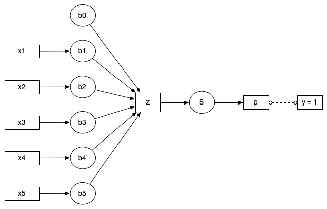
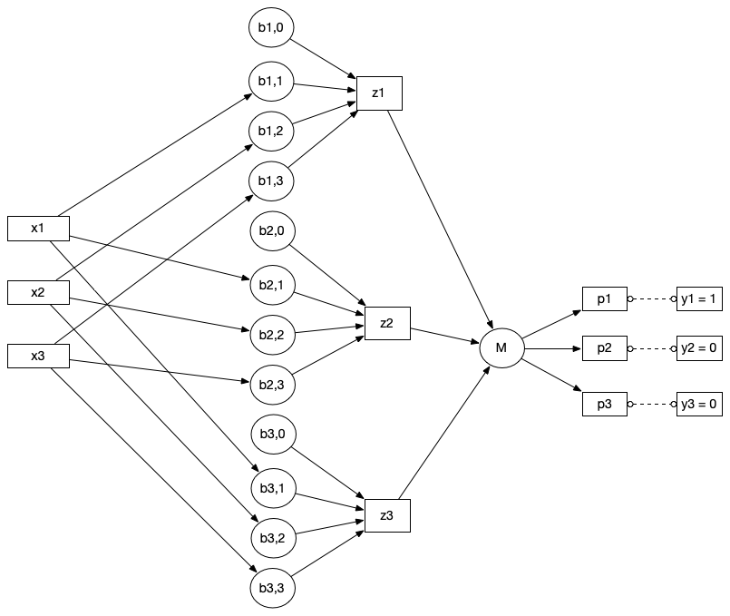

[comment]: # (THEME = pdsp)
[comment]: # (CODE_THEME = base16/zenburn)

### Practical Data Science with Python

# 11b. Softmax

[comment]: # (!!!)

## Logistic Regression

 

### $z = \beta_0 + \beta_1 x_1 + \ldots + \beta_d x_d$

### $p = \frac{1}{1 + e^{-z}}$

[comment]: # (!!!)

## Multi-class?

 

[comment]: # (!!!)

## Softmax!

### $p_i = \frac{e^{z_i}}{\sum_{j=1}^K e^{z_j}}$

[comment]: # (!!!)

## Softmax in python

```python
def softmax(z):
    shifted_z = z - np.max(z)
    exps = np.exp(shifted_z)
    return exps / np.sum(exps)
```


[comment]: # (!!!)


## Gradient of softmax

### $p_j = \frac{e^{z_j}}{\sum_{k=1}^K e^{z_k}}$


### If $i = j$: $\frac{\partial p_i}{\partial z_j} = p_i \left(1 - p_i)\right)$

### If $i \neq j$: $\frac{\partial p_i}{\partial z_j} = -p_i p_j$

[comment]: # (!!!)

## Cross Entropy for multiclass

### $J = - \sum_{i = 1}^K y_i \ln(p_i)$

[comment]: # (!!!)

## Gradient of softmax with cross entropy loss

### $\frac{\partial J}{\partial z_j}= p_i - y_i$

[comment]: # (!!!)

## Multinomial Logistic Regression in Python

```python
model = LogisticRegression(multi_class='multinomial')
```
[comment]: # (!!!)


# Demo

### [Colab](https://colab.research.google.com/drive/1iOzTEvQB4g8SIextJeDyvueXFBpLBJr4?usp=sharing)


[comment]: # (!!!)


# Questions?

[comment]: # (!!!)
