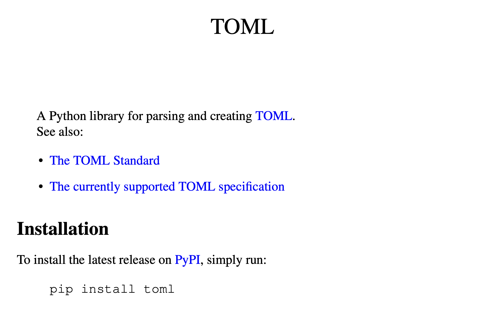
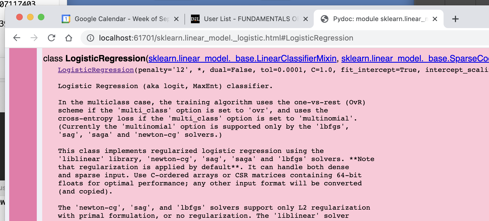

[comment]: # (THEME = pdsp)
[comment]: # (CODE_THEME = base16/zenburn)

### Practical Data Science with Python

# 11c. Stylish Python

[comment]: # (!!!)


## DRY! (Don't Repeat Yourself)

- Blocks of code repeated? Use functions

- Step repeated? Use loops

- Several similar variables? Use a dictionary

[comment]: # (!!!)

## Files shouldn't get too long

- Harder to read

- Harder to reuse

- And git...

[comment]: # (!!!)

# Use black

[comment]: # (!!!)

## Don't reinvent the wheel

- Reading a CSV is harder than you think
- Modern programmers read docs

[comment]: # (!!!)

## Use assert

Stops execution with message

```python
result = do_something()
assert result > 0, f"Error: do_something returned {result}!"
```

To run without checks:
```text
python -O mycode.py
```
[comment]: # (!!!)

## Give default values in functions

```python
def normalize(v, safe_method=True):
```
[comment]: # (!!!)

## Include README.rst

Like markdown

```text
****
TOML
****

A Python library for parsing and creating `TOML <https://en.wikipedia.org/wiki/TOML>`_.

See also:
* `The TOML Standard <https://github.com/toml-lang/toml>`_
* `The currently supported TOML specification <https://github.com/toml-lang/toml/blob/v0.5.0/README.md>`_

Installation
============
To install the latest release on `PyPI <https://pypi.org/project/toml/>`_,
simply run:
::
  pip install toml
```
[comment]: # (!!!)

## README.pdf

```text
> pip3 install docutils
> rst2latex README.rst > README.tex
> pdflatex README.tex
```

 

[comment]: # (!!!)


## Type hints

Pretty new (3.5)

```python
from typing import List
Vector = List[float]

def scale(scalar: float, vector: Vector) -> Vector:
    return [scalar * num for num in vector]
```
[comment]: # (!!!)

## Docstrings

```python
def add_binary(a, b):
    '''
    Returns the sum of two decimal numbers in binary digits.

            Parameters:
                    a (int): A decimal integer
                    b (int): Another decimal integer

            Returns:
                    binary_sum (str): Binary string of the sum of a and b
    '''
    binary_sum = bin(a+b)[2:]
    return binary_sum
```

```python
print(add_binary.__doc__)
```

[comment]: # (!!!)

## Seeing Docstrings (Terminal)

```text
> pydoc3 pandas.DataFrame

pandas.DataFrame = class DataFrame(...)
 |  pandas.DataFrame(data=None, index: 'Axes | None' = None, columns: 'Axes | None' = None, dtype: 'Dtype | None' = None, copy: 'bool | None' = None)
 |  
 |  Two-dimensional, size-mutable, potentially heterogeneous tabular data.
 |  
 |  Data structure also contains labeled axes (rows and columns).
 |  Arithmetic operations align on both row and column labels. Can be
 |  thought of as a dict-like container for Series objects. The primary
 |  pandas data structure.
```
[comment]: # (!!!)

## Seeing Docstrings (Web)

```text
> pydoc3 -b
```

 

[comment]: # (!!!)

## Use context managers

```python
fd = open('myfile.txt')
try:
	process_file.(fd)
finally:
   fd.close()
```

```python
with open('myfile.txt') as fd:
	process_file.(fd)
```
[comment]: # (!!!)

## Use list comprehensions

```python
numbers = []
for i in range(10):
	numbers.append(do_something(i)) 
```

```python
numbers = [do_something(i) for i in range(10)]
```


[comment]: # (!!!)

# Questions?
