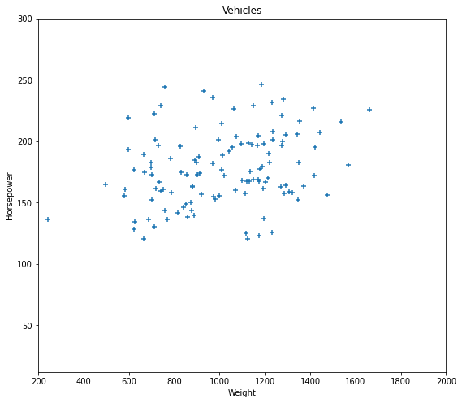
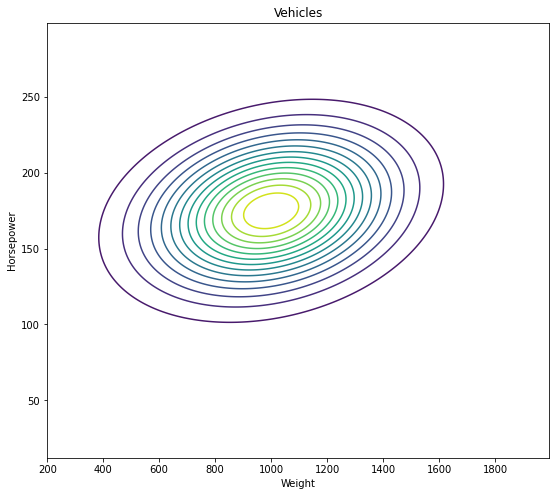
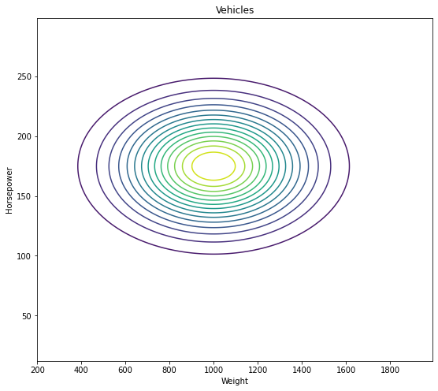
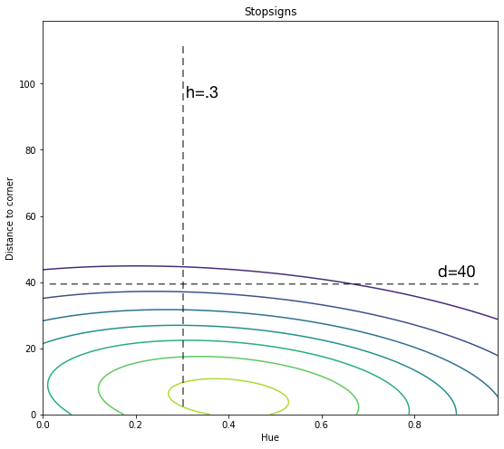

[comment]: # (THEME = pdsp)
[comment]: # (CODE_THEME = base16/zenburn)

### Practical Data Science with Python

# 11d. Bayesian Classifiers

[comment]: # (!!!)


## Review: Joint Probability

### $x \in X, y \in Y$

### $p(x, y)$


 

[comment]: # (!!!)

## Review: Joint Probability Density

### $\int_x \int_y p(x, y) dy dx = 1$


 

[comment]: # (!!!)


## Review: Indepedence

### $p(x, y) = p(x) p(y)$

 

[comment]: # (!!!)


## Street Sign Classification

### Is this sign a stop sign, a commercial sign, or a warning sign?


- $p(y = s) = .2$
- $p(y = c) = .5$
- $p(y = w) = .3$


[comment]: # (!!!)

## How are stop signs placed/colored?

 

### $p(h, d | y=s)$

[comment]: # (!!!)

## All signs?

 

[comment]: # (!!!)


## Review: Bayes' rule

### $P(y | x) = \frac{P(x | y) P(x)}{P(y)}$

### $P(y| x) = \frac{P(x| y) P(x)}{\sum_{x_i \in X} P( y | x_i) P(x_i)}$

### $P(y | x) \propto P(x | y) P(x)$

[comment]: # (!!!)

## Given sign's hue/distance, is it a stop sign?

#### $\vec{x} = [h = .3, d = 40]$  Prior: $p(y = s) = .2$

 

#### Likelihood: $p(\vec{x} | y = s) = 0.0034$

$p(y | \vec{x}) = p(\vec{x} | y = s)p(y = s) = 0.00068$

[comment]: # (!!!)


## Car sees a sign. What is it?

### $\vec{x} = [h = .3, d = 40]$

#### $p(y = s | \vec{x}) \propto p(\vec{x} | y =s) p(y =s)$

#### $p(y = w | \vec{x}) \propto p(\vec{x} | y =w) p(y =w)$

#### $p(y = c | \vec{x}) \propto p(\vec{x} | y =s) p(y =c)$

### Normalize!

[comment]: # (!!!)

## True Bayesian Classifier

- Figure out priors $p(y)$ for every class $y$ ("30% of the signs are stop signs")

- For each class, make function: inputs ($\vec{x}$) in, likelihood of $\vec{x}$ for class $y$.

- Given an $\vec{x}$,  compute $p(\vec{x}|y) p(y)$ for each.

- Scale so they sum to 1.0

[comment]: # (!!!)

## True Bayesian Classifiers Are The Dream! 

### Gives best answer and confidence!

### Very rare: $p(\vec{x}| y)$ is just really difficult to compute as the dimension of $X$ increases

[comment]: # (!!!)

## Naive Bayes

### Assumption: Given a class $y$,  each dimension of $p(\vec{x} | y)$ is independent. That is:

### $p(x_1, x_2, \ldots, x_d | y) = p(x_1 | y) p(x_2 | y) p(x_3 | y) \ldots p(x_d | y)$

### Makes Bayesian classifiers practical in many situations

[comment]: # (!!!)

## Your Homework (data_prep.py)

- Tweets to airlines: negative (0), neutral (1), positive (2)
- Remove stop words and names of airlines
- Save list of 2000 most common words to `word_list.pkl`
- Divide data: `train.py` and `test.py` (10%)

```text
@united I sure did.   I had to drive a total of 3 hours to get 
my own bag.  I'd like to explain that debacle but no one wants 
to talk to me.,0
```

[comment]: # (!!!)

## Your Homework (train.py)

- Read `train.csv` and compute priors: $p(t=0), p(t=1), p(t=2)$
- Make word freqency vector for negative, neutral, positive.
- Save priors and frequency vectors to `frequencies.pkl`
[comment]: # (!!!)

## Word frequency vectors

Vocab: ['flight', 'get', 'cancelled', 'thanks', 'service',...]

#### $c_{0,0} = \frac{\text{# of occurences of 'flight' in negative tweets}}{\text{total common words in negative tweets}}$

#### $c_{2,1} = \frac{\text{# of occurences of 'get' in positive tweets}}{\text{total common words in positive tweets}}$

$ $

$\vec{c_{0}} = [c_{0,0}, c_{0,1}, \ldots, c_{0,1999}]$ sums to 1.0

$\vec{c_{0}}$: word frequences for negative tweets

$\vec{c_{2}}$: word frequences for postive tweets

[comment]: # (!!!)


## Inference

If $u$ is negative, what is probability that $u$ is "cancelled flight cancelled"?

### $p(u | t=0) = \left(c_{0,0}^1 \right)\left(c_{0,1}^0\right)\left(c_{0,2}^2\right)$
### $p(u | t=2) = \left(c_{2,0}^1 \right)\left(c_{2,1}^0\right)\left(c_{2,2}^2\right)$
and
### $p(t=0) \propto p(u | t=0) p(t=0)$
### $p(t=2) \propto p(u | t=2) p(t=2)$

"There is a 78% chance this is a negative tweet."

[comment]: # (!!!)

## Zeros are a big deal

### $p(u | t=0) = \left(c_{0,0}^1 \right)\left(c_{0,1}^1\right)\left(c_{0,2}^2\right)$

So we often "soften" them:

```python
counts[counts==0] = 0.5
```

[comment]: # (!!!)


## Logarithms!

You have a vector $\vec{c}$ and a column vector of word counts $\vec{W}$.  How to safely and quickly compute:

### $p = c_0^{W_0} c_{1}^{W_1} \ldots c_{1999}^{W_{1999}}$

$ $

### $\log{p} = W_0 \log{c_1} + W_1 \log{c_0} + \ldots + W_{1999} \log{c_{1999}}$

$ $

### $\log{p} = \vec{W} \cdot \log{\vec{c}}$

[comment]: # (!!!)

## Matrices!

Three vectors $\vec{c_0}$, $\vec{c_1}$, $\vec{c_2}$ to dot with $\vec{W}$?

Make each $\vec{c}$ the row of a matrix $C$, then

### $p = C W + B$

($p$ is vector of log posteriors (unnormalized), $C$ is matrix of log-likelihoods, $W$ is a vector of word frequencies, $B$ is the priors as a vector)

[comment]: # (!!!)


## Homework test.py

- `train.py` saves the *logarithms* of the frequencies and priors!
- Read in `train.csv` and `frequencies.pkl`
- Count word occurences in a tweet as $W$
- Take the dot product of the log-frequencies and $W$
- Add the log of the prior
- Exponentiate!
- Score (63% are negative, you can get 79%)

[comment]: # (!!!)


# Questions?

