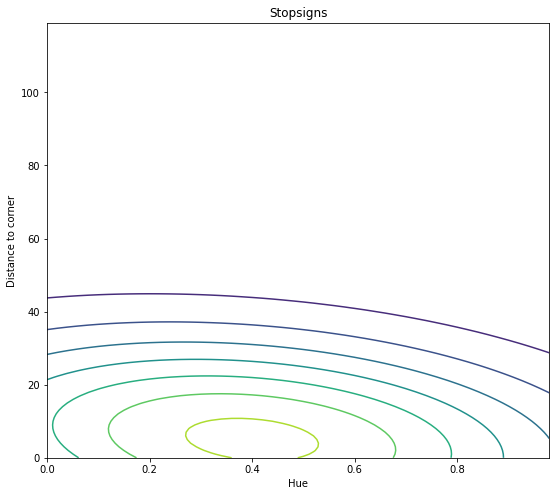

[comment]: # (THEME = pdsp)
[comment]: # (CODE_THEME = base16/zenburn)

### Practical Data Science with Python

# 11d. Bayesian Classifiers

[comment]: # (!!!)

## Review: Joint Probability

### $x \in X, y \in Y$

### $p(x, y)$

 

[comment]: # (!!!)

## Review: Joint Probability Density

### $\int_x \int_y p(x, y) dy dx = 1$

 

[comment]: # (!!!)

## Review: Indepedence

### $p(x, y) = p(x) p(y)$

 

[comment]: # (!!!)

## Street Sign Classification

### Is this sign a stop sign, a commercial sign, or a warning sign?

- $p(y = s) = .2$
- $p(y = c) = .5$
- $p(y = w) = .3$

[comment]: # (!!!)

## How are stop signs placed/colored?

 

### $p(h, d | y=s)$

[comment]: # (!!!)

## All signs?

 

[comment]: # (!!!)

## Review: Bayes' rule

### $P(y | x) = \frac{P(x | y) P(x)}{P(y)}$

### $P(y| x) = \frac{P(x| y) P(x)}{\sum_{x_i \in X} P( y | x_i) P(x_i)}$

### $P(y | x) \propto P(x | y) P(x)$

[comment]: # (!!!)

## Car knows a sign's hue/distance. Stop sign?

#### $h = .3, d = 40$  Prior: $p(y = s) = .2$

 

#### Likelihood: $p(h = .3, d = 40 | y = s) = 0.0034$

#### $p(y | h = .3, d = 40) = p(h = .3, d = 40 | y = s)p(y = s) = 0.00068$

[comment]: # (!!!)

## Car sees a sign. What is it?

### $h = .3, d = 40$

#### $p(y = s | h=.3, d=40) \propto p(h=.3, d=40 | y =s) p(y =s)$

#### $p(y = w | h=.3, d=40) \propto p(h=.3, d=40 | y =w) p(y =w)$

#### $p(y = c | h=.3, d=40) \propto p(h=.3, d=40 | y =s) p(y =c)$

### Normalize!

[comment]: # (!!!)

## True Bayesian Classifier

- Figure out priors $p(y)$ for every class $y$ ("30% of the signs are stop signs")

- For each class, make function: inputs ($x$) in, likelihood of $x$ for class $y$.

- Given an $x$,  compute $p(x|y) p(x)$ for each.

- Scale so they sum to 1.0

[comment]: # (!!!)

## True Bayesian Classifiers Are The Dream! 

### Gives best answer and confidence!

### Very rare: $p(x | y)$ is just really difficult to compute as the dimension of $X$ increases

[comment]: # (!!!)

## Naive Bayes

### Assumption: Given a class $y$,  each dimension of $p(x | y)$ is independent. That is:

### $p(x_1, x_2, \ldots, x_d | y) = p(x_1 | y) p(x_2 | y) p(x_3 | y) \ldots p(x_d | y)$

### Makes Bayesian classifiers practical in many situations

[comment]: # (!!!)

# Questions?

