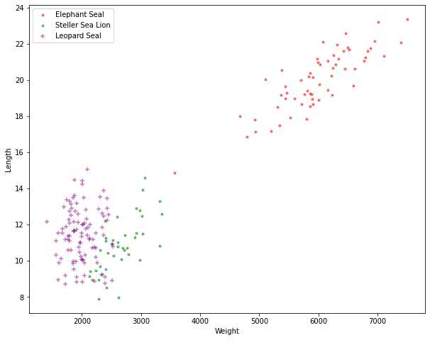

[comment]: # (THEME = pdsp)
[comment]: # (CODE_THEME = base16/zenburn)

### Practical Data Science with Python

# 11f. Gaussian Naive Bayesian Classifiers

[comment]: # (!!!)

## Classifying Seals

- Southern Elephant Seal
- Steller Sea Lion
- Leopard Seal

Using weight and length

 

[comment]: # (!!!)

## The data we have

 

Before weighing and measuring, in this area:

- 30% Elephant Seals
- 20% Steller Sea Lions
- 50% Leopard Seals

[comment]: # (!!!)

## Real Likelihood

Given it is an Elephant Seal, what is the likelihood of a particular weight and length?

#### $p(w, s| y = 1) = ?$

 

#### $\int_{w} \int_{s} p(w, s| y = 1) ds \hspace{1mm} dw = 1.0$

[comment]: # (!!!)

## The Naive Part

We assume:

- Each attribute is normally distributed
- All attributes are independent

 

[comment]: # (!!!)

## Naive Likelihood

Take the mean and standard deviation of each feature:
- Weight of Elephant Seals: mean = 6098, std = 676
- Length of Elephant Seals: mean = 20.2, std = 2.72

 

#### $p(w, s) = p(w) p(s)$

[comment]: # (!!!)

## The Simplification

 

[comment]: # (!!!)

## Solving

For each seal species $i$ and an attribute $j$:
- Find mean ($\mu_{i,j}$) and standard deviation ($\sigma_{i,j}$) 

#### $p(x_j | y_i) = \frac{1}{\sigma_{i,j} \sqrt{2\pi} } e^{-\frac{1}{2}\left(\frac{x-\mu_{i,j}}{\sigma_{i,j}}\right)^2}$

#### $p(y | \vec{x} ) \propto p(x_1 | y_i)p(x_2 | y_i)\ldots p(x_d | y_i)p(y_i)$

#### Normalize!

[comment]: # (!!!)

# Questions?

