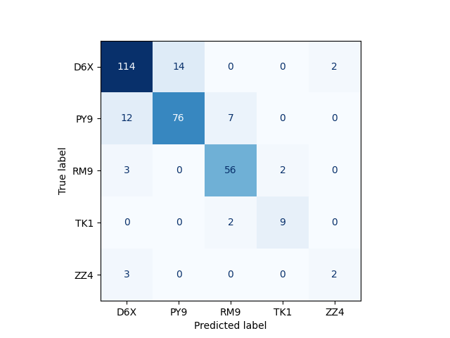
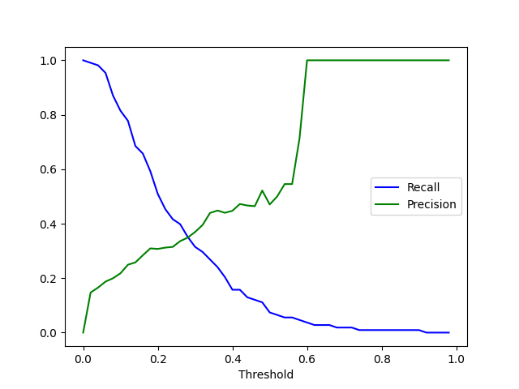
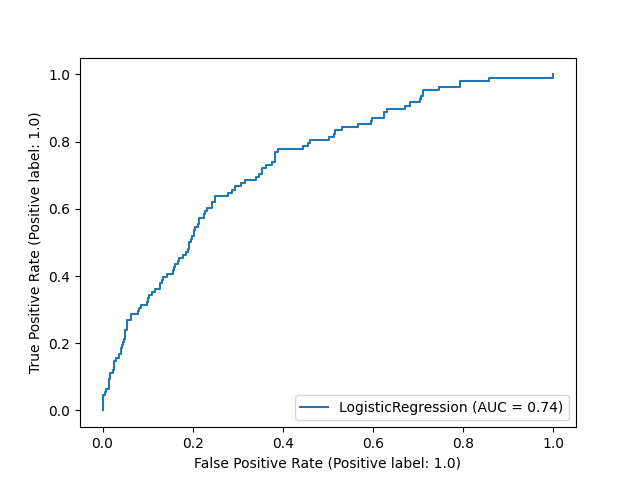
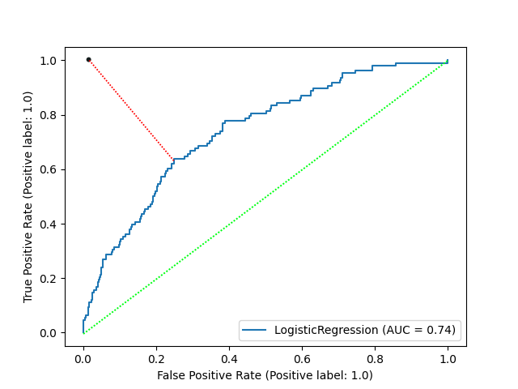
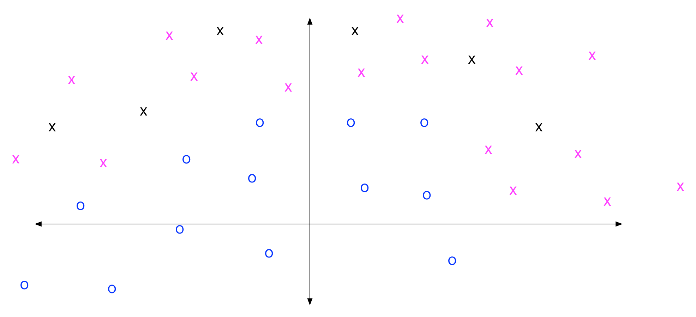

[comment]: # (THEME = pdsp)
[comment]: # (CODE_THEME = base16/zenburn)

### Practical Data Science with Python

# 12. Evaluating Multi-class Classifiers and Sampling for Classification

[comment]: # (!!!)


## Train vs Test vs Validate

- No important hyperparameters?  Just train and test (10 - 40%).

- Hyperparameters? Train, validate, test. Use train/validation data to optimize hyperparameter.

- Or! Just train and test. Use cross-validation on training to optimize hyperparameter.

[comment]: # (!!!)

## Confusion Matrix

 

[comment]: # (!!!)

## Confusion Matrix in python

```python
from sklearn.metrics import confusion_matrix
import matplotlib.pyplot as plt
from sklearn.metrics import ConfusionMatrixDisplay

cm = confusion_matrix(gt, predictions)
cs = ["D6X, PY9", "RM9", "TK1", "ZZ4"]
fig, ax = plt.subplots()
cmd = ConfusionMatrixDisplay(confusion_matrix=cm, 
                                 display_labels=cs)
cmd.plot(ax=ax, cmap="Blues", colorbar=False)
```

 

[comment]: # (!!!)


## Accuracy

### Accuracy = $\frac{\text{right}}{\text{right + wrong}}$

[comment]: # (!!!)

## Precision, Recall, F1 (binary)

### Precision = $\frac{\text{True Positives}}{\text{True Positives} + \text{False Positives}}$

$ $

### Recall = $\frac{\text{True Positives}}{\text{True Positives} + \text{False Negatives}}$

$ $ 

### F1 = $\frac{2 \times \text{Precision} \times \text{Recall}}{\text{Precision} + \text{Recall}}$

[comment]: # (!!!)

## Precision, Recall (multiclass)

```python
for c, label in enumerate(labels):
    precision_rows = (predictions == c)
    recall_rows = (gt == c)
    correct_t_rows = precision_rows & recall_rows
    pred_t_count = precision_rows.sum()
    gt_t_count = recall_rows.sum()
    true_positive_count = correct_t_rows.sum()
    if pred_t_count > 0:
        precision = true_positive_count / pred_t_count
    else:
        precision = np.nan
    if gt_t_count > 0:
        recall = true_positive_count / gt_t_count
    else:
        recall = np.nan
    print(f"{label}: {precision*100.0:.1f}%, {recall*100.0:.1f}%")
```
[comment]: # (!!!)

## Recall vs Precision

From your homework 07

 

[comment]: # (!!!)

## ROC and AUC

"Receiver Operating Characteristics"

 

[comment]: # (!!!)

## Which is best?

- Whatever your boss tells you
- Maximize F1
- Upper left distance
- Youden' J (Maximizes TPR - FPR)

 


[comment]: # (!!!)

## Imbalanced Data

 

```text
302 data points analyzed, 257 correct (85.1% accuracy)
D6X: precision:86.4% recall:87.7%
PY9: precision:84.4% recall:80.0%
RM9: precision:86.2% recall:91.8%
TK1: precision:81.8% recall:81.8%
ZZ4: precision:50.0% recall:40.0%
```

[comment]: # (!!!)

## Undersampling

Throw away data for classes with a lot of examples.

```text
while data_is_imbalanced:
	choose a random data point p from the biggest class
	discard p
```

[comment]: # (!!!)

## Oversampling

Duplicate data for classes with few examples.

```text
while data_is_imbalanced:
	choose a random data point p from the smallest class c
	make a copy of p and add it to c
```

[comment]: # (!!!)

## imblearn


```python
from imblearn.under_sampling import RandomUnderSampler

rus = RandomUnderSampler()
X_smaller, Y_smaller = rus.fit_resample(X, Y)
```

```python
from imblearn.over_sampling import RandomOverSampler

ros = RandomOverSampler()
X_bigger, Y_bigger = ros.fit_resample(X, Y)
```

[comment]: # (!!!)

## Synthesizing data

KMeansSMOTE (2017)


 


[comment]: # (!!!)

## Synthesizing data in python

```python
from imblearn.over_sampling import KMeansSMOTE

oversampler = KMeansSMOTE()
X_bigger, Y_bigger = oversampler.fit_resample(X, Y)
```

 


[comment]: # (!!!)


## Questions?

