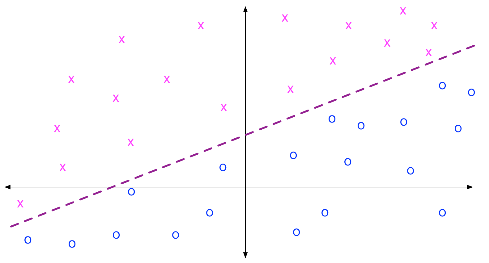
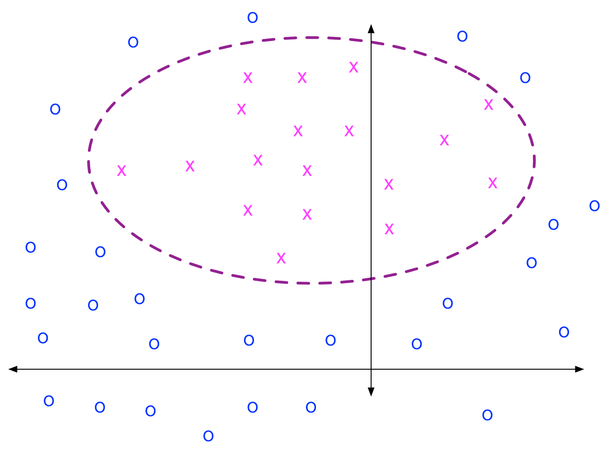
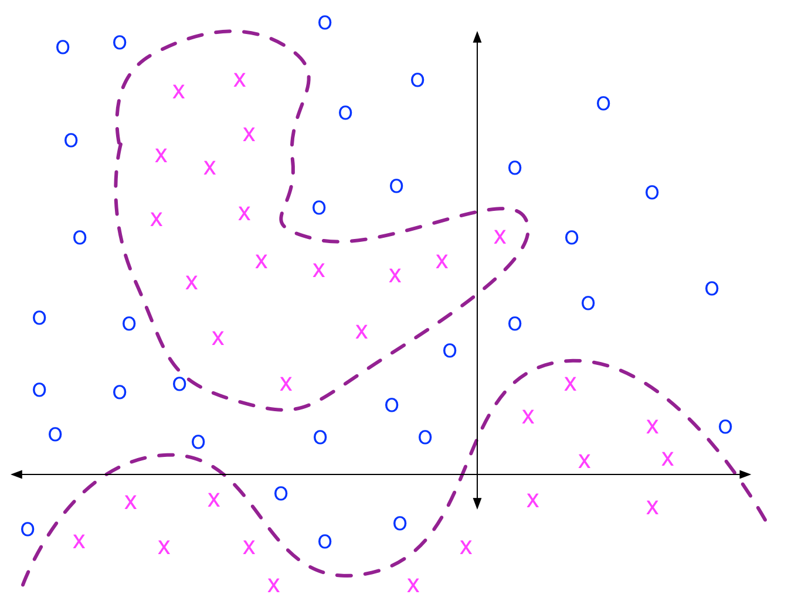
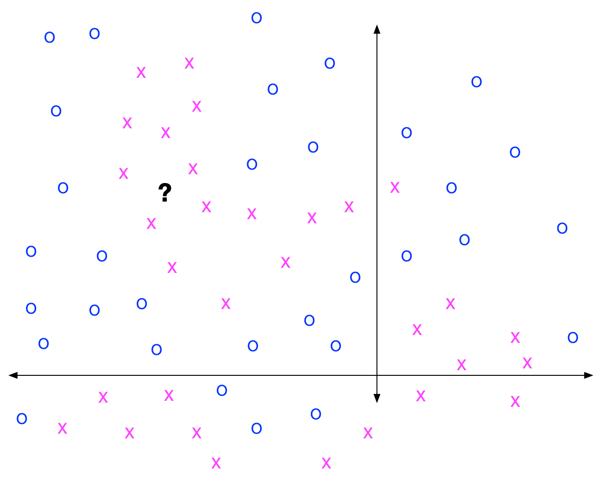
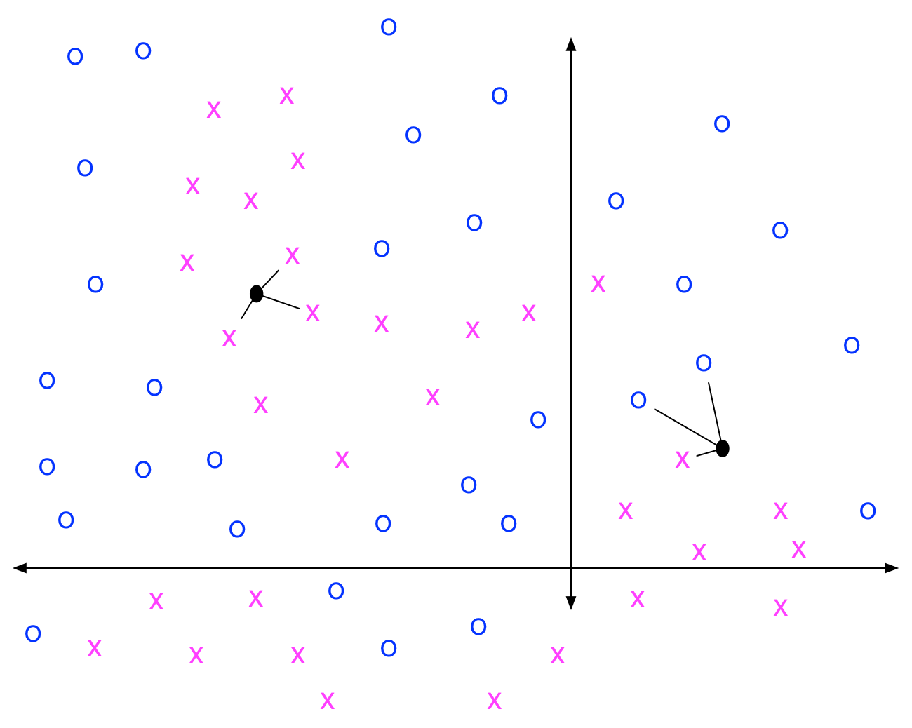
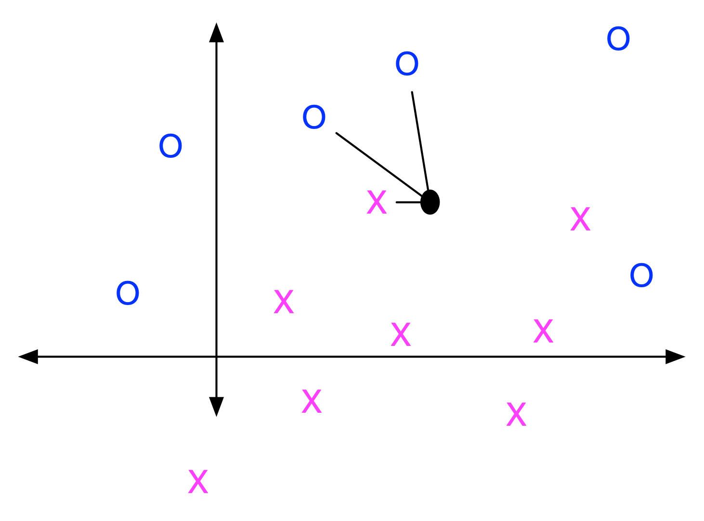
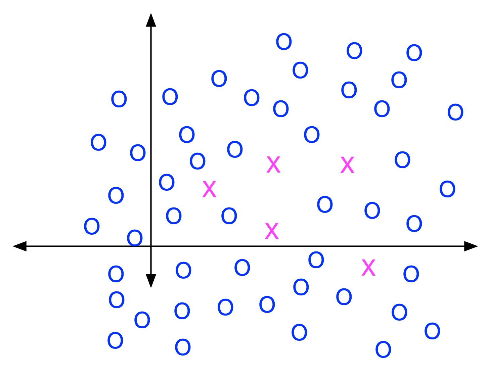
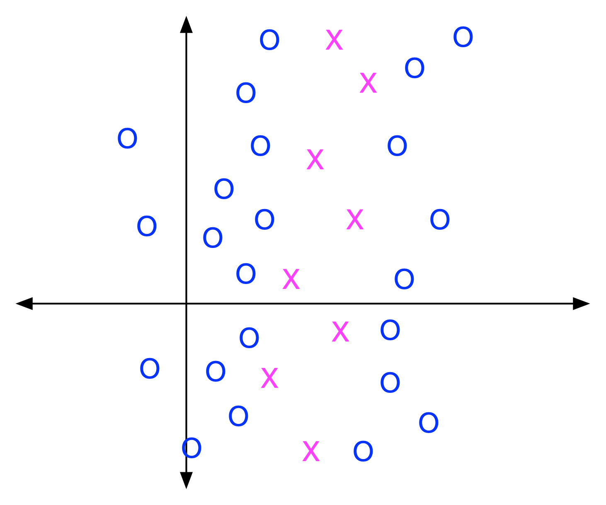

[comment]: # (THEME = pdsp)
[comment]: # (CODE_THEME = base16/zenburn)

### Practical Data Science with Python

# 12c. Classification with K-Nearest Neighbor

[comment]: # (!!!)

## HW08: Trouble with certificates?

```python
import nltk
import ssl
 
try:
    _create_unverified_https_context = ssl._create_unverified_context
except AttributeError:
    pass
else:
    ssl._create_default_https_context = _create_unverified_https_context
 
nltk.download()
```

[comment]: # (!!!)

## What shapes can logistic regression separate?

$b_1 x_1 + b_2 x_2 \gt c$

 


[comment]: # (!!!)

## What shapes can gaussian naive bayes classifiers separate?

Each class is normally distributed around a single mean

 

[comment]: # (!!!)


## What about more complex shapes?

Disconnected? Non-convex?

 

[comment]: # (!!!)

## Hmm?


 

[comment]: # (!!!)


## 3-nearest neighbor

 

[comment]: # (!!!)

## 3-nearest neighbors in Python

```python
from sklearn.neighbors import KNeighborsClassifier

classifier = KNeighborsClassifier(n_neighbors=3)
classifier.fit(X_train, y_train)

predictions = classifier.predict(X_test)
```

[comment]: # (!!!)

## What should K be?

- Too small? Overfits
- Too big? Bad fit

[comment]: # (!!!)


## Weighting

 


```python
clf = KNeighborsClassifier(n_neighbors=3, weights=‘distance’)
clf(X_train, y_train)

probabilities = clf.predict_proba(X_test)
```

[comment]: # (!!!)

## Distance Metrics

- euclidean: $\sqrt{(a_1 - b_1)^2 + \ldots + (a_d - b_d)^2}$
- manhattan: $| a_1 - b_1 | + \ldots + | a_d - b_d |$
- cosine: $( a \cdot b) / (|a| |b|)$

```python
clf = KNeighborsClassifier(n_neighbors=3, metric=‘manhattan’)
```

[comment]: # (!!!)

## Cross validation to find

- k
- weighted or not
- distance metric

[comment]: # (!!!)


## Problems with KNN

- Imbalanced training data skews everything
- Dimensions are all treated equally
- Terrible performance

[comment]: # (!!!)


## 1. Imbalanced training data

1,000,000 points for Elephant Seals, 10 points for Leopard Seals

 

Possible fix: balance via undersampling, oversampling, synthesizing data

[comment]: # (!!!)


## 2. Dimensions are all treated equally

Logistic Regression: coefficients on each dimension

KNN: Every dimension is equally important

 

Possible fix: scale data by importance and variance?

[comment]: # (!!!)


## 3. Terrible performance

Trained on $n$ datapoints? At inference, compare to all $n$.

First fix: Use KDTree or Ball Tree.

(Try KDTree first,  Ball Tree for data with a lot of dimensions)

```python
clf = KNeighborsClassifier(n_neighbors=3, algorithm="kd_tree")
```

[comment]: # (!!!)


## Nearest Neighbor with Faiss

Facebook AI Research
```text
> pip install faiss-cpu --no-cache
```

```python
import faiss
index = faiss.IndexFlatL2(7)
index.add(X_train)
D, I = index.search(X_test, 3) 
print(I[0])
print(D[0])
```            

[comment]: # (!!!)

## Approximate Nearest Neighbor

Hierarchical Navigable Small Worlds + Inverted File Index + Product Quantization

```python
import faiss
quantizer = faiss.IndexHNSWFlat(d, 32)
index = faiss.IndexIVFPQ(quantizer, d, 1024, 16, 8)
index.train(X_train)
index.add(X_train)
D, I = index.search(X_test, 3) 
print(I[0])
print(D[0])
```            

[comment]: # (!!!)

# Demo!

### [Colab](https://colab.research.google.com/drive/11VMKBVm-1tvXb30974CWoUT8LtIgVJVi?usp=sharing)

[comment]: # (!!!)


## Questions?

