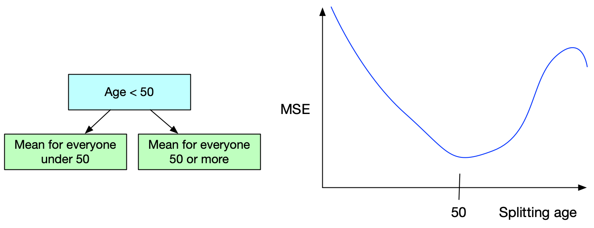

[comment]: # (THEME = pdsp)
[comment]: # (CODE_THEME = base16/zenburn)

### Practical Data Science with Python

# 13. Regression

[comment]: # (!!!)


## Classification

- Prediction: This seal is 4.2m long and 1,321 lbs.  I predict it is a Leopard Seal.

- Confidence: There is a 81% chance that I am right, a 7% chance it is a harbor seal, and a 2% chance it is another kind of seal.

- Errors: The flaws of the model show up in the confusion matrix.

[comment]: # (!!!)


## Regression

- Prediction: This is a male Indian Elephant that is 3.2m tall.  I predict that it weights 8,231 lbs.

- Confidence: There is a 95% chance that my prediction is within 87 lbs.

- Errors: The flaws of the model show up in the residual.

[comment]: # (!!!)

## Regression and Classification are "Supervised"

### We learn from labeled data

### Unsupervised: clustering, density estimation, dimension reduction

[comment]: # (!!!)


## Model 1: Linear regression

### $\hat{y} = \beta_0 + \beta_1 x_1 + \ldots + \beta_d x_d$

Find $\vec{\beta}$ that minimizes squared error on training set:

### $\sum_{i = 1}^{n} \left(y_i - \hat{y_i} \right)^2$

### $ $

Predictions are linear! (Includes Ridge, Lasso, Elastic)

[comment]: # (!!!)

## Model 2: Polynomial regression

Same as linear, but we include polynomial terms.  

Here is the 2nd degree polynomial estimate:

### $\hat{y} = \beta_0 + \beta_1 x_1 + \ldots + \beta_d x_d$
###  $ + \beta_{d+1} {x_1}^2 + \dots + \beta_{d+d} {x_d}^2 $
###  $ + \beta_{2d + 1} x_1 x_2 + \dots + \beta_{?} x_{d-1} x_d$


[comment]: # (!!!)


## Model 3: K-nearest neighbor regression

Let $k=3$

Input $x_0$ is closest to $x_{12}$, $x_{15}$, $x_{97}$

### $\hat{y_0} = \frac{y_{12} + y_{15} + y_{97}}{3}$

Alternative: Weight the average by the inverse of their distances.

[comment]: # (!!!)

## K-Nearest Neighbor Regression

```python
from sklearn.neighbors import KNeighborsRegressor

knn = KNeighborsRegressor(3, weights="distance")
knn.fit(X_train, y_train)

y_pred = knn.predict(X_test)
```

[comment]: # (!!!)


## K-Nearest Neighbor Regression

#### Pros:

- Train quickly
- Deals with nonlinear patterns

#### Cons:

- Predictions are slow
- Doesn't extrapolate

[comment]: # (!!!)


## Model 4: Decision Tree Regression

Tree divides space into rectangular regions $R_1, \ldots, R_m$.

Each region $R_i$ has a value $\hat{y_i}$.

Find tree that minimizes squared error on data set. (NP-hard)


[comment]: # (!!!)

## Creating Tree for Regression

Greedy: Minimize squared error with each split.

 

(You want more? StatQuest's "Regression Trees, Clearly Explained" on Youtube.)

[comment]: # (!!!)

## Decision Tree Regression

```python
from sklearn.tree import DecisionTreeRegressor

regressor = DecisionTreeRegressor(min_samples_leaf=3)
regressor.fit(X_train, y_train)

y_pred = regressor.predict(y_test)
```

[comment]: # (!!!)

## Model 5: Random Forest Regression

Just like for classification: 

- Make hundreds of decision trees (for classification)
- limit the attributes that the tree can split on.

Take mean of all the tree outputs.

```python
from sklearn.ensemble import RandomForestRegressor

regressor = RandomForestRegressor(n_estimators=600)
regressor.fit(X_train, y_train)

y_pred = regressor.predict(y_test)
```

[comment]: # (!!!)

## Where are we?

- Linear, Ridge, Lasso Regression
- Polynomial Regression
- K-Nearest Neighbor
- Decision Tree Regression 
- Random Forest
- Gradient Boosted Regression
- Neural Network
- Support Vector Machines with the kernel trick
- Gausian Process Regression

[comment]: # (!!!)


# Questions?

