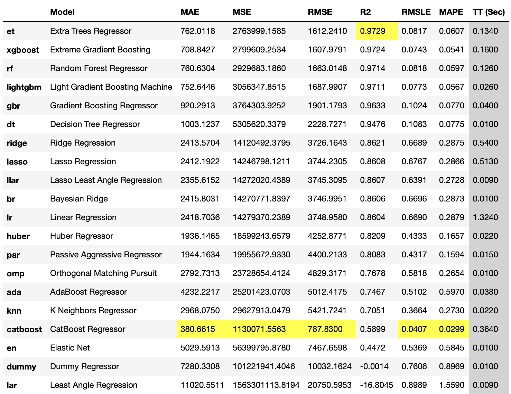
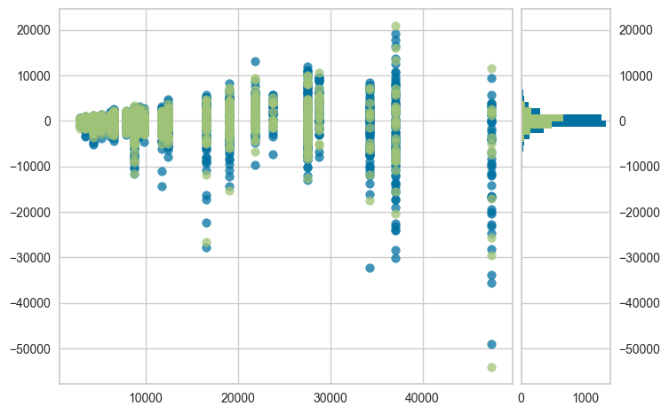
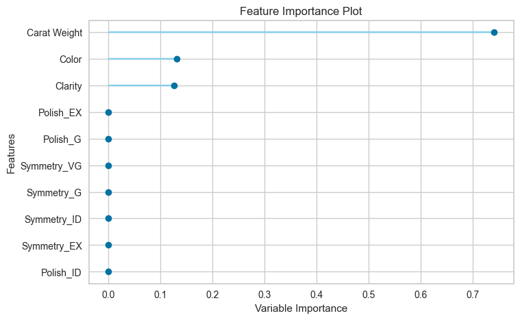

[comment]: # (THEME = pdsp)
[comment]: # (CODE_THEME = base16/zenburn)

### Practical Data Science with Python

# 14. Optimizing Models and Using AutoML

[comment]: # (!!!)

## Too many options!

- Linear, Ridge, Lasso Regression
- Polynomial Regression
- K-Nearest Neighbor
- Decision Tree Regression 
- Random Forest
- Gradient Boosted Regression
- Neural Network
- Support Vector Machines with the kernel trick
- Gaussian Process Regression

[comment]: # (!!!)

## But...
```python
from whatever import WhateverRegressor

regressor = WhateverRegressor()
regressor.fit(X_train, y_train)

y_pred = regressor.predict(y_test)
# Do statistics to evaluate
```
[comment]: # (!!!)

## AutoML

- Tries to find best algorithm
- Tunes hyperparameters
- There are hundreds of them now
 
[comment]: # (!!!)

## pycaret

- Python
- Open source
- Speeds up experimentation
- Has a ton of dependencies

[comment]: # (!!!)


## Setup

```python
import pycaret.regression as carreg
train_df = # 
exp1 = carreg.setup(data=train_df, target='Price')
```
```text
                 Description             Value
0                 Session id               257
1                     Target             Price
2                Target type        Regression
3                 Data shape        (5400, 18)
4           Train data shape        (3779, 18)
5            Test data shape        (1621, 18)
6           Ordinal features                 1
7           Numeric features                 1
8       Categorical features                 6
9                 Preprocess              True
10           Imputation type            simple
11        Numeric imputation              mean
12    Categorical imputation          constant
13  Maximum one-hot encoding                 5
14           Encoding method              None
15    Low variance threshold                 0
16            Fold Generator             KFold
17               Fold Number                10
18                  CPU Jobs                -1
19                   Use GPU             False
20            Log Experiment             False
21           Experiment Name  reg-default-name
22                       USI              d28c
```

[comment]: # (!!!)

## Glossary

- MAE: Mean absolute error
- MSE: Mean squared error
- RMSE: Square root of MSE
- R2: $R^2$ measure of fit
- RMSLE: Root mean squared logarithmic error
- MAPE: Mean absolute percentage error 
- TT: Total Time

[comment]: # (!!!)

## Compare all models (default parameters)

```python
best = carreg.compare_models() 
```
 

[comment]: # (!!!)

## Create and tune a particular model

```python
rf = carreg.create_model('rf')
tuned_rf = carreg.tune_model(rf)
print(tuned_rf)
```

Want more control?

```python
grid = {"n_estimators":[100,200,300],
        "max_depth":[4,8, 12]}
tuned_rf = carreg.tune_model(rf, grid)
```

[comment]: # (!!!)

## Plot a residual

```python
carreg.plot_model(tuned_rf)
```
Blue is data it was trained on

 

[comment]: # (!!!)

## Feature importance

```python
carreg.plot_model(tuned_rf, plot='feature')
```

 

[comment]: # (!!!)


## Finalize and Test

```python
final_rf = carreg.finalize_model(tuned_rf)

test_df = # 
y_pred = carreg.predict_model(final_rf, data= test_df)
```

```text
                  Model    MAE      MSE    RMSE     R2  RMSLE  MAPE
Random Forest Regressor 1509.7 8.29e+06 2880.75 0.9193 0.1592 0.117
```


[comment]: # (!!!)

## Save and Load

```python
carreg.save_model(final_rf,'randomforest_001')
```

```python
final_rf = carreg.load_model('randomforest_001')
```

[comment]: # (!!!)


# Questions?

