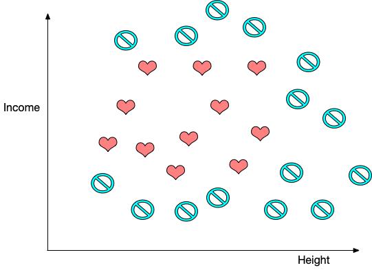
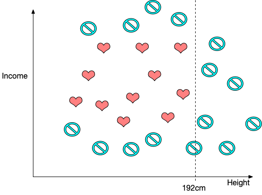
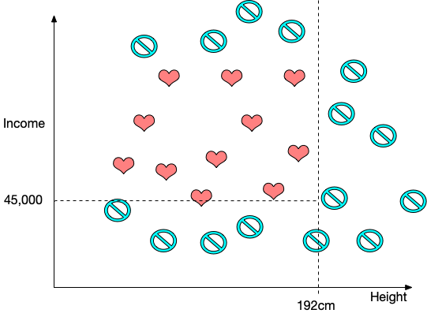
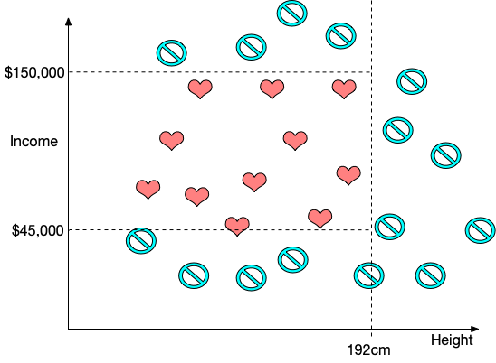
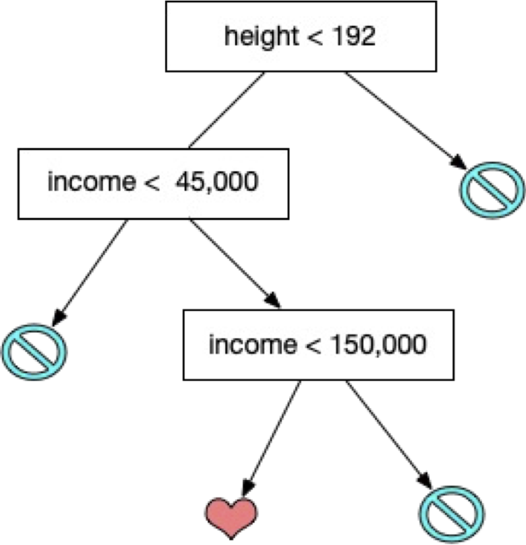
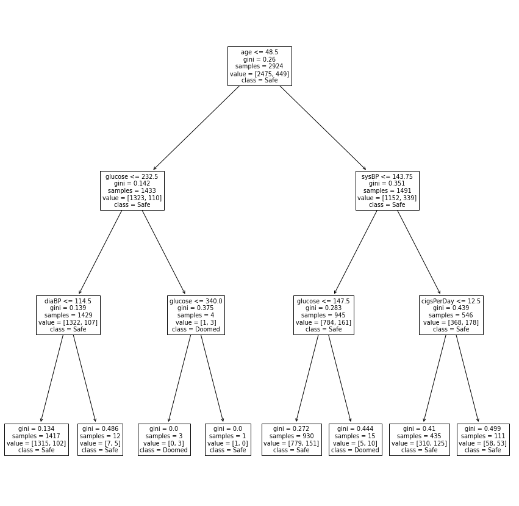

[comment]: # (THEME = pdsp)
[comment]: # (CODE_THEME = base16/zenburn)

### Practical Data Science with Python

# 15. Decision Trees for Classification

[comment]: # (!!!)

## Standardization

Only compute mean/variance for standardization in training!

In prediction/testing use mean/variance computed in train.

[comment]: # (!!!)

## Identifying customers for a small luxury car

 

[comment]: # (!!!)


## Height and Income

 

[comment]: # (!!!)


## Height and Income 2

 

[comment]: # (!!!)


## Height and Income 3

 

[comment]: # (!!!)


## Height and Income 4

 

[comment]: # (!!!)


## Decision Tree

 

[comment]: # (!!!)

## Video!

[StatQuest's Decision and Classification Trees, Clearly Explained!](https://youtu.be/_L39rN6gz7Y)

[comment]: # (!!!)


## Libraries

- Scikit-Learn (CART, numerical only)
- ChefBoost (CART, ID3, C4.5, categorical OK)
- H2O 

[comment]: # (!!!)


## Decision Tree in Python

```python
from sklearn.tree import DecisionTreeClassifier, plot_tree

tree = DecisionTreeClassifier(max_depth=3)
tree.fit(X_train,y_train)

y_pred = tree.predict(X_test)

fig,ax = plt.subplots(figsize=(15,15))
plot_tree(tree, feature_names=labels,
       class_names=class_names, ax=ax)
```
[comment]: # (!!!)

## Decision Tree Visualized

 

[comment]: # (!!!)


## Demo (Scikit-learn)

[Colab](https://colab.research.google.com/drive/1FAB6mLm3v2_KoBwXJYzRNI8upy6B_ex7?usp=sharing)

[comment]: # (!!!)


## But...this sucks

- Sensitive to small changes in data
- Generalizes poorly
- No idea of confidence

[comment]: # (!!!)

# Ensemble methods

Ensemble methods help lots of bad classifiers make a good decision:

- Bagging
- Random Forest
- Boosting (AdaBoost)
- Gradient boosted trees (XGBoost)

[comment]: # (!!!)

## Bootstrapping

- You have a training set with only $n$ data points
- You make $m$ training sets by resampling with replacement.

Often used for finding confidence in a number:  If the mean of the $m$ training sets are very varied,  you can't be confident in mean.

[comment]: # (!!!)


## Bagging

- You have a training set with $n$ data points
- You make $m$ training sets by resampling with replacement.
- Get $m$ trees
- Making prediction? Let them vote
- Tuning hyperparameters? Us Out-of-Bag (OoB) error rate

[comment]: # (!!!)


## Random Forest

Make 1000 trees. But not the same

- Splits are only allowed on a random subset of $k$ features
- Usually $k$ is about $\sqrt{d}$.

[comment]: # (!!!)

## Random Forest in Python

```python
from sklearn.ensemble import RandomForestClassifier

clf = RandomForestClassifier(450, max_depth=4, 
                                    max_features=4)
clf.fit(X_train, y_train)
y_pred = clf.predict(X_test)
```

[comment]: # (!!!)


# Questions?

