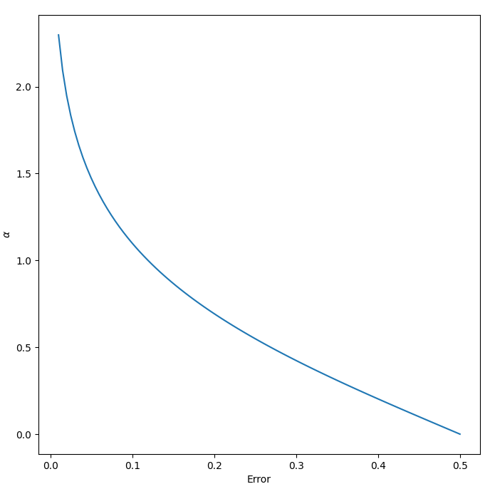

[comment]: # (THEME = pdsp)
[comment]: # (CODE_THEME = base16/zenburn)

### Practical Data Science with Python

# 15. AdaBoost

[comment]: # (!!!)

## Random Forest but...

- Used for binary classification
- Trees have max_depth of 1: Stumps
- Trees made one-at-a-time to correct the errors of the previously created
- Trees are weighted in the voting process

[comment]: # (!!!)

## Basics

* Training data $x_1 \dots x_n$ and $y_1 \dots y_n \in \{-1, 1\}$
* Initial weights $w_1 \dots w_n$ set to $\frac{1}{n}$
* Making weak learners $h_t(x) \rightarrow \{-1,1\}$ and weights $\alpha_t$
* $F(x) = \sum_{t = 1}^{T} \alpha_t h_t(x)$

[comment]: # (!!!)

## Loop

For $t$ in $1 \dots T$:

* Choose $h_t(x)$ that minimizes $\epsilon_t$, the weighted sum error for misclassified points $\epsilon_t = \sum_{i |  h_t(x_i)\neq y_i} w_i $

* $\alpha_t = \frac{1}{2} \ln \left(\frac{1-\epsilon_t}{\epsilon_t}\right)$

* $c_t = -1$ if $y_i = h_t(x_i)$ else $c_t = 1$

* $w_i = w_i e^{\alpha_t c_t}$ for $i$ in $1 \dots n$

* Renormalize $\vec{w}$ such that $\sum_i w_i = 1$

[comment]: # (!!!)

## $\alpha = \frac{1}{2} \ln \left(\frac{1-\epsilon}{\epsilon}\right)$

 

[comment]: # (!!!)


## AdaBoost in Python

```python
from sklearn.ensemble import AdaBoostClassifier

classifier = AdaBoostClassifier(n_estimators=120)
classifier.fit(X_train, y_train)

y_pred = classifier.predict(X_test)
```
[comment]: # (!!!)

## You can...

- use AdaBoost with trees deeper than 1
- use AdaBoost for multi-class classification
- use AdaBoost for regression

[comment]: # (!!!)


# Questions?

