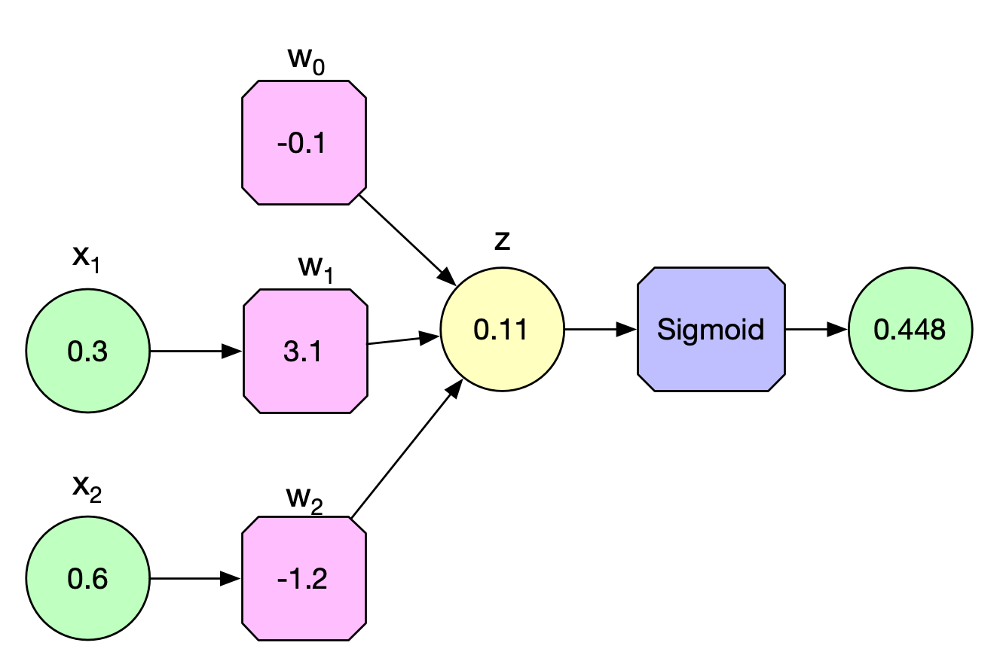
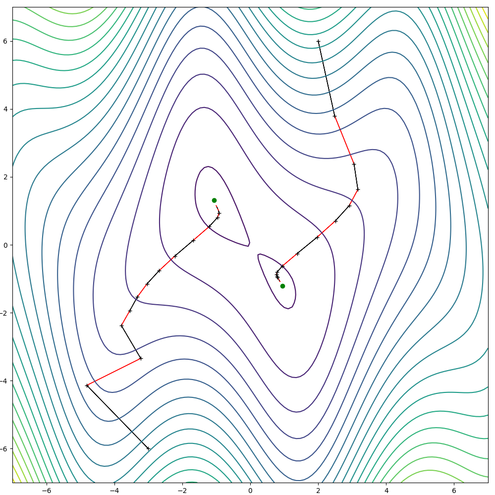
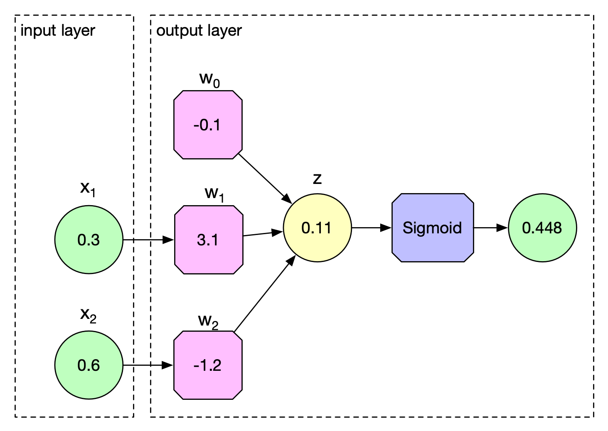
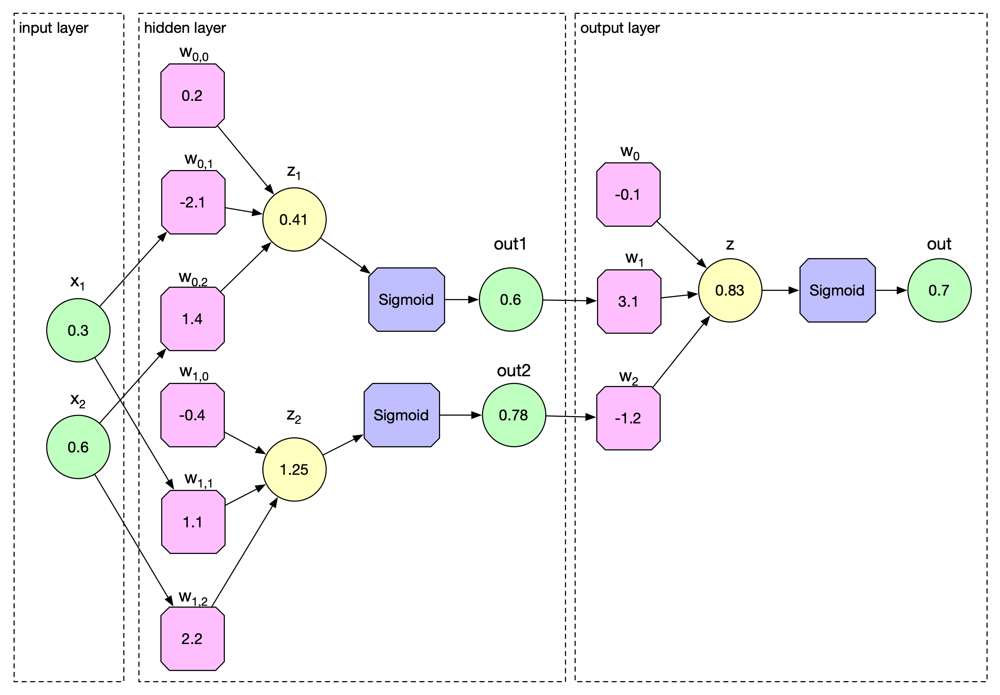
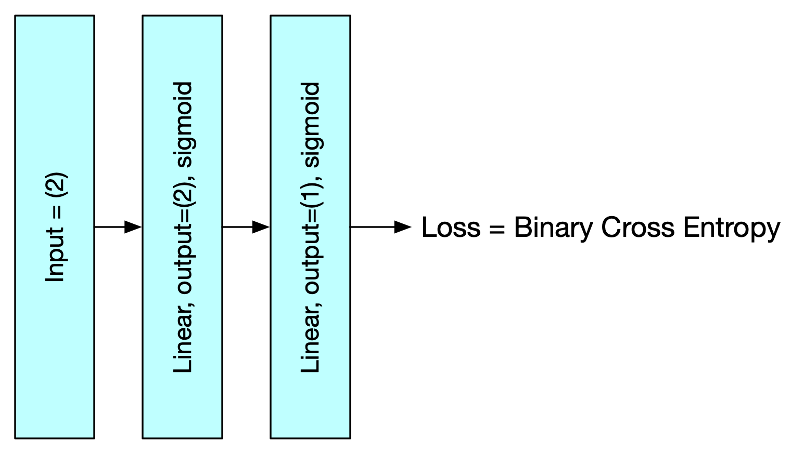
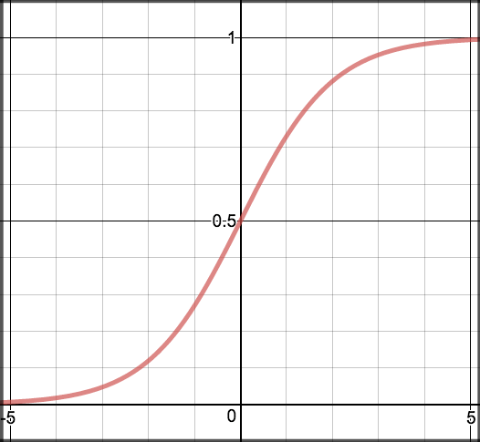
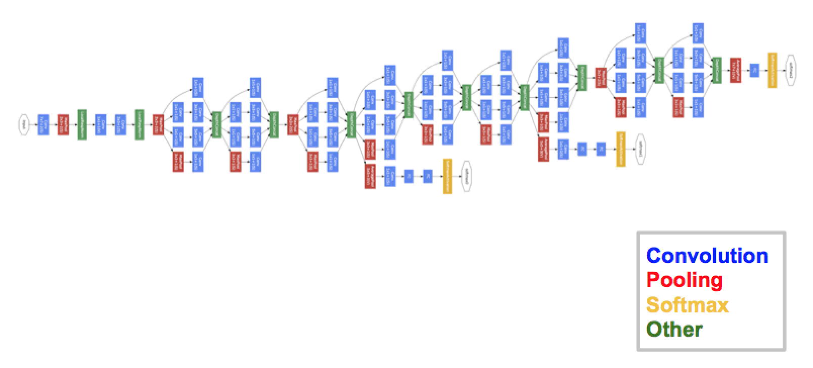

[comment]: # (THEME = pdsp)
[comment]: # (CODE_THEME = base16/zenburn)

### Practical Data Science with Python

# 15d. Neural Nets

[comment]: # (!!!)

## Logistic Regression

 

#### $\hat{y} = \sigma(w_0 + x_1 w_1 + x_2 w_2)$ 

[comment]: # (!!!)

## Training Data

| $x_1$ | $x_2$ |  $y$  |
|------|-------|-------|
| 0.3  |  0.6 |  1  |
| 0.5  |  0.1 |  0  |
| 0.9  |  0.9 |  0  |
| 0.4  |  0.5 |  1  |

Adjust $\vec{w}$ to minimize the loss function. 

#### $L(\vec{w}, X, \vec{y}) = \sum_{(\vec{x},y) \in X, \vec{y}} \left( -y \log(\hat{y}) - (1 - y) \log(1-\hat{y}) \right)$

[comment]: # (!!!)

## Think backwards!

- Weights ($w_0, w_1, w_2$) are variables
- Inputs ($X$) and outputs ($\vec{y}$) are constants

Then let $f(\vec{w}) = L(\vec{w}, X, \vec{y})$ be the loss.

Use $\nabla f(\vec{w})$ in gradient descent to lower loss.

[comment]: # (!!!)

## Gradient descent

Initialize the weights randomly.



Step size is a *big deal*.

## The chain rule

$f(\vec{w})$ is many functions composed together.

To find $\nabla f(\vec{w})$, we use the chain rule.

Neural nets people say "Backpropogation"

[comment]: # (!!!)


## Layers

 


[comment]: # (!!!)

## Hidden Layers

 


[comment]: # (!!!)

## Matrix operations

```python
x = np.array([0.3, 0.6])
layer1 = np.array([[0.2, -2.1, 1.4], [-0.4, 1.1, 2.2]])
layer2 = np.array([-0.1, 3.1, -1.2])

x = np.insert(x, 0, 1)
z1 = layer1 @ x
out1 = sigmoid(z1)
out1 = np.insert(out1, 0, 1)
z2 = layer2 @ out1
out2 = sigmoid(z2)
```

[comment]: # (!!!)

## Many samples all at once!

```python
x = np.array([[0.3, 0.6], [0.9, 0.7]])
layer1 = np.array([[0.2, -2.1, 1.4], [-0.4, 1.1, 2.2]])
layer2 = np.array([-0.1, 3.1, -1.2])

x = np.insert(x, 0, 1, axis=1)
z1 = (layer1 @ x.T).T
out1 = sigmoid(z1)
out1 = np.insert(out1, 0, 1, axis=1)
z2 = (layer2 @ out1.T).T
out2 = sigmoid(z2)
```
[comment]: # (!!!)

## But...

"I don't like calculating gradients!"

Autodifferentiation: The libraries do it for you:

- PyTorch
- TensorFlow
- MXNet
- JAX

[comment]: # (!!!)

### PyTorch!

[Demo](https://colab.research.google.com/drive/15y0ZySFucnUxHpVAUbWVK1-fGD_2pPgT?usp=sharing)

[comment]: # (!!!)

## Diagrams

 

[comment]: # (!!!)

## Activation function: Sigmoid

#### $\frac{1}{1 + e^{-z}}$

 

[comment]: # (!!!)


## Activation function: Tanh

#### $\frac{e^z - e^{-z}}{e^z + e^{-z}}$

 

[comment]: # (!!!)

## Activation function: ReLU

#### $z$ if $z > 0$,  else $0$

 

[comment]: # (!!!)

## Output for classification: Softmax

#### $\frac{e^{z_i}}{\sum_{j=1}^K e^{z_j}}$

#### Use cross-entropy loss

[comment]: # (!!!)


## Output for regression: Nothing!

#### $z$

#### Use Mean-Squared-Error loss

[comment]: # (!!!)

## "Deep Learning"

 

Many are 500 layers deep.

GPT-3 has tuned 175 billion parameters.

[comment]: # (!!!)

## Problems

- Local miniumums?
- Hyperparameter tuning (AutoML)
- Vanishing gradients (residual networks, batch normalization)
- Lack of generalization (dropout)

[comment]: # (!!!)

## Hot things

- Transformers
- Recurrent Neural Nets
- Reinforcement learning
- Explainability

[comment]: # (!!!)


# Questions?

