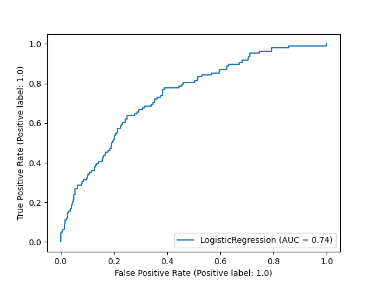

[comment]: # (THEME = pdsp)
[comment]: # (CODE_THEME = base16/zenburn)

### Practical Data Science with Python

# 15e. Midterm Review

[comment]: # (!!!)

## What to expect

- In-person in Classroom South 427
- On-line in Classroom South 105
- Bring photo ID
- Be on time: 2:30. Leave when done. Pencils down at 4:00.
- First 20 questions are quick; 2 points each
- Remaining 15 questions require thought; 4 points each
- Bring a pen or pencil. Write clearly, circle final answer

[comment]: # (!!!)

Q: In regular linear regression, what are we minimizing when we fit the model?

[comment]: # (!!!)

Squared error (or mean squared error)

#### $\sum_{i=1}^{n} \left( y_i - \hat{y_i} \right)^2$

[comment]: # (!!!)

Q: You have done linear regression on some data.  What is the mean of the residual? 

[comment]: # (!!!)

After minimizing the squared error, the mean is always 0.

[comment]: # (!!!)

Q: In regular logistic regression, what are we minimizing when we fit the model?

[comment]: # (!!!)

Cross-entropy error

[comment]: # (!!!)

Q: What is the ISO-standard format for the date Monday, October 31, 2022?

[comment]: # (!!!)

2022-10-31

[comment]: # (!!!)

Q: "Random Forest" and "AdaBoost" are examples of what kind of machine learning algorithms?

[comment]: # (!!!)

They are "ensemble" machine learning algorithms.

[comment]: # (!!!)

Q: You have to show what proportion of a company's revenues are spent on payroll,  office rental, and marketing.  What would be the best kind of diagram?

[comment]: # (!!!)

Pie chart

[comment]: # (!!!)

Q: You have to show how age and cognitive function are related in a study.  You have the data for 45 people.  What would be the best kind of diagram to show the relationship?

[comment]: # (!!!)

Scatter plot

[comment]: # (!!!)

Q: The power company is studying the relationship between temperature and power consumption.  They have a power reading every 20 minutes, but they only have the temperature every hour.  What would be a good way to synthesize the missing temperature data?

[comment]: # (!!!)

Linear interpolation

[comment]: # (!!!)

Q: You are given data for a study on exercise and longevity.  You are missing the "average calories consumed per day" for a lot of the people in the study.  You really don't want to throw away the data just because it is missing a variable that you are pretty sure is not that important.  What could you do?

[comment]: # (!!!)

Impute a value.  For example, you might use the mean of calories for the rows you do have data for.

[comment]: # (!!!)

Q: What is the gradient of:

##### $f(x, y, z) = x^2 + xy + 5z$

[comment]: # (!!!)

#### $\nabla f(x, y, z) = [2x + y, x, 5]$

[comment]: # (!!!)

Q: The linear regression problem you are working on has 9 columns of input.  When you do the fit, how many coefficients will you compute?

[comment]: # (!!!)

10 (don't forget the y-intercept)

[comment]: # (!!!)

Q: What are you minimizing when you fit a logistic regression model?

[comment]: # (!!!)

Cross-entropy loss

#### - $\sum_{i=1}^{n} y_i \log \hat{y_i}$

[comment]: # (!!!)

Q: The number 9 appears in a list of data that is to be standardized.

The mean of the list is 6.  The variance is 4.

When you standardize the 9,  what will it become?

[comment]: # (!!!)

Variance is the square of the standard deviation!  So, the standard deviation is 2.

The standardized value would then be:

#### $\frac{9 - 6}{2} = \frac{3}{2}$

[comment]: # (!!!)
 
Q: BeautifulSoup creates a "DOM tree".  What is a DOM Tree?

[comment]: # (!!!)

When BeautifulSoup parses the HTML,  it creates an abstract syntax tree called a "Document Object Model".

[comment]: # (!!!)

Q: What is "Geocoding"?

[comment]: # (!!!)

Geocoding is where you have address and you are fetching the longitude and latitude.

[comment]: # (!!!)

Q: Name as many regression algorithms as you can.

[comment]: # (!!!)

- Linear regression 
- Lasso, ridge, and elastic regression
- Polynomial regression
- K-nearest Neighbor Regression
- Decision Tree Regression
- Random Forest Regression
- Neural Net Regression
- Gradient Boosted Tree Regression

[comment]: # (!!!)

Q: Name as many classification algorithms as you can.

[comment]: # (!!!)

- Logistic Regression
- K-nearest Neighbor Classifier
- Bayesian Classifier (naive, gaussian naive)
- Decision Tree Classifier
- Random Forest Classifier
- Neural Net Classifier
- Gradient Boosted Tree Classifier

[comment]: # (!!!)

Q: What assumption makes a Naive Bayesian Classifier "naive"?

[comment]: # (!!!)

Assumes all attributes in the input are independent.

#### $P(x_1, x_2, x_3 | y) = P(x_1 | y)P(x_2 | y)P(x_3 | y)$

[comment]: # (!!!)
Q: What additional assumption makes a Gaussian Naive Bayesian Classifier "Gaussian"?

[comment]: # (!!!)

Assumes all attributes are normally distributed.

#### $P(x_1 | y) = \frac{1}{\sigma\sqrt{2\pi}} e^{-\frac{1}{2}\left(\frac{x - \mu}{\sigma}\right)^2}$

Variance = $\sigma^2$

Mean = $\mu$

[comment]: # (!!!)

Q: What does AUC stand for?

[comment]: # (!!!)

"Area Under Curve" where the curve is the ROC curve.

[comment]: # (!!!)

Q: Do you want the AUC of your classifier to be large or small?  What is the range of possible values for AUC?

[comment]: # (!!!)

Bigger is better.

The range goes from 0 to 1.

 

[comment]: # (!!!)

Q: What does ROC stand for? 

[comment]: # (!!!)

"Receiver Operating Characteristics"

[comment]: # (!!!)

Q: What does the ROC curve tell you?

[comment]: # (!!!)

The curve shows the complete recall vs. precision tradeoff for your model.

[comment]: # (!!!)

Q: In probability, what does PDF stand for and how does it relate to CDF?

[comment]: # (!!!)

"Probability Density Function"

It is the derivative of the Cumulative Density Function.

[comment]: # (!!!)

Q: What are three hyperparameters for k-Nearest Neighbor classifiers that you might want to tune?

[comment]: # (!!!)

- K: how many neighbors?
- Weighted: Do we just count the nearest neighbors or weight them by closeness?
- Metric: Euclidean? Or manhattan? Or Cosine distance?

[comment]: # (!!!)

Q: Name three wasy to fix an imbalanced data set.

[comment]: # (!!!)

- Oversampling
- Undersampling
- Synthesizing data

[comment]: # (!!!)

Q: Why don't we use linear regression for all regression problems?

[comment]: # (!!!)

Because some data is not linearly related.

[comment]: # (!!!)

Q: Everyone at GSU takes a test for a rare disease (only present in 0.2% of the population).  

The test has a false positive rate of 1%. 

There is never a false negative. You get a positive result on the test.  

What is the probability you have the disease?

[comment]: # (!!!)

Let $T$ be getting a positive test.  Let $D$ be having the disease

$P(T | D) = 1.0$

$P(D) = 0.002$

$P(T) = (0.01)(0.998) + (1.0)(0.002) \approx 0.01 + 0.002 = 0.012$

Bayes says:

$P(D | T) = \frac{P(T | D) P(D)}{P(T)} = \frac{(1.0)(0.002)}{0.012} = \frac{1}{6}$

[comment]: # (!!!)

Q: The weights of bluejays is normally distributed with a mean of 102 grams and a standard deviation of 12.  If I asked you to give me a range of weights that contains 68\% of all bluejays.  What would be a good range? 

[comment]: # (!!!)

With a normal distribution,  68% of all samples are within 1 standard deviation of the mean.  So 90 - 114 grams.

95% are within two standard deviations.

99.7% are within three standard deviations.

[comment]: # (!!!)

Q: The ground truth is $[10,6,9,7]$  

Your predictions are $[9, 7, 9, 7]$

What is $R^2$?

[comment]: # (!!!)

The ground truth is $[10,6,9,7]$, so the mean is 8.

Your predictions are $[9, 7, 9, 7]$

$R^2 = 1-\frac{1^2 + 1^2 + 0^2 + 0^2}{2^2 + 2^2 + 1^2 + 1^2} = 1-\frac{2}{10} = \frac{4}{5}$

[comment]: # (!!!)

Q: Here is a confusion matrix for a binary classifier:

|  | Predicted False | Predicted True | Sum |
|---|-----------------|----------------|-----|
| Actual False | 8 | 1 | **9** |
| Actual True | 2 | 10 | **12** |
| **Sum** | **10** | **11** | **21** |

 
- Accuracy?
- Precision?
- Recall?
- F1?

[comment]: # (!!!)

- Accuracy?  $\frac{18}{21}$
- Precision? $\frac{10}{12}$
- Recall? $\frac{10}{11}$
- F1? $\frac{2 \left( \frac{18}{21}\right)\left( \frac{10}{11} \right)}{\frac{18}{21} + \frac{10}{11}}$

[comment]: # (!!!)

Q: What is the probability of rolling a die 3 times and not getting any even numbers?

[comment]: # (!!!)

#### $P = \left(\frac{1}{2} \right)^3 = \frac{1}{8}$

[comment]: # (!!!)

# Questions?

