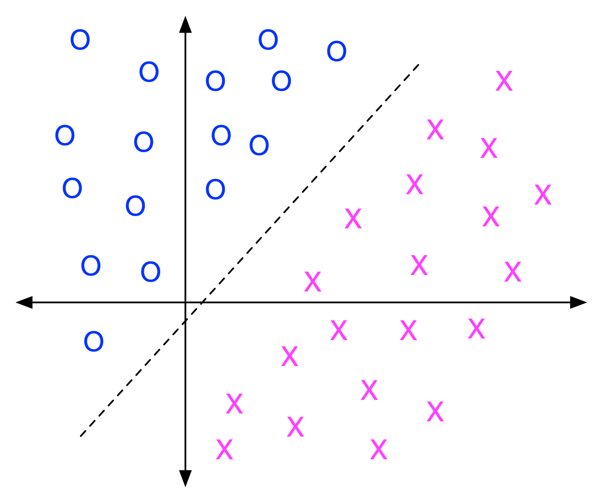
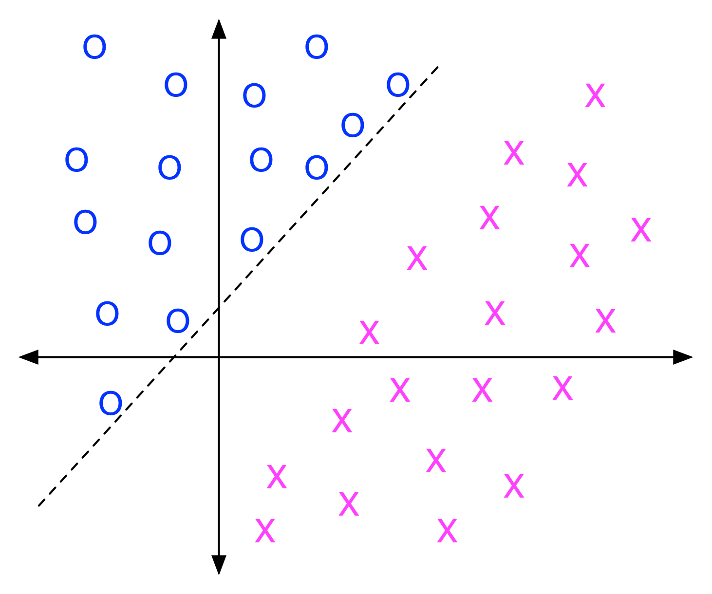
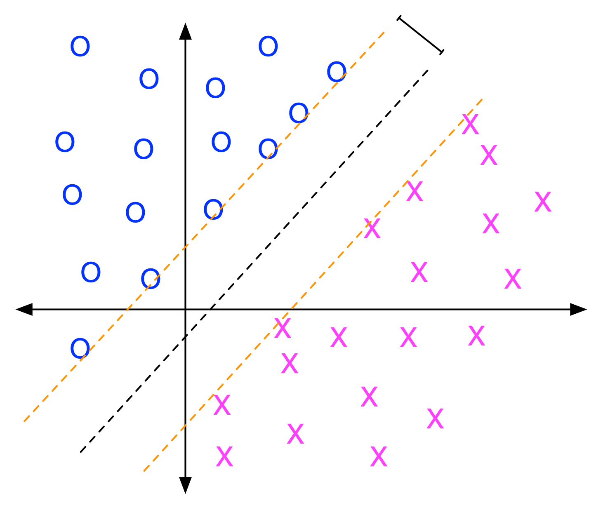
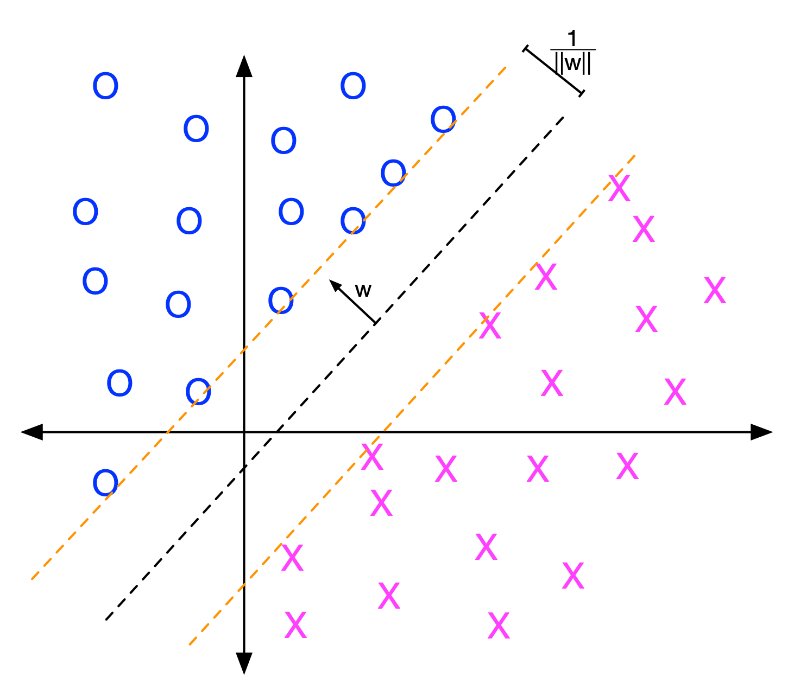
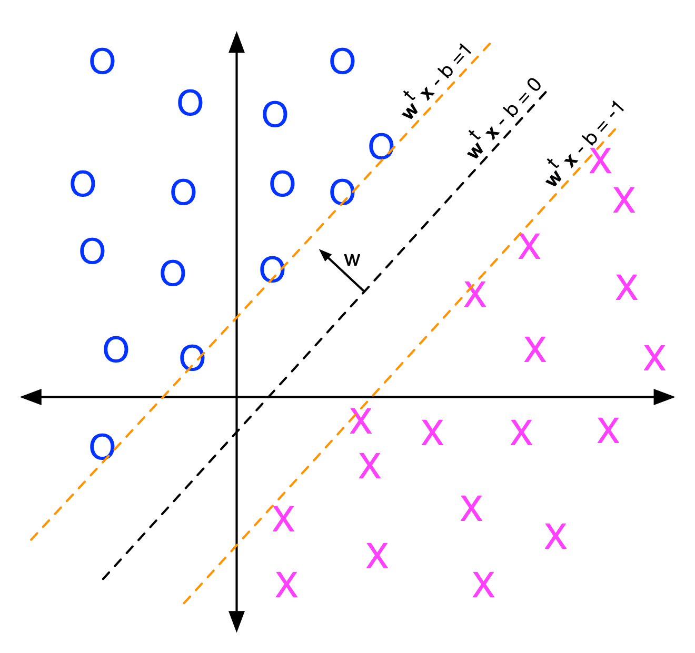
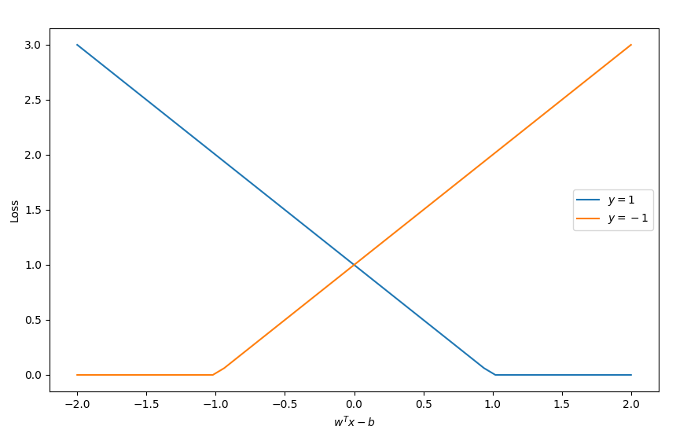
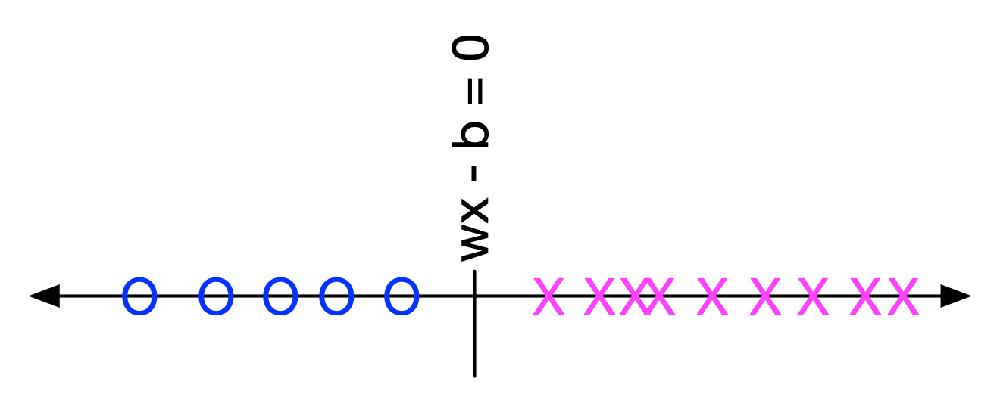
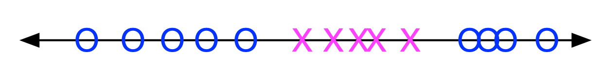
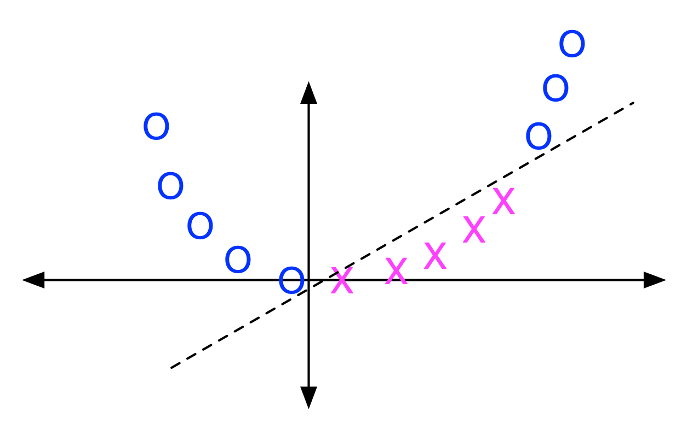

[comment]: # (THEME = pdsp)
[comment]: # (CODE_THEME = base16/zenburn)

## Practical Data Science with Python

# 16. Support Vector Machines

[comment]: # (!!!)

## Linearly Separable Problems

 

[comment]: # (!!!)


## A poor separation

 

[comment]: # (!!!)


## Good separation!

 

[comment]: # (!!!)

## In D dimensions?

Any hyperplane can be described as the vectors $\vec{x}$ that satisfy:

#### $\vec{w^T} \vec{x} - b = 0$

$ $

Plane is perpendicular to vector $\vec{w}$. 

- Direction is important!
- What do we want for the magnitude?

[comment]: # (!!!)


## The vector w

 

[comment]: # (!!!)

## Lines



[comment]: # (!!!)

## After finding w

For all training data $x_i$ and $y_i \in \{-1, 1
}$:

- If $y_i = 1$, then $\vec{w}^T x_i - b \geq 1$ 

- If $y_i = -1$, then $\vec{w}^T x_i - b \leq -1$ 

[comment]: # (!!!)

## Hinge Loss (Hard Margin)

#### $L = \sum_{i =0}^{n} \max\left(0, 1 - y_i \left(\vec{w}^T x_i - b \right) \right)$




#### Minimize $L = \frac{1}{n}\sum_{i =0}^{n} \max\left(0, 1 - y_i \left(\vec{w}^T x_i - b \right) \right)$

[comment]: # (!!!)

## Hinge Loss (Soft Margin)

#### Is OK if a few wander into the margin


#### Minimize $L = \frac{1}{n}\sum_{i =0}^{n} \max\left(0, 1 - y_i \left(\vec{w}^T x_i - b \right) \right) + \frac{1}{C} || \vec{w} ||^2$

How do we pick $C$? Cross validation!

[comment]: # (!!!)

## Linear SVM in python

```python
from sklearn.svm import LinearSVC

classifier = LinearSVC(C=2.0)

classifier.fit(X_train, y_train)

coefficients = classifier.coef_[0,:]
print(f"W = {coefficients}")
intercept = classifier.intercept_[0]
print(f"Intercept = {intercept:.3f} (AKA -b)")

y_prediction = classifier.predict(X_test)
```

[comment]: # (!!!)

## Linear SVM with scaling in python

```python
from sklearn.pipeline import make_pipeline
from sklearn.preprocessing import StandardScaler

classifier2 = make_pipeline(StandardScaler(), LinearSVC(C=2.0))
classifier2.fit(X, y)
y_prediction2 = classifier2.predict(X_test)
```

[comment]: # (!!!)


# Demo (Linear SVM)
[Colab](https://colab.research.google.com/drive/1nbeuvHwCx4s51r0RLgRC1ueQL2mAaNv1?usp=sharing)

[comment]: # (!!!)

## Linearly Separable in 1-D





[comment]: # (!!!)


## Not Linearly Separable in 1-D





[comment]: # (!!!)

## Lift into 2-D





[comment]: # (!!!)


## Kernel functions

Compute "distance" between samples:

- Linear: $\langle x_i, x_j \rangle$ 
- Polynomial: $\left( \gamma \langle x_i, x_j \rangle + r \right) ^ d$
- Radial Basis Function: $e^{\gamma || x_i - x_j ||^2}$
- Sigmoid:  $\tanh \left( \gamma \langle x_i, x_j \rangle + r \right)$

The "Kernel Trick" is that we don't actually generate the data in the higher dimension.

[comment]: # (!!!)


# Demo (SVM with Kernel)
[Colab](https://colab.research.google.com/drive/17dJQlVcqQ7TraW0Cyq1GkQCWBsjHCNDM)

[comment]: # (!!!)

# Questions?

