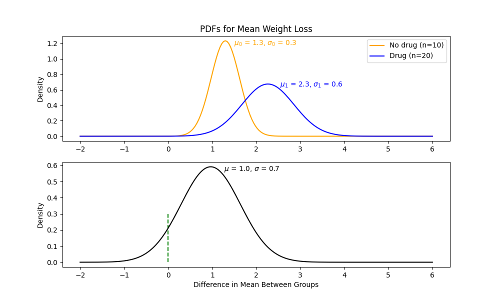

[comment]: # (THEME = pdsp)
[comment]: # (CODE_THEME = base16/zenburn)

### Practical Data Science with Python

# 16. Do two categories have different means?

[comment]: # (!!!)

## Central Limit Theorem

The distribution of weight among seals is *not* normally distributed.

 

[comment]: # (!!!)

## What if we take the mean of subgroups?

 

[comment]: # (!!!)

## Central limit theorem

If $x_1, x_2, \ldots, x_k$ has mean $\mu$ and standard deviation $\sigma$, the PDF of means of groups of $m$ converges to 
- Normal distributions
- With mean $\mu$
- With variance $\frac{\sigma}{\sqrt{m}}$

[comment]: # (!!!)

## Sample mean vs population mean

What is the average weight of a quarter?

If I have $n$ samples with a mean of $\mu$ and a standard deviation of $\sigma$, what can I say about the population mean?

[comment]: # (!!!)


## What if you have only two n data points?

Can you guess the population mean?

 

[comment]: # (!!!)

## PDF of population mean

If $x_1, x_2, \ldots, x_n$ has mean $\mu$ and standard deviation $\sigma$, as $n$ grows, the PDF of mean of the population approaches 
- Normal distribution
- With mean $\mu$
- With variance $\frac{\sigma}{\sqrt{n}}$

[comment]: # (!!!)


## Does the diet drug work?

Both groups exercised.  Group A took the drug.

How confident are we that it actually works?

- Confidence goes up as $n$ increases.
- High variance decreases confidence

[comment]: # (!!!)


## The Data

| participant    | used_drug  |  kg_lost     |
|----------------|------------|--------------|
| 1              | 1        |  2.2         |  
| 2              | 0         |  -1.1        |  
| 3              | 0         |  1.7         |  
| 4              | 1        |  0.5         |  
| 5              | 1        |  2.1         |  
| ...            | ...        |  ...        |  

[comment]: # (!!!)


## Basics

|  n = 30  | Drugged      |  Not Drugged     |
|------------|------------|--------------|
| n             | 20        |  10         |  
| Mean kg lost ($\bar{x}$)       | 2.26     |  1.30        |  
| Std. Deviation ($\sigma$) | 2.65    |  1.02         |  

 

[comment]: # (!!!)

## Basics in python

```python
n = len(df)

mask = df["used_drug"] == 1
drug_n = np.sum(mask)
nodrug_n = n - drug_n

drug_mean = df["kg_lost"][mask].mean()
nodrug_mean = df["kg_lost"][~mask].mean()

drug_std = df["kg_lost"][mask].std()
nodrug_std = df["kg_lost"][~mask].std()
```

[comment]: # (!!!)


# "I'm 95% sure that if we ran this experiment with a million people, the mean weight loss of the experimental group would be greater than that of the control group."

[comment]: # (!!!)


## Guessing population mean from sample mean

Normal distribution:
- $\mu = \bar{x}$
- Standard deviation = $\frac{\sigma}{\sqrt{n}}$ 


 

[comment]: # (!!!)

## Sample mean vs population mean (python)

```python 
pop_nodrug_mean = nodrug_mean
pop_drug_mean = drug_mean
pop_nodrug_std = nodrug_std / np.sqrt(nodrug_n)
pop_drug_std = drug_std / np.sqrt(drug_n)
```

 

[comment]: # (!!!)


## What is the difference between the means?

We have $p(\bar{x_1})$ and $p(\bar{x_0})$.  What is $p(\bar{x_1} - \bar{x_0})$?

#### $\mu_d = \mu_1 - \mu_0$
#### $\sigma_d = \sqrt{\sigma_1^2 + \sigma_0^2}$ 


 


[comment]: # (!!!)

## What is the difference between the means? (python)

```text
diff_mu = pop_drug_mean - pop_nodrug_mean
diff_sigma = np.sqrt(pop_drug_std ** 2 + pop_nodrug_std ** 2)
p = norm.cdf(0.0, loc=diff_mu, scale=diff_sigma)
print(
    f"Probability that mean weight change of drugged 
    participants will be greater than mean weight change 
    of undrugged patients: {100.0 * (1 -p):.2f}%"
)
```

```text
Probability that mean weight change of drugged 
participants will be greater than mean weight change 
of undrugged patients: 92.41 %
```


[comment]: # (!!!)

## The Formula

If you have two groups: 
- $x_1$ has $n_1$ samples, mean=$\mu_1$, std=$\sigma_1$
- $x_2$ has $n_2$ samples, mean=$\mu_2$, std=$\sigma_2$

The prediction for the difference in the population means is: $\mu = \mu_1 - \mu_2$.

The standard error is $\sigma = \sqrt{ \frac{\sigma_1^2}{n_1} + \frac{\sigma_2^2}{n_2}}$

For large $n_1$ and $n_2$, your 95% confidence interval is $\mu \pm 1.96 \times \sigma$

[comment]: # (!!!)

# Questions?

