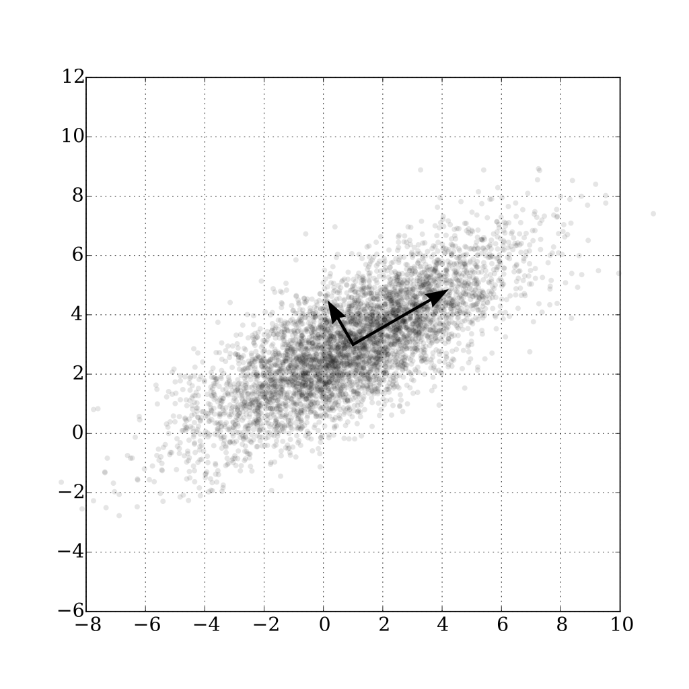

[comment]: # (THEME = pdsp)
[comment]: # (CODE_THEME = base16/zenburn)

### Practical Data Science with Python

# 16b. Principal Component Analysis

[comment]: # (!!!)

## Dimension Reduction

- You have 21 columns of continuous input
- You suspect a few are very correlated
- Maybe we can reduce it from 21 to 15?

#### Principal component analysis was invented in 1901.

[comment]: # (!!!)

## In 2 dimensions

1. Find the mean
2. Find the vector of most variance
3. Project data points onto vector

 

[comment]: # (!!!)

## Covariance Matrix

#### You have $n$ inputs $\{X_1, \ldots, X_n\}$

##### You compute the mean $\bar{X}$

#### $C = \frac{1}{n - 1} \sum_{i = 1}^{n} \left(X_i - \bar{X}\right) \left(X_i - \bar{X} \right)^T$

- Diagonals are the variance ($\sigma^2$) for each component.
- $C_{(i,j)}$ shows how closely component $i$ and $j$ are related.
- Symmetrical

Mean is zero? $C = \frac{X^T X}{ n - 1}$

[comment]: # (!!!)

## Eigenvectors of the covariance matrix

 

#### $C = V L V^T$

(Each column of $V$ is an eigenvector)

[comment]: # (!!!)


## Singular Value Decomposition

#### $X = U S V^T$

- $U$ and $V$ are orthogonal 
- $S$ is diagonal

[comment]: # (!!!)


## Calculating the eigenvectors/values

### $X = U S V^T$

### $C = \frac{X^T X}{n - 1}= \frac{V S U^T U S V^T}{n - 1} = V \frac{S^2}{n - 1} V^T$

Do SVD, $V$ is the eigenvectors. $\lambda_i = \frac{s_i^2}{n -1}$


[comment]: # (!!!)


## Now what?

$k$ eigenvectors with largest eigenvalues become columns: $W_k$

Output is $T = X W_k$

Voila!

[comment]: # (!!!)


## In python code

```python
from numpy.linalg import svd

k = 5 # Reducing to 5 dimensions
X_train_scaled = scaler.fit_transform(X_train)

U, S, VT = svd(X_train_scaled)
S = S[:k]
print(f"Largest k eigenvalues = {S}")

W = VT[:,:k]
X_train_reduced = X_train_scaled @ W
```

Dimensions: X_train_scaled=(n,d), C=(d,d), W=(d,k)

[comment]: # (!!!)


## Or

```python
from sklearn.decomposition import PCA

k = 5 # Reducing to 5 dimensions
pca = PCA(n_components=k)
X_train_scaled =pca.fit_transform(X_train)
```

[comment]: # (!!!)

## Nonlinear Dimension Reduction

Isomap tries to preserve distances between datapoints.

```python
from sklearn.manifold import Isomap
isomap = Isomap(n_components=k)
X_train_scaled = isomap.fit_transform(X_train)
```

Good for visualizations.

[comment]: # (!!!)


# Questions?

