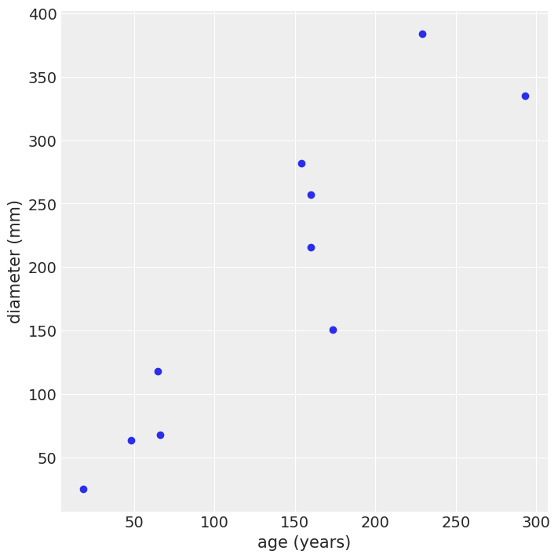
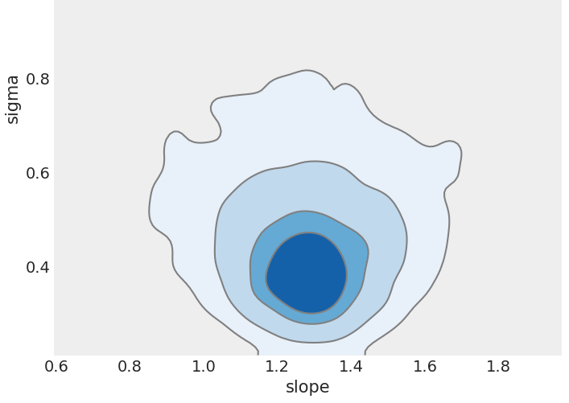
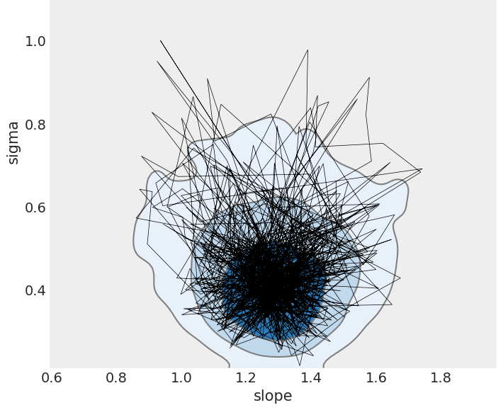

[comment]: # (THEME = pdsp)
[comment]: # (CODE_THEME = base16/zenburn)

### Practical Data Science with Python

# 16e. Bayesian Modeling

[comment]: # (!!!)

## Final

- December 7, 1:30 - 4:00
- In-person


[comment]: # (!!!)

## Model

I think the diameter of an oak tree's trunk is linearly related to its age.

#### $y = m x + \epsilon$

Where $\epsilon$ is the error, which I think is: 

- normally distributed
- mean zero
- std deviation of $x \sigma$ 

I want to know $m$ and $\sigma$.

[comment]: # (!!!)

## Data

 
 

[comment]: # (!!!)


## Simple approach

- You have $n$ datapoints $Y = \{ (x_1, y_1), \ldots, (x_n, y_n) \}$
- Find $m$ that minimizes the error squared 
- Find the standard deviation $\sigma$ of the residual
- Proclaim these things as true

[comment]: # (!!!)

## But...do you really know?

How confident are you that you really know $m$ and $\sigma$ for all oak trees looking at these 10?

[comment]: # (!!!)

## $p(m, \sigma | Y)$

 

[comment]: # (!!!)

## Bayes' Rule!

#### $p(m, \sigma | Y) = \frac{p(Y | m, \sigma) p(m, \sigma)}{p(Y)}$

Hard to calculate with a pencil.

But we have fast computers...

 


[comment]: # (!!!)

## Monte Carlo Markov Chains (MCMC)

 

[comment]: # (!!!)


## Priors are based on commonsense

#### $p(m)$ and $p(\sigma)$

Example: Variance is never negative, smaller variances are more common than larger ones

#### $\sigma \sim \text{half-normal}(0, 10)$

Accurate priors are nice, but not really necessary.

[comment]: # (!!!)

## Likelihoods are based on your model

#### $y_i = m x_i + N(0, x_i \sigma)$

#### $p(y_i | x_i, m, \sigma) = \frac{1}{x_i \sigma \sqrt{2\pi} } e^{-\frac{1}{2}\left(\frac{y_i - m x_i}{x_i \sigma}\right)^2}$

#### $p(Y| X, m, \sigma) = \prod_{i=1}^{n} p(y_i | x_i, m, \sigma)$


[comment]: # (!!!)


## Monte Carlo Markov Chains

Hop about $R^2$ trying out points ($m$, $\sigma$).

You can compute $p(Y | m, \sigma)$ and $p(\theta)$.  This guides your hops.

MCMC guarantees that as you wander, the density of ($m$, $\sigma$) you visit is proportional to the $p(m, \sigma | Y)$

 


[comment]: # (!!!)

## Chains

Long chains are more accurate the short chains. (Less lumpy)

The first 500 entries in the chain are suspect.  We throw away the "Burn In".

 


[comment]: # (!!!)

## PyMC Library

- Describe your priors
- Describe your model
- Tell it what data you have observed
- Tell it to make chains -- lists of ($m$, $\sigma$)
- Do analysis on the chains.

[comment]: # (!!!)

## In python

```python
import pymc as pm

basic_model = pm.Model()
with basic_model:
    # Priors for unknown model parameters
    slope = pm.Uniform("slope", lower=0, upper=10)
    sigma = pm.HalfNormal("sigma", sigma=1)

    # Expected value of outcome
    expected_diameter = slope * age 
    # The output of the model 
    target = pm.Normal("target", mu=expected_diameter, 
                  sigma=age * sigma, observed=diameter)
    # Make make 3 chains 2000 samples long, 
    # Before sampling, warm up with 1000 samples
    trace = pm.sample(2000, tune=1000, chains=3)
```
[comment]: # (!!!)

## But...how fast does the tree grow?

Maximum a posteriori estimation!

#### argmax $_{m, \sigma} \hspace{3mm} p(m, \sigma | Y)$

```python
with basic_model:
  map = pm.find_MAP()
  print(f"Based on these {n} trees, the best explanation:")
  print(f"\tOak trees grow {map['slope']:.2f} mm per year")
  print(f"\tExpected residual? Normal with mean 0 and std")
  print(f"\tof {map['sigma']:.2f} mm times the age of the tree.")
```
```text
Based on these 10 trees, the most likely explanation:
    Oak trees grow 1.26 mm per year
    Expected residual? Normal with mean 0 and std
    of 0.29 mm times the age of the tree.
```
[comment]: # (!!!)

## I have two models? Which is best?

- Good: Likely parameters make observed data likely.
- Must generalize (check with cross-validation)
- Leave-one-out or Widely Applicable Information Criterion
- Estimated log pointwise predictive density

### $\sum_{i=1}^{n} \log \int_{\theta} p(y_i | \theta) p(\theta)$

[comment]: # (!!!)


## Model comparison (python)

```python
pd_loo = az.loo(trace)
print(pd_loo.loo)

pd_waic = az.waic(trace)
print(pd_waic.waic)

```

```text
-50.97861522710673
-50.93410409235515
```

[comment]: # (!!!)


# Demo

[Colab](https://colab.research.google.com/drive/1tF-T29CLPs4trS393xFfJ6k3mkvci6Y9?usp=sharing)

[comment]: # (!!!)

# Questions?

