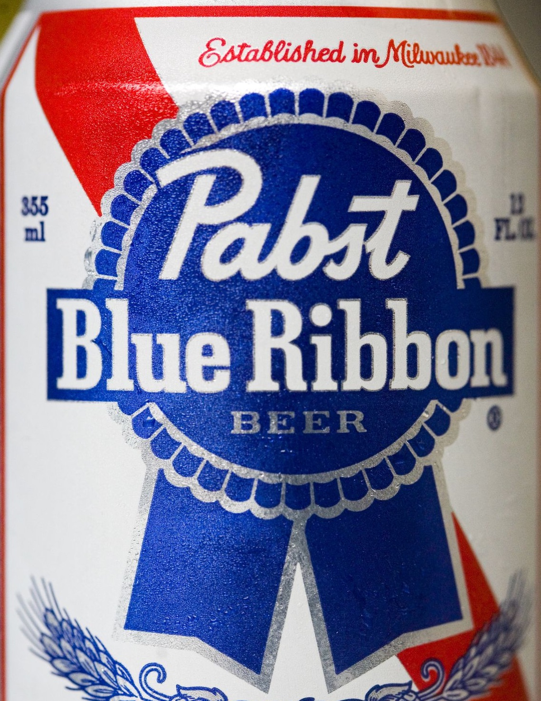
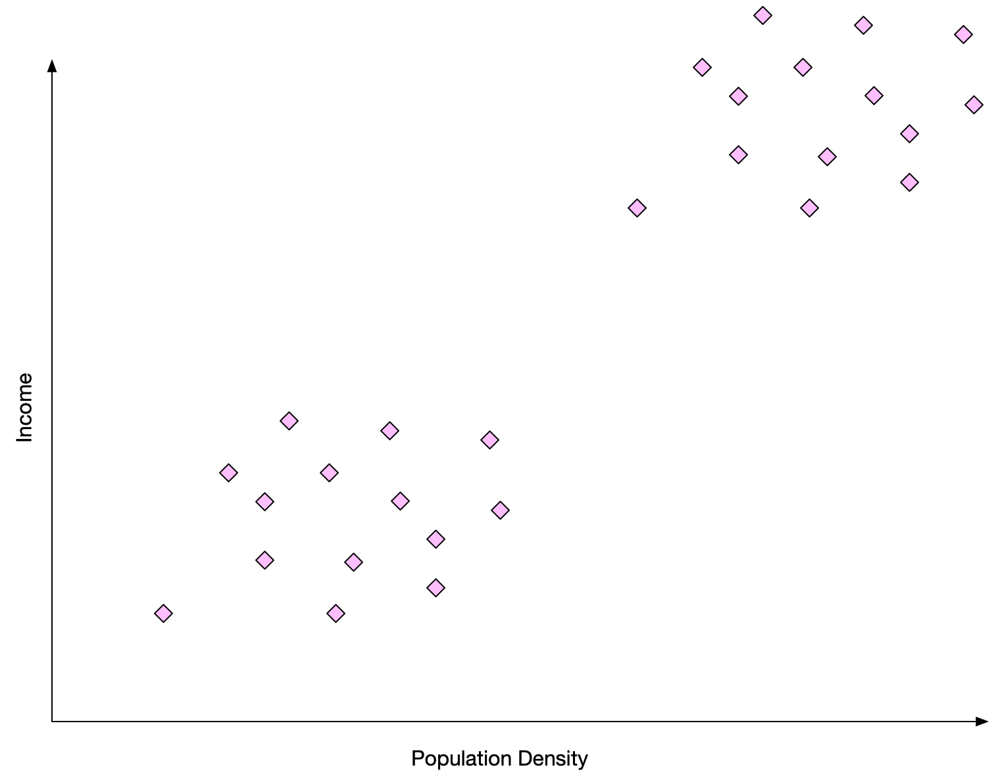
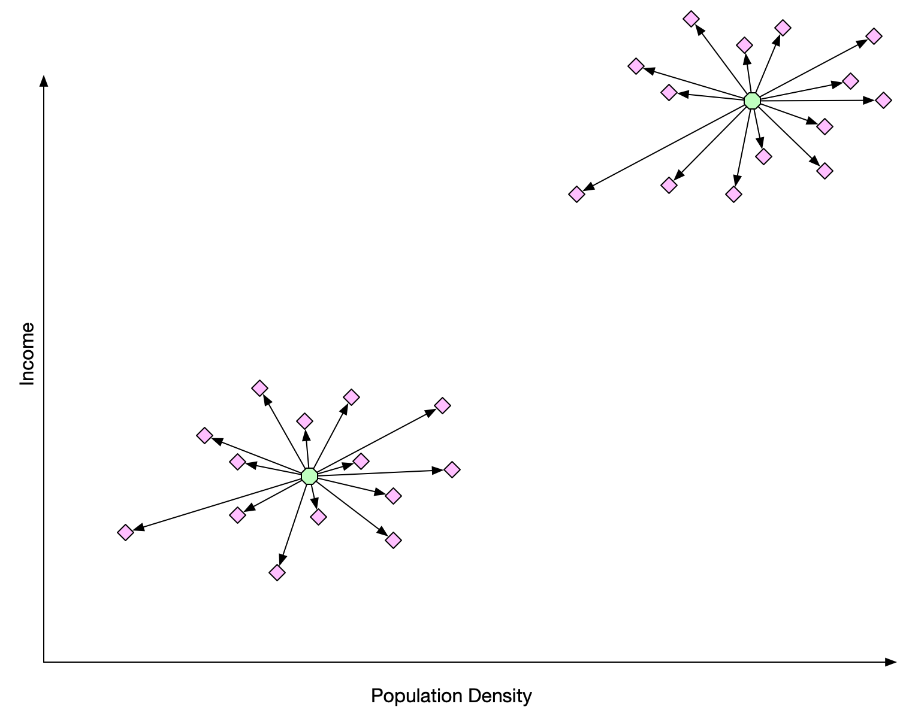
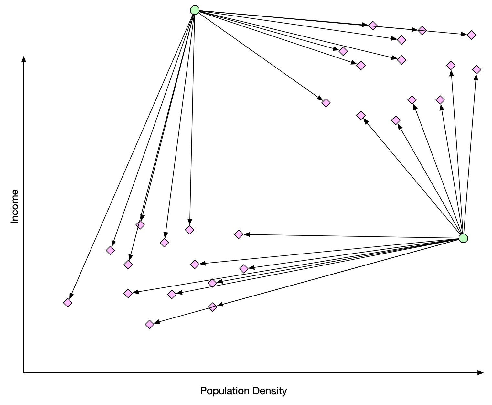
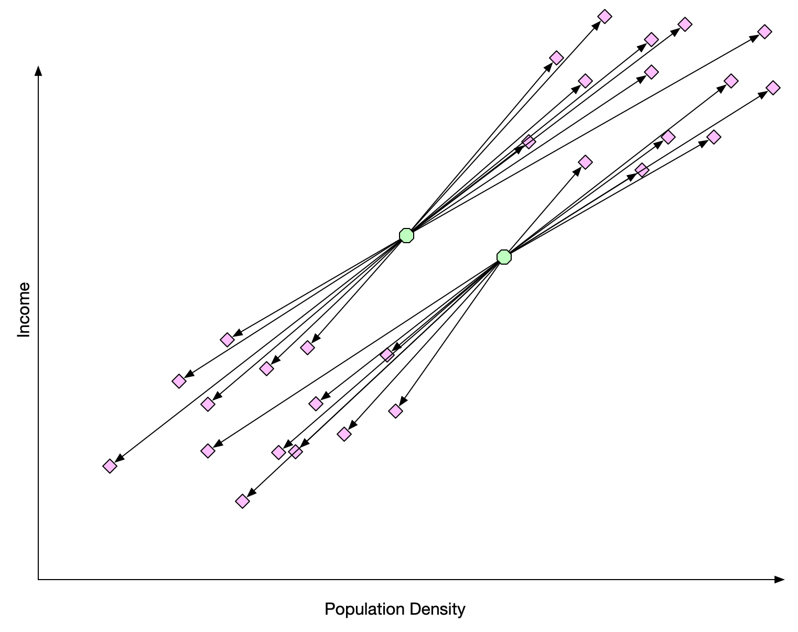
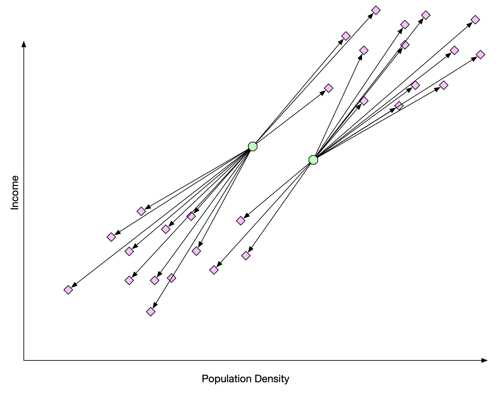
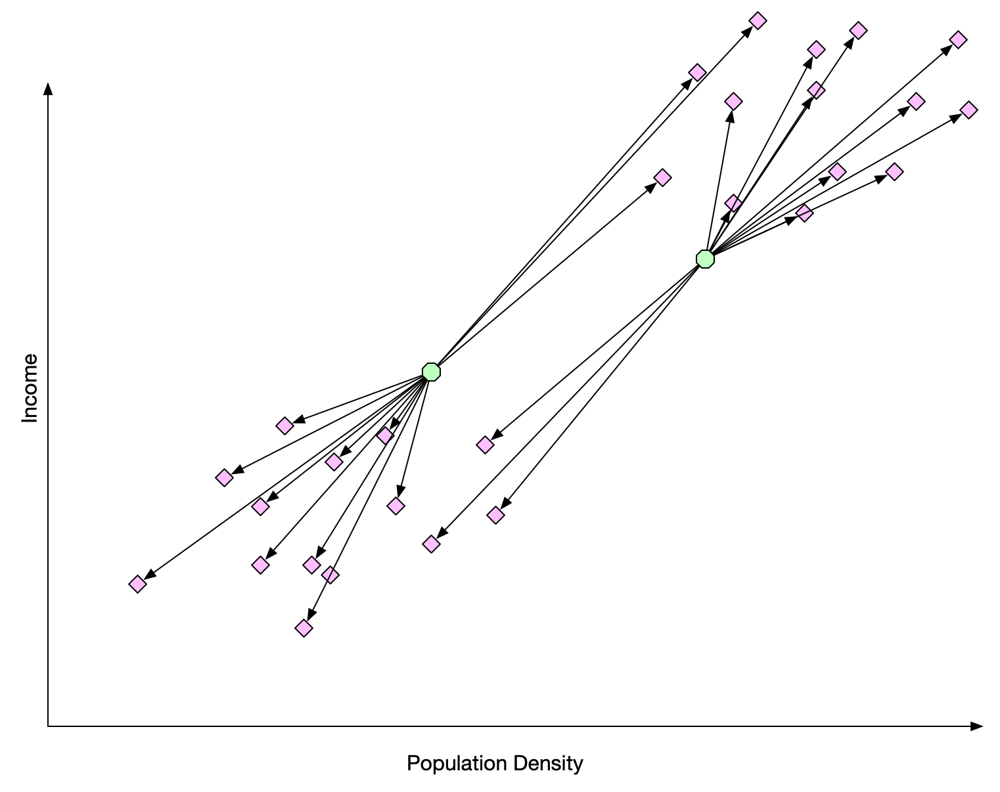
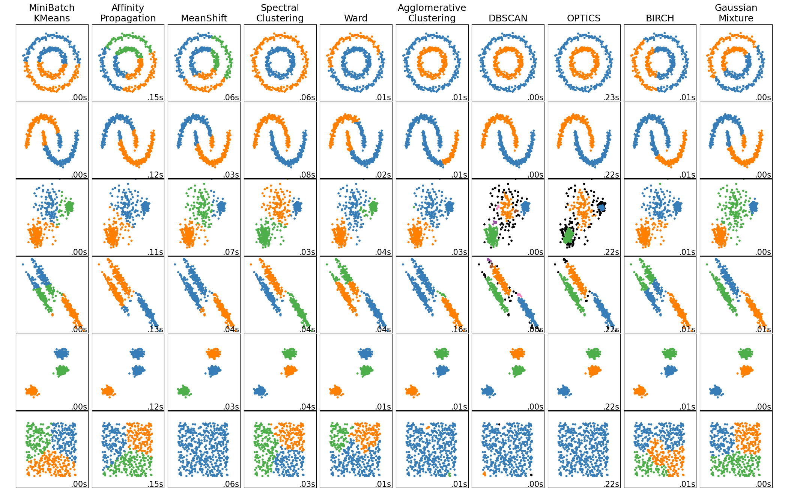

[comment]: # (THEME = pdsp)
[comment]: # (CODE_THEME = base16/zenburn)

### Practical Data Science with Python

# 17. Clustering with Machine Learning

[comment]: # (!!!)

## Who buys Pabst?

Pabst is a cheap, old-fashioned beer that hipsters like.

 


- Urban and high-income
- Rural and low-income

If we have $n$ data vectors, how do we find these clusters?

[comment]: # (!!!)


## Clusters


 

[comment]: # (!!!)


## Centroids




#### $C = \frac{\sum_{i = 1}^{n} x_i}{n}$

[comment]: # (!!!)


## k-Means Clustering

Start: Pick two centroids in the space

Repeat until points stop changing teams:
- Attach each point to the closest centroid
- Move the centroid to the center of its points

[comment]: # (!!!)

## 2-Means: Start



[comment]: # (!!!)

## 2-Means: Maximization



[comment]: # (!!!)

## 2-Means: Expectation



[comment]: # (!!!)

## 2-Means: Maximization 2



[comment]: # (!!!)

## k-Means: Details

- At start, every centroid must be connected to at least one point
- Always converges, could be local minimum
- Standardize data before using

[comment]: # (!!!)

## k-means in python

```python
from sklearn.cluster import KMeans
from sklearn.preprocessing import StandardScaler

scaler = StandardScaler()
X_train = scaler.fit

clusterer = KMeans(n_clusters=3)
clusterer.fit(X_train)
labels = clusterer.predict(X_test)
centroids = clusterer.cluster_centers_
```

[comment]: # (!!!)

## Best k?

- Within-Cluster Sum-of-Squares (WCSS) decreases as k increases.
- Look for "elbows"
- WCSS also called "inertia"

```python
for k in [2, 4, 7, 11]:
    clusterer = KMeans(n_clusters=k)
    clusterer.fit(X_train)
    wcss = clusterer.inertia_
    print(f"WCSS for {k}={wcss}")
```


[comment]: # (!!!)



[comment]: # (!!!)


# Questions?

