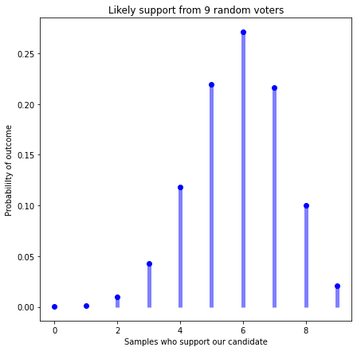
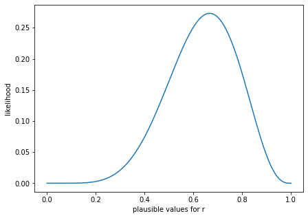
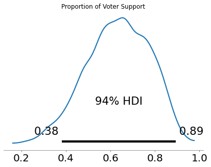
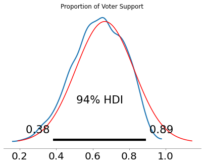
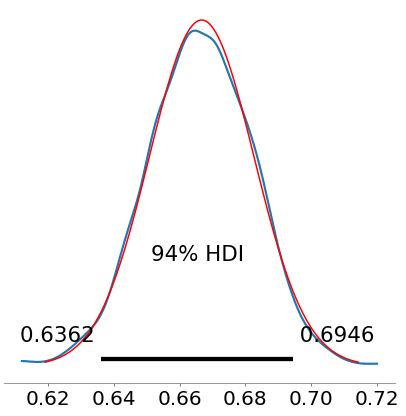
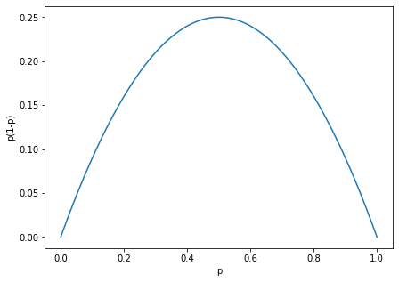

[comment]: # (THEME = pdsp)
[comment]: # (CODE_THEME = base16/zenburn)

### Practical Data Science with Python

# 17. Population Proportion

[comment]: # (!!!)

## Will your candidate win?

You work for a campaign. Based on a survey, you need to know:

- What percentage of the population of voters will vote for her?
- How confident are you?

But you don't have time/budget to ask everyone.

[comment]: # (!!!)


## What if you already knew?

Say 65% of the voters support your candidate.

You are going to ask 9 randomly chosen people if they will vote for your candidate.

$r=0.65, n=9$

What outcome do you expect? ($k$ members of the sample say they suppport your candidate.)


[comment]: # (!!!)


## Binomial Distribution


#### $p(k) = \frac{n!}{k! (n-k)!}p^k (p-1)^{n - k}$




[comment]: # (!!!)

## In python

```python 
r = 0.65
n = 9
outcomes = np.arange(n+1)
p_outcomes = binom.pmf(outcomes, n, r)
```


[comment]: # (!!!)

## Demo

[Demo](https://colab.research.google.com/drive/1dn0J3CbfswlkJ6fiNFosHwJj45CZ4SKU?usp=sharing)

[comment]: # (!!!)

## Now the other way

- You asked 9 voters ($n=9$)
- 6 said they would vote for your candidate ($k = 6$).

What do you know about $r$?

For each possible $r$, we can calculate $p(k | r)$.

So we can use Bayes's rule:

### $p(r | k) \propto p(k | r) p(r)$

[comment]: # (!!!)

## Look at the likelihoods

Given some $r$ what is the likelihood of seeing 6 out 9?
```python
possible_rs = np.linspace(0.0, 1.0, 200)
p_r = binom.pmf(k, n, possible_rs)
```



[comment]: # (!!!)


## MCMC: the answer

MAP = $6/9 \approx $ 67%

94% Confidence = (38%, 89%)



[comment]: # (!!!)

## The process

```python
k = 6
basic_model = pymc.Model()
with basic_model:
   model_r = pymc.Uniform("r", lower=0, upper=1.0)
   expected_k = pymc.Binomial("k", n=n, p=model_r, observed=k)
   trace = pymc.sample(5000, tune=1000, chains=1)
   map = pymc.find_MAP()
   print(f"Based on these {n} voters, the MAP:")
   print(f"\t{map['r'] * 100.0:.4f}% voters")
   posterior_params = pymc.plot_posterior(trace,
                                     point_estimate=None,
                                     round_to=2);
```    


[comment]: # (!!!)

## Approximation

- $p(r)$ is normal
- mean $= \frac{k}{n}$
- std $= \sqrt{\frac{p(1-p)}{n}}$

<br>



[comment]: # (!!!)

## n grows? Approximation gets good

k=600, n=900



[comment]: # (!!!)

## How many people do I need to ask?

Boss demands "95% confidence, $\mu \pm 0.08$." 

Thats  $2 \sigma \leq 0.08$

### $\sigma = \sqrt{\frac{p(1 - p)}{n}}$

### $0.08 = 2\sqrt{\frac{0.67(1 - 0.67)}{n}}$

Solve for $n$.  

What if you don't know $p$?

[comment]: # (!!!)

## Worst case

Given $\sigma = \sqrt{\frac{p(1 - p)}{n}}$

Worst case is where $p(1 - p)$ is largest.  



Happens when $p=0.5$: $\sigma = \sqrt{\frac{0.25}{n}}$


[comment]: # (!!!)


# Questions?

