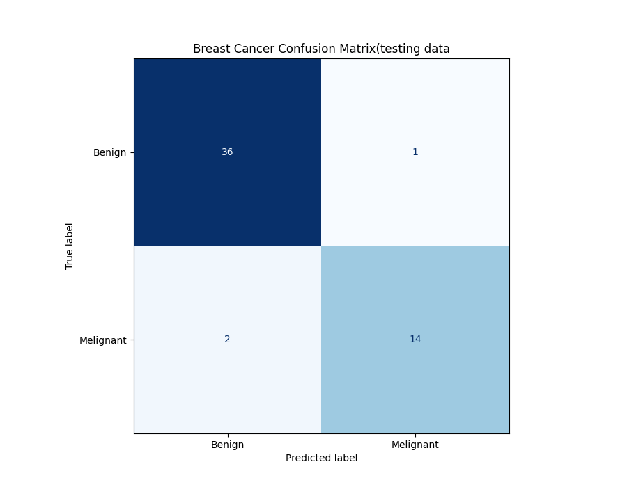

[comment]: # (THEME = pdsp)
[comment]: # (CODE_THEME = base16/zenburn)

### Practical Data Science with Python
# 21. The Wrap Up

[comment]: # (!!!)

## A unnecessary correction

#### $X = USV^T$

#### $X^T X = VSU^T U S V^T = V S^2 V^T$$

```python
x = np.random.rand(6, 3)
scaler = StandardScaler()
x_scaled = scaler.fit_transform(x)

c = x_scaled.T @ x_scaled
_, _, CVT = np.linalg.svd(c)
_, _, XVT = np.linalg.svd(x_scaled)

for i in range(CVT.shape[1]):
    print(f"C eigenvector {i}:{CVT[:,i]}")
    print(f"X eigenvectoir {i}: {XVT[:,i]}")
```

[comment]: # (!!!)

## Final

- You will get a data set and a text file with a set of tasks to complete. 
- You will write code to fill in the answers on the text file.  
- You will turn in the whole directory: text file, code, any plots.
- Have the libraries we have used this semester installed.
- Have a text editor installed.
- Submit to iCollege

[comment]: # (!!!)

## Cheating

- Do not collaborate. 
- Anyone caught collaborating will fail the course. 




[comment]: # (!!!)


## Data Science

- Figure out what question is really being asked
- Data exploration
- Clean up
- Produce statistics
- Produce predictions: regression and classification
- Analyze error for confidence
- Do data visualization
- Explain what you did

[comment]: # (!!!)

## The Question Being Asked

"How many students will graduate this spring?" 

- For what purpose?
- What is a "student"?
- What is "graduate"?
- How accurate?
- What data do you have?
- How much time/money do you have?

[comment]: # (!!!)

## Data Exploration

- Basic structure: table or graph
- Data types and ranges
- Missing values
- Histograms

[comment]: # (!!!)

## Clean up

- Imputing values?
- Dropping outlines?
- Filling in missing information?

[comment]: # (!!!)

## Produce statistics

- Continuous: Population mean? variance?
- Discrete: Population proportion?
- Mean, mode, median
- Mutual information: $\chi^2$ test, Pearson correlation

[comment]: # (!!!)

## Bayesian modeling

- Create models
- Fit to observed data
- Compare models (LOO)

[comment]: # (!!!)

## Features

- Selection - How do we know what columns are important?
- Engineering - How can we manipulate the columns so they are more useful?

[comment]: # (!!!)


## Prediction: Regression

Create and tune models that do regression:

- Linear, ridge, lasso, elastic regression
- Polynomial regression
- Neural nets
- Random forest
- Gradient boosted trees
- K Nearest Neighbors 

[comment]: # (!!!)

## Prediction: Classification

Create and tune models that do classification:

- Logistic regression
- Neural nets
- Bayesian classifiers
- Random forest
- Gradient boosted trees
- K Nearest Neighbors

[comment]: # (!!!)

## Picking and Tuning Models

- AutoML (pycaret)
- Cross Validation and Leave-one-out

[comment]: # (!!!)

## Confidence

- Regression: Look at the residual
- Classification: Look at confusion matrix, ROC
- Data it was trained on?

[comment]: # (!!!)

## Decision Support

What does "best" prediction mean?
- Minimize mean squared error?
- Maximize accuracy?
- Or...?

[comment]: # (!!!)

## Data Visualization

A good plot has so much information:

- Scatter plot
- Violin and Box plots
- Pie chart
- Bar chart
- Histogram
- Density plot
- Density contour plot
- Time series

[comment]: # (!!!)

## Telling the story

- Plots and PowerPoint
- LaTeX for reports
- Public speaking (Toastmasters)
- Give answers
- Help create the next question

[comment]: # (!!!)

## Be truthful

- Be explicit about assumptions
- Everything ties back to probability and Bayes' rule
- Be truthful about residuals/confusions
- Be truthful about confidence intervals

[comment]: # (!!!)

## Next?

- Deep learning
- Bayesian modeling
- Database design
- Animated visualizations (VR?)
- Commercial tools: Spark, Tableau, AWS SageMaker
- Subject matter expertise

[comment]: # (!!!)


# Thanks!

